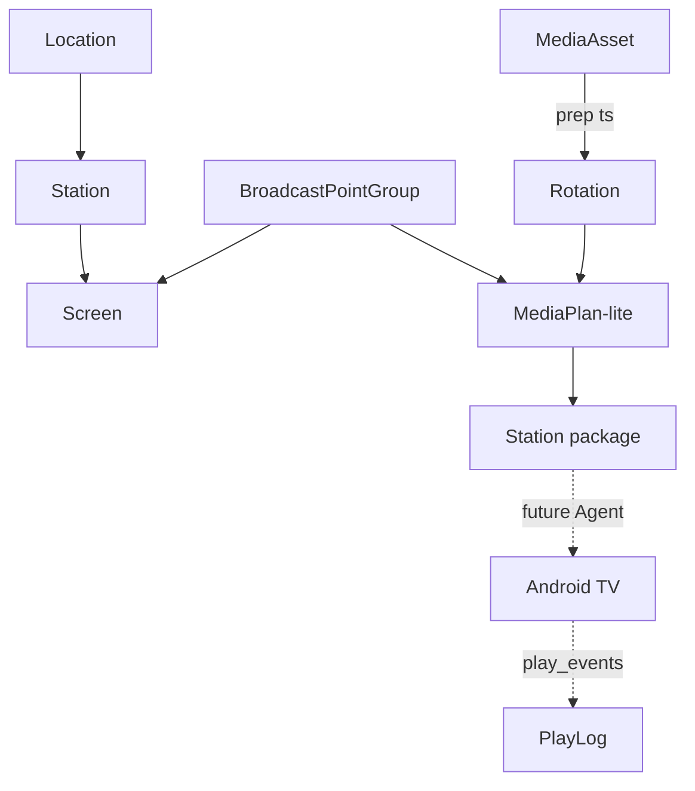
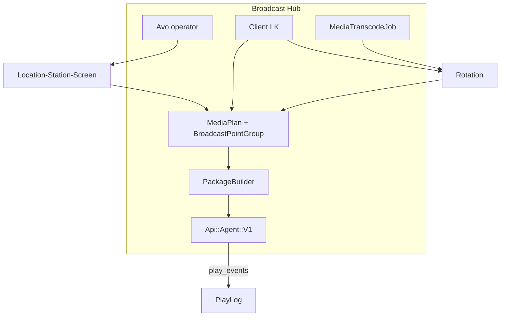
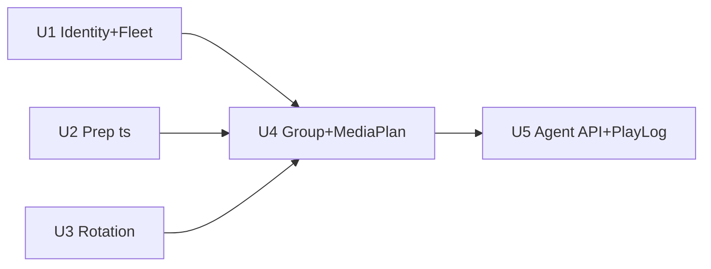

# Broadcast Hub MVP-1 (MediaPlan-lite) - Plan

> **Примечание (2026-08-05):** gem **Avo** удалён из кодовой базы. Упоминания Avo / `/avo` / `app/avo` ниже — исторические; операторская админка будет заменена на **Administrate**.

## Goal Capsule

- **Objective:** Пилотный Broadcast Hub: иерархия точек, ротации, медиаплан-lite, prep `.ts`, и минимальный Agent-facing API (package/config + play_events) без реализации Агента.
- **Product authority:** Product Contract ниже (origin brainstorm 2026-08-01) > `specs/002-monitors-broadcast-tz/requirements-analysis.md` (v1.8) > этот Planning Contract. Сужение относительно `specs/002-monitors-broadcast-tz/implementation-plan-broadcast-hub.md`.
- **Open blockers:** нет.
- **Execution profile:** code; feature-bearing units — test-first where domain rules (conflict reject, ready gate, Agent API) are load-bearing.
- **Stop conditions:** срез готов по R14; не расширять на квоты, Агент-runtime, sync/транспорт, полный ScheduleItem.

---

## Product Contract

**Product Contract preservation:** changed R5, R6, R9, AE2 — правило «медиаплан только при fully ready ротации»; набор экранов = новая сущность **группа точек трансляции** (`BroadcastPointGroup`), не `PointGroup` 001 и не анонимный M2M. Остальное Product Contract без изменений смысла.

### Summary

Срез — только **Broadcast Hub** в этом репозитории: оператор ведёт Локация→Станция→Экран в Avo; клиент в ЛК работает с медиатекой, **ротациями** и **медиаплан-lite** (ротация ↔ группа точек трансляции ↔ расписание без квот); Хаб готовит `.ts` и отдаёт package/config, принимает play_events. Агент, транспорт до ТВ и sync — вне среза. Пилот на **новой модели** без обязательства мигрировать точки MVP-001.

### Problem Frame

MVP-001 уже даёт медиатеку, `Playlist`, окна и плоский `BroadcastPoint`, но не закрывает целевую иерархию станций, терминологию ротации/медиаплана, prep под edge и контракт, к которому позже подключится Station Agent. Полное ТЗ 002 тянет квоты, полный Агент и sync — слишком широко для первого пилота Хаба. Нужен узкий срез Хаба, который проверяет новую модель эфира и API без ожидания runtime на станции.

### Key Decisions

- **Срез = Хаб only.** Реализуется Broadcast Hub; приложение Station Agent — отдельный репозиторий/этап. `(session-settled: user-directed — chosen over thin/full Agent in this repo: взаимодействие с Агентом только через API Хаба)`
- **Иерархия в данных/Avo.** Локация → Станция → Экран — обязательная модель пилота. `(session-settled: user-directed — chosen over flat points-only: иерархия без откладывания на Fleet Ops)`
- **Медиаплан-lite без квот.** Эфир задаётся сущностью медиаплана (ротация ↔ группа точек ↔ расписание), не прямым назначением как в 001 и не полным Airtime. `(session-settled: user-directed — chosen over direct screen assignment / station-only channel: раньше целевой язык ТЗ)`
- **Конфликт двух медиапланов на один экран/окно = reject.** Второй план не сохраняется; исходный остаётся. `(session-settled: user-directed — chosen over LWW / single-org-only: явный отказ при пересечении)`
- **Agent API минимум:** Хаб отдаёт package и config станции; принимает play_events (факт старта). Heartbeat/alerts — позже. `(session-settled: user-directed — chosen over full §16.4 or spec-only: минимум для эфира и proof-of-play)`
- **Prep `.ts` в Хабе** сразу после загрузки (GOP=25 профиль из ТЗ); package ссылается на готовые артефакты. `(session-settled: user-directed — chosen over defer encode / stub queue: encode — новая возможность, сейчас есть только metadata/ffprobe)`
- **Playlist → Rotation** в домене и ЛК, включая переименование модели. `(session-settled: user-directed — chosen over keep Playlist name: термин ТЗ)`
- **Чистый пилот.** Нет обязательства мигрировать существующие `BroadcastPoint` 001. `(session-settled: user-directed — chosen over mandatory migration / dual-run: стенд на новой модели)`
- **Готовность без живого Агента.** Достаточно Avo + ЛК + контрактная/ручная проверка API. `(session-settled: user-directed — chosen over requiring live Agent: Агент вне среза)`
- **Медиаплан сохраняется только если ротация полностью `ready`.** `(session-settled: user-directed — chosen over inactive plan / strip unready assets in package: валидация на сохранении)`
- **Группа точек трансляции = новая сущность; `PointGroup` 001 не трогаем.** `(session-settled: user-directed — chosen over reuse PointGroup / anonymous M2M: имя из ТЗ, изоляция от Device-API групп)`

### Actors

- A1. **Оператор** — работает в Avo: иерархия локаций/станций/экранов, обзор флота пилота.
- A2. **Менеджер клиента** — в ЛК: загрузка медиа, ротации, медиапланы-lite, группы точек трансляции.
- A3. **Broadcast Hub** — источник правды по эфиру, prep, package/config, PlayLog.
- A4. **Station Agent (вне среза)** — будущий потребитель package/config и источник play_events; в этом срезе не реализуется.

### Key Flows

- F1. Регистрация иерархии
  - **Trigger:** Оператор заводит новую точку пилота.
  - **Actors:** A1, A3
  - **Steps:** Создаёт Локацию → Станцию → Экран(ы) с ориентацией/признаками; станция получает параметры config (в т.ч. окно кэша N ч для будущего Агента).
  - **Outcome:** Станция адресуема для package/config API.
  - **Covered by:** R1, R2, R10

- F2. Медиа → ротация → медиаплан-lite
  - **Trigger:** Менеджер готовит эфир.
  - **Actors:** A2, A3
  - **Steps:** Загружает ролик → Хаб ставит prep `.ts` и обновляет статус → собирает ротацию → создаёт/правит группу точек трансляции → создаёт медиаплан (ротация + группа + окна) только если все ролики ротации `ready` → при пересечении с существующим планом на тот же экран/окно — reject.
  - **Outcome:** Утверждённый медиаплан без пересечений; package всегда полный по ready-артефактам.
  - **Covered by:** R3–R9

- F3. Package / play_events без Агента
  - **Trigger:** Проверка контракта или будущий pull Агента.
  - **Actors:** A3, (A4 later)
  - **Steps:** Клиент API запрашивает package и config станции; при появлении события старта POST play_events → PlayLog хранит факт старта.
  - **Outcome:** Package отражает актуальные медиапланы станции; PlayLog пополняется при событиях.
  - **Covered by:** R10–R13

### Requirements

**Hierarchy and Avo**

- R1. Хаб моделирует обязательную иерархию Локация → Станция → Экран для пилотных точек.
- R2. Оператор в Avo создаёт и правит локации, станции и экраны (ориентация, признаки/теги).

**Media, rotation, prep**

- R3. В ЛК и домене используется термин и сущность **ротация** (замена playlist).
- R4. После загрузки медиа Хаб запускает фоновый prep в `.ts` (профиль GOP=25 / 1080p25 из ТЗ) и ведёт статусы до `ready` / `failed`.
- R5. Ротация — именованный упорядоченный набор роликов; **сохранение медиаплана запрещено**, пока любой ролик ротации не в `ready`.

**MediaPlan-lite**

- R6. Медиаплан-lite связывает одну ротацию, **группу точек трансляции** и расписание/окна показа — без бронирования квот и без оплаты.
- R7. Если новый или изменённый медиаплан пересекается с уже сохранённым по тому же экрану и тому же временному окну — операция **reject**; существующий план не меняется.
- R8. Клиент в ЛК создаёт и просматривает свои ротации, группы точек трансляции и медиапланы с фильтрами, достаточными для пилота (экраны, даты, ролик).
- R9. **Группа точек трансляции** — новая именованная сущность (членство = экраны пилотной иерархии). Существующий `PointGroup` MVP-001 **не изменяется** и не используется медиапланом.

**Hub ↔ Agent API (Hub side)**

- R10. Хаб отдаёт **config** станции (идентичность станции, список экранов, параметры кэша N ч и пр., нужные будущему Агенту).
- R11. Хаб отдаёт **package** эфира станции, собранный из активных медиапланов её экранов и готовых `.ts` артефактов.
- R12. Хаб принимает **play_events** (факт старта показа) и сохраняет PlayLog.
- R13. Heartbeat и alerts **не** входят в этот срез.

**Delivery / readiness**

- R14. Срез считается готовым, когда работают Avo-иерархия, ЛК (ротации/медиа/медиапланы), prep `.ts`, package/config и приём play_events — проверка API контрактными или ручными вызовами **без** живого Агента.
- R15. Миграция существующих `BroadcastPoint` / данных MVP-001 **не требуется**.

### Acceptance Examples

- AE1. Конфликт медиапланов
  - **Covers:** R7
  - **Given:** На экране E окно 10:00–12:00 уже занято медиапланом P1.
  - **When:** Менеджер сохраняет P2 на E с окном 10:00–11:00.
  - **Then:** Сохранение P2 отклоняется; P1 без изменений.

- AE2. Медиаплан только при ready-ротации
  - **Covers:** R4, R5, R11
  - **Given:** В ротации есть ролик со статусом `processing` или `failed`.
  - **When:** Менеджер пытается сохранить медиаплан с этой ротацией.
  - **Then:** Сохранение отклоняется валидацией; после перехода всех роликов в `ready` сохранение проходит; package для станции включает полный набор `.ts` по плану.

- AE3. Play log без Агента в рантайме
  - **Covers:** R12, R14
  - **Given:** Хаб поднят; Агент не задеплоен.
  - **When:** Тестовый клиент POST play_event старта для экрана/ассета.
  - **Then:** Запись появляется в PlayLog и доступна для просмотра в Avo (минимум) и/или ЛК клиента по своим событиям.

### Success Criteria

- Оператор может описать пилотную локацию целиком в Avo через иерархию без плоского `BroadcastPoint`.
- Менеджер проходит путь ролик → prep ready → ротация → группа точек → медиаплан без квот.
- Пересечение медиапланов стабильно даёт reject.
- Внешний клиент получает осмысленные package и config по `station_id` и может записать play_event.
- Команда согласна начинать репозиторий Агента против этого контракта, не меняя продуктовых границ Хаба.

### Scope Boundaries

**In scope**

- Broadcast Hub: иерархия, ротации, группа точек трансляции (новая), медиаплан-lite, prep `.ts`, PlayLog, package/config/play_events API.
- Avo для оператора; ЛК клиента для медиа/ротаций/групп/медиапланов.
- Пилот на новой модели данных; минимальный tenant split (operator владеет флотом, client — медиа/планами).

**Deferred for later**

- Приложение Station Agent (кэш, раздача, VLC/ADB, power).
- Выбор транспорта до ТВ и параметры sync (после тестов; HLS снят с ТЗ).
- Heartbeat/alerts Agent API.
- Airtime-квоты, FWW-бронь, перенос/отмена квот, полный multi-org marketplace.
- Полный RBAC (`manager`/`accountant`/`administrator`) и «режим клиента» из Avo.
- `ScheduleItem` modes loop/exact/fill в полной форме; нейтральные пулы; шаблоны зон; финансы/XLS/PDF.
- Обязательная миграция MVP-001 точек; эволюция `BroadcastPoint` → `Screen`.
- Изменения `PointGroup` / `ScheduleRule` Device-API контура 001.

**Outside this slice's identity**

- CMS динамических меню; native mobile; онлайн-оплата после брони; реализация Агента в этом репозитории.

### Dependencies / Assumptions

- Целевое железо и runtime плеера остаются Android TV + VLC/ADB в будущем Агенте; на поведение Хаба в этом срезе не влияют, кроме формы package/config.
- Пилот может быть одно- или малоорганизационным; политика reject достаточна без квот.
- Профиль prep из ТЗ (§15.3) — продуктовый ориентир; отклонения железа/CPU — в планировании.
- Related doc: `specs/002-monitors-broadcast-tz/implementation-plan-broadcast-hub.md` — этот план **сужает** первый пилотный срез относительно него (без фаз E/F полного Airtime/ScheduleItem и без rename BroadcastPoint).

### Outstanding Questions

**Resolve Before Planning**

- (пусто)

**Deferred to Planning** *(resolved below as KTDs unless noted)*

- ~~AE2 rule~~ → KTD: validate on save.
- ~~PointGroup vs new entity~~ → KTD: `BroadcastPointGroup`.
- Точные поля JSON package/config — черновик в U5 + `contracts/agent-api-v1.md`; version field обязателен.
- Auth Agent API → KTD: token digest на Station (как Device API на point).
- PlayLog UI → KTD: Avo index минимум; ЛК list опционально в том же unit.

### Sources / Research

- `specs/002-monitors-broadcast-tz/requirements-analysis.md` — ТЗ v1.8, глоссарий, FR, §16 Agent, MVP-1…7.
- `specs/002-monitors-broadcast-tz/implementation-plan-broadcast-hub.md` — широкий план Хаба (A–I); пилот сужает.
- `specs/001-media-playlist-broadcast/` — текущий MVP.
- Код: `BroadcastPoint`, `Playlist`, `PointGroup`, `ScheduleRule` + `Scheduling::ConflictDetector`, Device API `Playback::CurrentAssignmentResolver`; `ProcessMediaMetadataJob` + ffprobe; нет Agent API / MediaPlan / Location–Station–Screen / transcode-to-`.ts`.

---

## Planning Contract

### Key Technical Decisions

- KTD1. **Параллельный флот.** Новые `Location` / `Station` / `Screen`; `BroadcastPoint` и Device API v1 остаются для 001. `(session-settled: user-directed — chosen over BroadcastPoint→Screen rename in this slice: clean pilot, R15)`
- KTD2. **`BroadcastPointGroup`.** Новая модель именованной группы экранов (`screens` HABTM/membership); `PointGroup` / `point_group_memberships` не меняем. `(session-settled: user-directed — chosen over reuse PointGroup / anonymous M2M)`
- KTD3. **MediaPlan-lite.** `MediaPlan` = `rotation` + `broadcast_point_group` + `starts_at`/`ends_at` (+ org); overlap через расширение паттерна `Scheduling::ConflictDetector` на screen×window. Без `AirtimeBooking` / `ScheduleItem`.
- KTD4. **Ready gate на save.** Валидация MediaPlan: все media в ротации `ready` и имеют `.ts` attachment; иначе reject. `(session-settled: user-directed)`
- KTD5. **Playlist → Rotation.** Rename модели/таблицы/UI (или alias `Rotation` + rename table в одном unit); маршруты и политики обновить. `(session-settled: user-directed)`
- KTD6. **Prep pipeline.** После metadata (video): `MediaTranscodeJob` → ActiveStorage `:broadcast_file` (`.ts`); статусы transcode отдельно или расширение `processing_status` — выбрать один enum-путь в unit, не оба.
- KTD7. **Agent API.** Namespace `Api::Agent::V1`; Bearer token → `Station` (`agent_token_digest`); эндпоинты `GET package`, `GET config`, `POST play_events`. Контракт: `specs/002-monitors-broadcast-tz/contracts/agent-api-v1.md`.
- KTD8. **Минимальный tenant.** `organizations.kind` `operator`|`client` (или эквивалент): флот только у operator; медиа/ротации/группы/медиапланы у client. Полный RBAC ролей и impersonation — deferred.
- KTD9. **Package builder.** Сервис в `app/domain/` (рядом с `Playback::`): по station собирает медиапланы экранов станции в окне «сейчас/горизонт», signed URLs на `.ts`, order из rotation items, `tv_map` screen→артефакты. Без привязки к протоколу HLS.
- KTD10. **PlayLog.** Модель факта старта (screen, media_asset, started_at, organization, source); Avo read; retention 2 мес. можно отложить job’ом follow-up, но поле/модель — в срезе.

### Assumptions

- ffmpeg доступен в runtime job worker’а (локально/CI — stub или fixture blob для тестов без реального encode).
- Пилотные экраны в группах принадлежат станциям operator-org; клиент читает каталог экранов read-only для сборки группы.
- Device API playback assignments **не** обязаны читать MediaPlan в этом срезе (параллельные контуры).

### High-Level Technical Design

Направление (не спецификация кода): доменные сервисы `app/domain/*` + `ServiceObject`; Solid Queue jobs; Pundit scopes по org; Avo resources для флота и PlayLog; Hotwire/daisyUI ЛК как сейчас.

### Sequencing

U2 и U3 после U1 могут идти параллельно.

### Implementation constraints

- Не ломать Device API 001 и `PointGroup`/`ScheduleRule`.
- Не выбирать транспорт до ТВ в package.
- Не реализовывать Station Agent в этом репо.
- Repo-relative paths only в артефактах.

---

## Implementation Units

### U1. Minimal identity + Location → Station → Screen

- **Goal:** Operator владеет пилотным флотом в Avo; client не CRUD’ит иерархию; станции имеют `offline_cache_hours` (default 24) и задел под agent token.
- **Requirements:** R1, R2, R15; KTD1, KTD8
- **Files:**
  - `db/migrate/*_create_locations_stations_screens.rb`
  - `app/models/location.rb`, `station.rb`, `screen.rb`
  - `app/models/organization.rb` (+ `kind`)
  - `app/avo/resources/location.rb`, `station.rb`, `screen.rb`
  - `app/policies/*` (fleet)
  - `spec/models/*`, `spec/requests/avo/*` или request policies
  - `spec/factories/*`
- **Approach:** Новые таблицы; Screen: orientation, tags (переиспользовать Tag или screen_tags — по аналогии с broadcast_point_tags). Station: `offline_cache_hours`, nullable `agent_token_digest`. Не rename `broadcast_points`. Seed/operator org для пилота.
- **Dependencies:** none
- **Execution note:** model/policy specs first for hierarchy invariants and client cannot create Screen.
- **Test scenarios:**
  - Happy: operator создаёт Location→Station→Screen с orientation; cache hours default 24.
  - Edge: Screen без Station — invalid.
  - Error: client-org user cannot create Location/Station/Screen (policy/request).
  - Integration: Avo lists screens scoped to operator org.
- **Verification:** `bundle exec rspec` на новые model/policy/request specs U1.

### U2. MediaTranscodeJob → `.ts`

- **Goal:** После загрузки video Хаб готовит `.ts` (GOP=25 профиль) и статус готовности для эфира.
- **Requirements:** R4; KTD6
- **Files:**
  - `app/jobs/media_transcode_job.rb`
  - `app/domain/media/*` (encoder wrapper)
  - `app/models/media_asset.rb` (attachment `:broadcast_file`, status fields, enqueue after metadata/create)
  - `spec/jobs/media_transcode_job_spec.rb`
  - ADR note under `specs/002-monitors-broadcast-tz/` or `docs/` (short encoding profile)
- **Approach:** Не-video пропускают transcode (остаются ready после metadata). Video: pending→processing→ready/failed. Тесты — stub ffmpeg / attach fixture `.ts`. Лимит 1 ГБ уже в продуктовых рамках — валидация если ещё нет.
- **Dependencies:** none (can parallel U1/U3); enqueue after existing metadata path.
- **Execution note:** job spec with stubbed shell/encoder; no real ffmpeg required in CI if stubbed.
- **Test scenarios:**
  - Happy: video asset ends `ready` with `broadcast_file` attached.
  - Edge: image/audio skips transcode, stays usable without `.ts` policy explicit (document: media plan/rotation for A/V pilot focuses video; non-video rules — if allowed in rotation, define in unit).
  - Error: encoder failure → `failed` + error metadata; no silent ready.
  - Integration: create MediaAsset enqueues job (ActiveJob assert).
- **Verification:** `bundle exec rspec spec/jobs/media_transcode_job_spec.rb` (+ model hooks).

### U3. Playlist → Rotation

- **Goal:** Домен и ЛК говорят «ротация»; модель/таблица переименованы согласованно.
- **Requirements:** R3; KTD5
- **Files:**
  - migration rename `playlists` → `rotations`, `playlist_items` → `rotation_items` (or staged alias)
  - `app/models/rotation.rb`, `rotation_item.rb`
  - controllers/views/routes/policies/factories/Avo formerly playlist*
  - `spec/models/rotation*_spec.rb`, request specs
- **Approach:** Один PR-stream rename; обновить `ScheduleRule` FK только если остаётся на rotations для 001 — сохранить совместимость Device API (playlist id в JSON → rotation id с тем же смыслом или dual-read). Предпочтительно: rename + обновить Device resolver ключ `playlist`→`rotation` **или** временно оставить JSON key `playlist` с TODO — зафиксировать в unit: для пилота Agent package использует `rotation`; Device API может сохранить старый ключ до follow-up.
- **Dependencies:** soft — after U1 optional; before U4 required.
- **Test scenarios:**
  - Happy: create rotation with unique name per org; ordered items.
  - Edge: duplicate name same org rejected.
  - Error: item with non-ready media rejected (existing PlaylistItem rule — preserve).
  - Integration: LK reorder endpoint still works under new routes.
- **Verification:** `bundle exec rspec` playlist/rotation specs + reorder request.

### U4. BroadcastPointGroup + MediaPlan-lite

- **Goal:** Клиент собирает группу экранов и медиаплан; overlap → reject; save только при fully ready rotation.
- **Requirements:** R5–R9, R7; AE1, AE2; KTD2, KTD3, KTD4
- **Files:**
  - migrations `broadcast_point_groups`, memberships, `media_plans`
  - `app/models/broadcast_point_group.rb`, `media_plan.rb`, memberships
  - `app/domain/scheduling/media_plan_conflict_detector.rb` (or extend `ConflictDetector`)
  - controllers/views ЛК; policies
  - `spec/models/media_plan_spec.rb`, request specs, domain conflict specs
  - factories
- **Approach:** MediaPlan belongs_to rotation, broadcast_point_group, organization; window `starts_at`/`ends_at`. Conflict: any screen in group overlapping another plan’s screens+window → validation error. Ready gate: all rotation items’ media `ready?` and (for video) `broadcast_file` attached. Do not touch `PointGroup`.
- **Dependencies:** U1, U2, U3
- **Execution note:** domain conflict + model validation specs first (characterization of reject).
- **Test scenarios:**
  - Happy: save plan with ready rotation + group of screens; listed in LK.
  - Edge: adjacent non-overlapping windows on same screen — both allowed.
  - Error: overlapping windows same screen — reject; original unchanged (AE1).
  - Error: rotation with processing asset — cannot save (AE2).
  - Integration: client cannot attach operator-foreign screens; group name unique per client org.
- **Verification:** `bundle exec rspec` media_plan + conflict + request specs.

### U5. Agent Package API + PlayLog

- **Goal:** Hub отдаёт package/config по станции и принимает play_events; контракт задокументирован.
- **Requirements:** R10–R14; AE3; KTD7, KTD9, KTD10
- **Files:**
  - `config/routes.rb` (`Api::Agent::V1`)
  - `app/controllers/api/agent/v1/*`
  - `app/domain/agent/package_builder.rb`, `config_builder.rb` (names directional)
  - `app/models/play_log.rb`
  - `app/avo/resources/play_log.rb`
  - `specs/002-monitors-broadcast-tz/contracts/agent-api-v1.md`
  - `spec/requests/api/agent/v1/*_spec.rb`
  - `spec/domain/agent/*_spec.rb`
- **Approach:** Auth как Device: Bearer + digest на Station. Package: version/etag, media signed URLs (`.ts`), rotation order, screen map; только планы, прошедшие ready gate (всегда true for saved plans). Config: cache hours, screens list. POST play_events → PlayLog. No heartbeat/alerts.
- **Dependencies:** U1, U4 (and U2 for `.ts` URLs)
- **Execution note:** request specs as contract tests; builder unit specs with fixtures.
- **Test scenarios:**
  - Happy: authorized GET package returns items for station screens’ active plans with `.ts` URLs.
  - Happy: GET config returns cache hours + screens.
  - Happy: POST play_event creates PlayLog (AE3).
  - Error: bad/missing token → 401.
  - Edge: station with no plans → empty package / 204 — pick one and document in contract.
  - Integration: package excludes other stations’ screens.
- **Verification:** `bundle exec rspec spec/requests/api/agent/v1 spec/domain/agent`; contract file exists.

---

## Verification Contract

| Gate | Command / signal | Applies |
|------|------------------|---------|
| Unit/feature specs | `bundle exec rspec` (targeted paths per unit, then full suite before merge) | all U1–U5 |
| Lint | `bin/rubocop` (as CI) | changed Ruby |
| CI parity | `.github/workflows/ci.yml` — `bundle exec rspec`, `bin/rubocop` | before merge |
| Contract | `specs/002-monitors-broadcast-tz/contracts/agent-api-v1.md` reviewed vs request specs | U5 |
| Manual API smoke | curl/HTTPie package + config + play_events with station token | R14 |

Behavioral proof for AE1/AE2/AE3 lives in U4/U5 specs — not optional.

---

## Definition of Done

**Global**

- [ ] R1–R15 выполнены в пилоте (R13 = confirmed absent).
- [ ] AE1–AE3 покрыты автотестами.
- [ ] Agent API contract файл существует и согласован с request specs.
- [ ] Device API 001 и `PointGroup` не сломаны (существующие specs green).
- [ ] Нет кода Агента / выбора транспорта / квот в diff.
- [ ] Abandoned experiment code removed from branch.

**Per unit**

- [ ] U1: hierarchy CRUD in Avo; client blocked from fleet write.
- [ ] U2: video reaches ready with `.ts` (or failed explicitly).
- [ ] U3: UI/domain use «ротация»; specs updated.
- [ ] U4: BroadcastPointGroup + MediaPlan reject/ready gates.
- [ ] U5: package/config/play_events + PlayLog + contract doc.

---

## System-Wide Impact

- **Auth:** новый Bearer-контур Agent (Station token), параллельно Device и session cookie.
- **Jobs:** нагрузка ffmpeg на Solid Queue workers — нужен runtime binary в deploy.
- **Tenancy:** `organizations.kind` меняет ownership флота vs медиа — проверить Avo/LK scopes.
- **Dual fleet:** операторы должны понимать два контура (BroadcastPoint vs Screen) до миграции follow-up.

## Risks & Dependencies

| Risk | Mitigation |
|------|------------|
| Dual fleet путает ops | Документировать в Avo help/pilot runbook; follow-up merge в Screen |
| ffmpeg/CI flaky | Stub encoder in tests; real encode only in staging |
| Package JSON churn before Agent repo | Version field + contract md before Agent coding |
| Wide hub plan (A–I) conflicts with this slice | This plan is authoritative for MVP-1 pilot; wide plan remains roadmap |

## Documentation / Operational Notes

- Создать `specs/002-monitors-broadcast-tz/contracts/agent-api-v1.md` в U5.
- Short ADR encoding profile при U2.
- Не обновлять широкий `implementation-plan-broadcast-hub.md` чеклист как «done» — только ссылка, что пилот закрыт этим unified plan.
