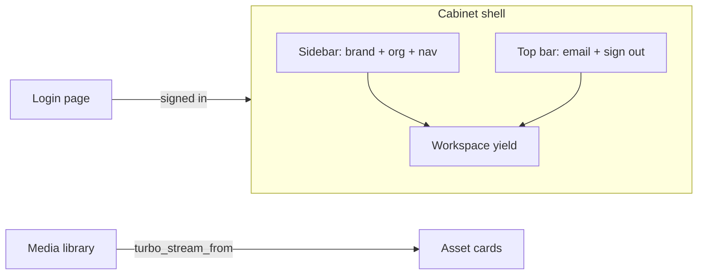

# Cabinet UI Redesign (Clean SaaS shell) - Plan

## Goal Capsule

- **Objective:** Светлая оболочка личного кабинета мультитенант SaaS (sidebar + workspace) на Tailwind 4 + daisyUI 5, с Hotwire-реактивностью; restyle layout, login и ключевых index-экранов без изменения доменной логики.
- **Product authority:** Product Contract ниже (origin brainstorm `docs/brainstorms/2026-08-05-cabinet-ui-redesign-brainstorm.md`) > этот Planning Contract.
- **Open blockers:** нет.
- **Execution profile:** code; UI-first, characterization/system coverage for shell and key screens; preserve existing Turbo Streams media-library behavior.
- **Stop conditions:** v1 готов по R1–R10; не расширять на show/edit формы, org switcher, dark theme, per-tenant брендинг.

---

## Product Contract

### Summary

Mediateca Broadcast — мультитенант SaaS для digital signage. Личный кабинет клиента сейчас визуально «сырой»: ссылки с underline, нет shell, нет tenant context. Нужен чистый SaaS-каркас с sidebar, явным именем организации, согласованными компонентами и живыми обновлениями медиатеки через Hotwire.

### Problem Frame

Операторы клиента работают в ЛК ежедневно (медиатека → ротации → группы экранов → медиапланы). Текущий layout не даёт ориентации в продукте и tenant-контексте, выглядит незавершённым для SaaS. Редизайн оболочки и ключевых списков должен поднять perceived quality без переписывания домена.

### Key Decisions

- **Каркас = sidebar + светлый workspace.** `(session-settled: user-directed — chosen over top-nav dark control-room / minimal refresh: удобнее для частых переключений разделов)` Governs R1, R2
- **Эстетика = Clean SaaS.** Нейтральные поверхности, один primary-акцент, много воздуха; без broadcast-театральности. `(session-settled: user-directed — chosen over broadcast-lite / corporate mono: мультитенант SaaS)` Governs R3
- **Tenant context вверху sidebar.** Бренд + `Current.organization.name`; switcher позже. `(session-settled: user-directed — chosen over top-bar only / email-only: tenant всегда на виду)` Governs R4
- **Объём v1 = оболочка + ключевые экраны.** Layout, login, Media library, index Rotations / Screen groups / Media plans. `(session-settled: user-directed — chosen over shell-only / full form pass)` Governs R5–R8
- **Реактивность = Hotwire.** Turbo Drive для навигации; существующие Turbo Streams медиатеки сохранить; Stimulus для локального UI (file picker, flash dismiss, drawer close-on-navigate при необходимости). `(session-settled: user-directed — chosen over SPA/Inertia rewrite: уже в стеке, не плодить клиентский роутер)` Governs R9, R10

### Actors

- A1. **Менеджер клиента** — авторизованный пользователь ЛК; работает внутри своей organization.
- A2. **Гость** — неавторизованный пользователь на экране login.

### Key Flows

- F1. Навигация по кабинету
  - **Trigger:** A1 открывает ЛК или кликает пункт меню.
  - **Actors:** A1
  - **Steps:** Видит sidebar (бренд, org name, разделы) + top bar (email, sign out); активный раздел подсвечен; Turbo Drive обновляет workspace без полной «перезагрузки ощущения».
  - **Outcome:** Ориентация в разделах и tenant context.
  - **Covered by:** R1, R2, R4, R9

- F2. Upload в медиатеке
  - **Trigger:** A1 загружает файл.
  - **Actors:** A1
  - **Steps:** Выбирает файл (Stimulus file-picker показывает имя) → Upload → flash notice → карточка появляется/обновляется; processing status обновляется через существующий `turbo_stream_from` / replace.
  - **Outcome:** Живая медиатека без ручного refresh для status updates.
  - **Covered by:** R6, R10

- F3. Sign in
  - **Trigger:** A2 открывает `/login`.
  - **Actors:** A2
  - **Steps:** Видит центрированную карточку логина (без sidebar кабинета); после успеха — redirect в ЛК с shell.
  - **Outcome:** Единый визуальный язык auth + cabinet.
  - **Covered by:** R5



### Requirements

**Shell**

- R1. Авторизованный кабинет использует drawer/sidebar layout: sidebar слева на `lg+`, toggle/drawer на меньших ширинах.
- R2. Sidebar содержит пункты: Media library, Rotations, Screen groups, Media plans; active state по текущему разделу.
- R3. Визуальный язык — Clean SaaS на daisyUI (btn, menu, card, alert, navbar/drawer, input); light theme по умолчанию.
- R4. Вверху sidebar отображаются бренд продукта и имя `Current.organization`.

**Screens**

- R5. Login — центрированная card-форма без cabinet sidebar.
- R6. Media library: page header, upload zone в card, grid карточек; сохранить Turbo Streams / card turbo_frame поведение.
- R7. Index Rotations / Screen groups / Media plans: page header + primary CTA + list/empty state в едином стиле shell.
- R8. Flash messages рендерятся как daisyUI alert в workspace (notice/alert), не ломая Turbo.

**Hotwire**

- R9. Навигация между разделами ЛК идёт через Turbo Drive; active nav пересчитывается сервером при каждом visit.
- R10. Существующие live-обновления media assets (`turbo_stream_from`, `turbo_stream.replace`, card `turbo_frame`) остаются рабочими после restyle.

### Acceptance Examples

- AE1. После login менеджер видит sidebar с названием своей organization и пункт Media library как active на `/` / media assets.
- AE2. Клик по Rotations подсвечивает этот пункт; URL меняется через Turbo; email и org остаются в shell.
- AE3. Upload PNG показывает flash success; после job карточка переходит в Ready без обязательного full reload (существующий stream-путь сохранён).
- AE4. На `/login` без сессии нет sidebar кабинета; форма в card.
- AE5. Пустой список Rotations показывает empty state, не «битую» разметку.

### Scope Boundaries

**In scope**

- daisyUI 5 подключение к `tailwindcss-rails` / Tailwind 4 CSS entry
- `app/views/layouts/application.html.erb` shell
- login view
- media assets index + media asset card component styles
- rotations / broadcast_point_groups / media_plans index views
- i18n keys для nav labels (media library в sidebar)
- минимальные Stimulus-доработки под shell (flash dismiss / drawer), без новых SPA-паттернов
- system/request specs на shell navigation и regression media upload

**Out of scope**

- show / new / edit формы (кроме визуальной совместимости унаследованных классов, если что-то «ломается» от theme)
- organization switcher / multi-org membership
- dark theme / theme toggle
- per-tenant branding (logo/colors)
- Avo admin restyle
- Inertia / React frontend
- изменение политик, моделей, API

### Assumptions

- A1. У пользователя ровно одна organization через `Current.user.organization` / `Current.organization` (как сейчас).
- A2. Root route остаётся `media_assets#index`.
- A3. Node/npm доступны в dev для пакета `daisyui` (сейчас `package.json` отсутствует — его нужно добавить).
- A4. Primary accent — daisyUI default `primary` на light theme (синий/фирменный daisy), без кастомного theme generator в v1.

### Open Questions

- Q1. **Deferred:** Нужен ли отдельный guest layout partial vs `content_for :layout` / conditional в том же `application` — решить при реализации U2.
- Q2. **Deferred:** Точные иконки пунктов sidebar (Heroicons SVG vs text-only) — не блокирует; text-only допустим в v1.

---

## Planning Contract

### Key Technical Decisions

- KTD1. **daisyUI через npm `@plugin "daisyui"` в CSS entry.** Добавить `package.json` + `daisyui`, в `app/assets/stylesheets/application.tailwind.css` — `@import "tailwindcss"` и `@plugin "daisyui" { themes: light --default; }`. `(session-settled: user-approved — chosen over pure utilities / CDN: workspace daisyUI 5 rules + Tailwind 4)`
- KTD2. **Shell = daisyUI `drawer` + `menu` + top `navbar` в workspace.** Sidebar fixed/open на `lg:drawer-open`; checkbox toggle для mobile. `(session-settled: user-approved — chosen over custom flex-only sidebar: меньше CSS, стандартные a11y паттерны daisy)`
- KTD3. **Active nav = server-side helper** (`current_page?` / `controller_path`), классы `menu-active` на `<li>`/`<a>`. Не хранить active state в Stimulus. `(session-settled: user-approved — chosen over client-side active tracking: Turbo Drive перерисует nav из layout)`
- KTD4. **Login без sidebar:** conditional в layout (`Current.user` → cabinet shell; иначе centered guest main). Один layout file, меньше файлов. `(session-settled: user-approved — chosen over separate layouts/guest: YAGNI для v1)`
- KTD5. **Hotwire boundaries:** не трогать broadcast/stream identifiers и `dom_id(..., :card)`; restyle только разметку/классы внутри card и index. Flash container с стабильным `id` для будущих turbo_stream flash (если уже есть — сохранить). `(session-settled: user-directed — preserve live media library)`
- KTD6. **Shared page chrome helpers/partials:** `_page_header` (title + actions) и единые class tokens для primary CTA / empty state, чтобы index-экраны не разъезжались. `(session-settled: user-approved — chosen over copy-paste classes per view)`

### Technical Design

**Foundation**

- Introduce Node dependency only for daisyUI (Tailwind itself остаётся на `tailwindcss-rails`).
- Ensure `.gitignore` ignores `node_modules` if missing.
- Theme: light only; semantic colors (`bg-base-100`, `bg-base-200`, `text-base-content`, `btn-primary`, `alert-*`).

**Shell structure (directional sketch, not final markup)**

```text
drawer.lg:drawer-open
  input#cabinet-drawer.drawer-toggle
  drawer-content
    navbar (mobile menu button + email + sign out)
    #flash
    main.workspace → yield
  drawer-side
    brand + org name
    menu: Media library | Rotations | Screen groups | Media plans
```

**Hotwire**

- Turbo Drive: default; avoid `data-turbo="false"` on nav links.
- Media library: keep `turbo_stream_from Current.organization, :media_library` and card `turbo_frame_tag dom_id(media_asset, :card)`.
- Stimulus: keep `file-picker`; optional `flash` auto-dismiss controller; drawer may rely on daisy checkbox + label (Stimulus only if Turbo morph/visit leaves drawer open incorrectly — verify in U2).
- Do not introduce Inertia or client router.

**Screens**

- Login: `card` + `fieldset`/`input` + `btn btn-primary`.
- Media library: upload in `card`; grid unchanged structurally; `Media::MediaAssetCardComponent` → daisy card classes + status badge.
- Indexes: header row + `btn btn-primary` CTA + `list` or stacked cards; empty → muted text / simple empty panel.

### Alternatives Considered

| Alternative | Why not |
|---|---|
| Pure Tailwind utilities without daisyUI | Больше custom CSS/классов; хуже консистентность кнопок/меню |
| Dark control-room theme | Отвергнуто как product direction для SaaS |
| Separate guest layout file | Лишний файл для одного экрана в v1 |
| Stimulus-driven SPA nav active state | Дублирует серверный render; хрупко с Turbo |

### Risks & Mitigations

| Risk | Mitigation |
|---|---|
| daisyUI + `tailwindcss-rails` plugin resolution fails without npm path | U1 первым шагом; проверить `bin/rails tailwindcss:build` |
| Restyle ломает system selector в `media_upload_spec` | Обновлять по i18n/labels, не по хрупким CSS; прогнать system spec |
| Drawer остаётся open после Turbo visit на mobile | Проверить вручную; при необходимости Stimulus `turbo:visit` → uncheck toggle |
| Index show/edit страницы выглядят «чужими» рядом с новым shell | Acceptable в v1 (out of scope); shell всё равно улучшит chrome |

### Execution Order

1. U1 Foundation (daisyUI)
2. U2 Shell layout + nav helper + flash
3. U3 Login
4. U4 Media library + card component
5. U5 Index pages
6. U6 Verification / spec updates

U3–U5 могут частично параллелиться после U2, но предпочтителен порядок выше для визуальной регрессии.

---

## Implementation Units

### U1. daisyUI foundation

**Goal:** Подключить daisyUI 5 к Tailwind 4 entry и убедиться, что CSS build зелёный.

**Files:**
- Create: `package.json`, `package-lock.json` (via npm)
- Modify: `app/assets/stylesheets/application.tailwind.css`
- Modify: `.gitignore` (добавить `node_modules` при отсутствии)
- Modify: `README.md` only if project already documents asset setup and npm step is required for contributors

**Patterns:** daisyUI 5 `@plugin "daisyui"`; existing `tailwindcss-rails` / `Procfile.dev` `tailwindcss:watch`.

**Test scenarios:**
- T1. `bin/rails tailwindcss:build` completes successfully after daisyUI install.
- T2. Built CSS contains a recognizable daisyUI utility/component marker (e.g. `.btn` or theme variable) — smoke check during implementation, not necessarily an RSpec.

**Dependencies:** none

---

### U2. Cabinet shell layout

**Goal:** Sidebar + top bar + flash + guest/cabinet conditional; Hotwire-friendly nav with active states.

**Files:**
- Modify: `app/views/layouts/application.html.erb`
- Create: `app/views/layouts/_sidebar.html.slim` (or `.erb` consistent with partials choice — prefer matching existing Slim in views)
- Create: `app/helpers/navigation_helper.rb` (active link helpers)
- Modify: `config/locales/mediateca.en.yml` (sidebar media_library label if missing under layouts)
- Optional Create: `app/javascript/controllers/flash_controller.js` and/or `drawer_controller.js` only if needed after manual Turbo check

**Patterns:** daisyUI drawer docs; existing `Current.user` / `Current.organization` in layout/controllers.

**Test scenarios:**
- T1. Signed-in request to root shows organization name and all four nav labels.
- T2. Visiting rotations index marks Rotations nav as active (assert `menu-active` or equivalent on that link).
- T3. Signed-out login page does not render cabinet sidebar nav items.
- T4. Sign out control still works (request or system).

**Dependencies:** U1

**Requirements:** R1, R2, R3, R4, R8, R9

---

### U3. Login restyle

**Goal:** Clean SaaS login card на guest layout path.

**Files:**
- Modify: `app/views/sessions/new.html.slim`
- Modify: `config/locales/mediateca.en.yml` only if new helper copy needed

**Test scenarios:**
- T1. Existing sessions request/system expectations still pass (sign in success/failure).
- T2. Login form uses daisyUI field/button classes and remains usable (labels via i18n).

**Dependencies:** U2

**Requirements:** R5

---

### U4. Media library restyle (Hotwire-preserving)

**Goal:** Upload card + grid/card visual upgrade without breaking Turbo Streams/Frames.

**Files:**
- Modify: `app/views/media_assets/index.html.slim`
- Modify: `app/components/media/media_asset_card_component.html.slim`
- Modify: `app/components/media/media_asset_card_component.rb` only if status badge helpers need class map updates
- Keep: `app/views/media_assets/_media_asset.html.slim` frame/`dom_id` contract
- Keep: `app/javascript/controllers/file_picker_controller.js` behavior (classes may change in view)

**Test scenarios:**
- T1. `spec/system/media_upload_spec.rb` passes.
- T2. `spec/requests/media_assets_spec.rb` turbo_stream update still replaces card.
- T3. Index still subscribes via `turbo_stream_from` (assert in view/request or keep characterization).

**Dependencies:** U2

**Requirements:** R6, R10

---

### U5. Index pages restyle

**Goal:** Rotations, Screen groups, Media plans index screens match shell chrome (header, CTA, list/empty).

**Files:**
- Modify: `app/views/rotations/index.html.slim`
- Modify: `app/views/broadcast_point_groups/index.html.slim`
- Modify: `app/views/media_plans/index.html.slim`
- Optional Create: `app/views/shared/_page_header.html.slim`

**Test scenarios:**
- T1. Request/system: signed-in indexes render title + new CTA + empty or list content.
- T2. Delete confirm on media plans index still wired (`turbo_confirm` preserved) if present.

**Dependencies:** U2

**Requirements:** R7

---

### U6. Shell navigation coverage

**Goal:** Свести verification по shell в устойчивые specs.

**Files:**
- Create: `spec/system/cabinet_shell_spec.rb` (or request spec if system flaky CI — prefer system for drawer/nav visible text)
- Modify: existing request/system specs only where selectors break due to restyle

**Test scenarios:**
- T1. Login → see org name in sidebar.
- T2. Navigate Media library → Rotations → Screen groups → Media plans; each shows expected heading; active nav updates.
- T3. Mobile drawer toggle reveals nav (optional if driver/viewport easy; otherwise document manual check).

**Dependencies:** U2–U5

**Requirements:** R1, R2, R4, R9 — AE1, AE2, AE4

---

## Verification Contract

- **Unit/request:** `bundle exec rspec spec/requests/media_assets_spec.rb spec/requests/sessions*` (and any new request specs added).
- **System:** `bundle exec rspec spec/system/media_upload_spec.rb spec/system/cabinet_shell_spec.rb` (plus rotation_reorder if layout changes affect it).
- **Assets:** `bin/rails tailwindcss:build` succeeds with daisyUI plugin.
- **Manual smoke:** login, sidebar nav across 4 sections, upload one image, confirm card status path still updates after job.
- **Quality:** no new RuboCop offenses in touched Ruby; Slim/ERB keep i18n (no hardcoded user-facing English beyond existing patterns).

---

## Definition of Done

- All Implementation Units U1–U6 complete.
- R1–R10 satisfied; AE1–AE5 covered by automated and/or recorded manual checks.
- Existing media Turbo Stream contract unchanged in identifiers/targets.
- No domain/model/API behavior changes.
- Out-of-scope items (org switcher, dark theme, form pages restyle) not started.
- Plan origin brainstorm decisions preserved.

---

## Appendix

### Origin

- Brainstorm: `docs/brainstorms/2026-08-05-cabinet-ui-redesign-brainstorm.md`
- Current shell baseline: `app/views/layouts/application.html.erb`
- Live media patterns: `app/views/media_assets/index.html.slim`, `app/views/media_assets/update.turbo_stream.erb`, `app/components/media/media_asset_card_component.html.slim`

### daisyUI install note (Tailwind 4)

```css
@import "tailwindcss";
@plugin "daisyui" {
  themes: light --default;
}
```

Requires `npm i -D daisyui@latest` alongside existing `tailwindcss-rails` watch/build.
