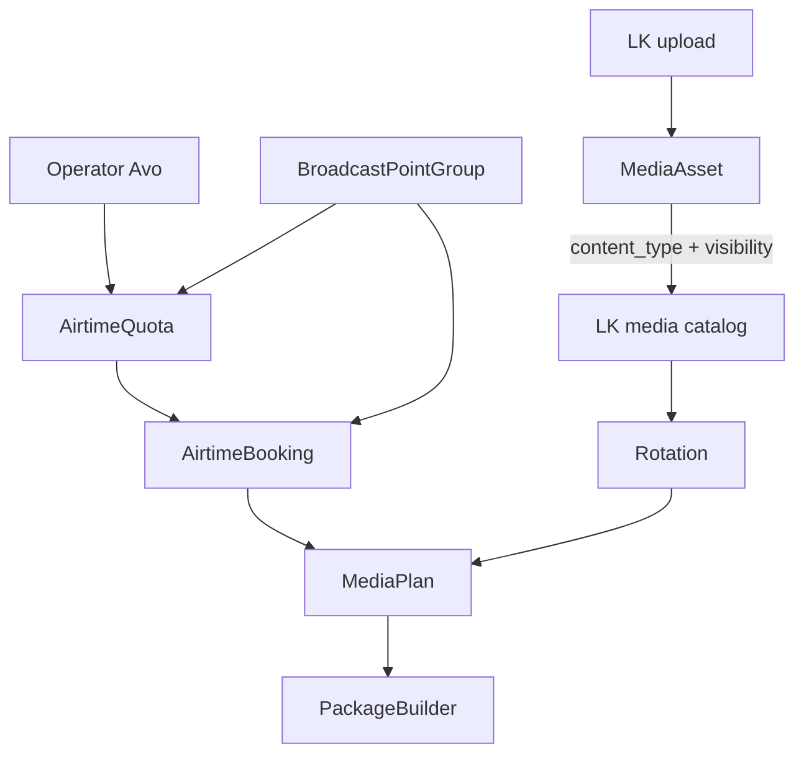
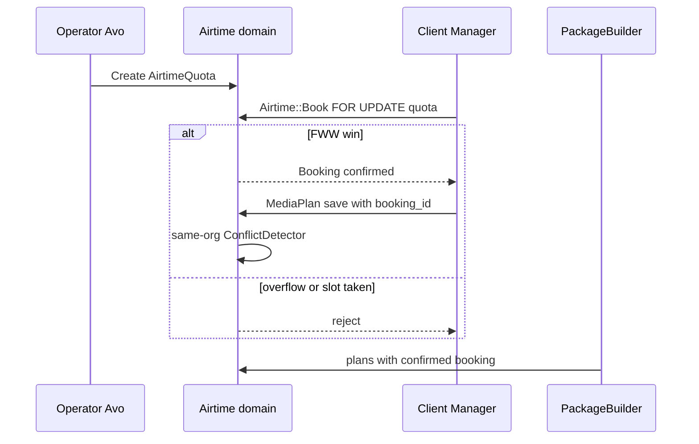
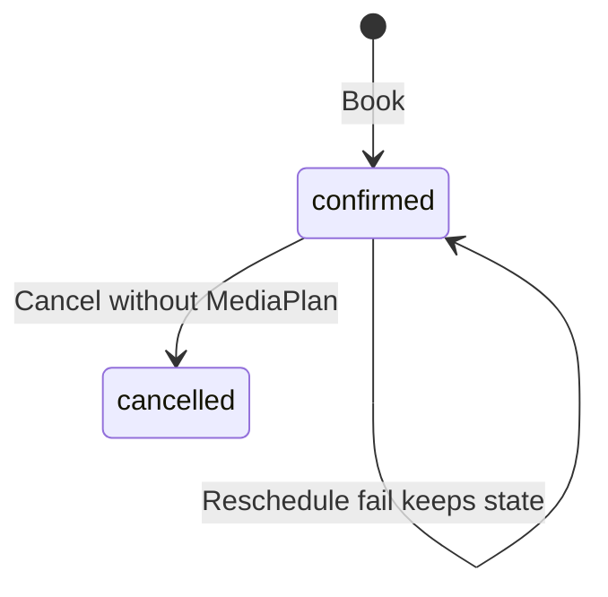
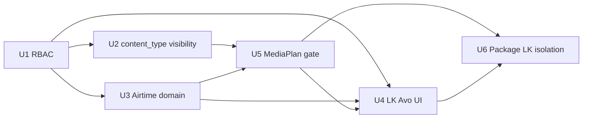

# Broadcast Hub MVP-2 (Airtime) - Plan

> **Примечание (2026-08-05):** gem **Avo** удалён из кодовой базы. Упоминания Avo / `/avo` / `app/avo` ниже — исторические; операторская админка будет заменена на **Administrate**.

## Goal Capsule

- **Objective:** Коммерческий слой Airtime поверх MVP-1: квоты в секундах, бронь/отмена/перенос (FWW), медиаплан только при валидной брони, типы контента и сетевая доступность медиа при загрузке, каталог ЛК (свои + shared чужих org), изоляция эфира по орг-циям, RBAC ролей ЛК.
- **Product authority:** Product Contract ниже (bootstrap из ТЗ MVP-2 + подтверждённый scoping 2026-08-05) > `specs/002-monitors-broadcast-tz/requirements-analysis.md` (v1.8 §3, FR-05, MVP-2) > `specs/002-monitors-broadcast-tz/implementation-plan-broadcast-hub.md` фазы A/D/E > этот Planning Contract. База кода — ветка после MVP-1 и `globalized fleet` (единый флот Screen; PointGroup/Device API сняты).
- **Open blockers:** нет.
- **Execution profile:** code; feature-bearing units — test-first для FWW/overflow/reschedule, MediaPlan↔booking gate, role denials.
- **Stop conditions:** срез готов по R16; не расширять на ScheduleItem loop/exact/fill, filler-генератор суточного эфира, отчёты XLS/PDF, оплату, «режим клиента» из Avo, Station Agent.

---

## Product Contract

**Product Contract preservation:** n/a (bootstrap; нет upstream requirements-only unified plan). Источник WHAT — ТЗ MVP-2 Airtime + session-settled scoping.

### Summary

Полный MVP-2 Airtime на едином флоте `Location → Station → Screen`: оператор задаёт квоты на группы точек трансляции; клиент бронирует / отменяет / переносит слоты (мгновенная фиксация, FWW, reject overflow); медиаплан создаётся/меняется только при валидной брони; при загрузке медиа manager указывает **тип контента** и **доступность другим организациям**; в медиатеке ЛК клиент видит файлы своей org плюс чужие, помеченные как доступные всем (типично нейтральный filler); клиент в содержимом эфира видит только свой блок; роли ЛК `manager` / `accountant` / `administrator`. Вне среза — Agent runtime, sync/транспорт, Scheduler (MVP-3), отчёты/финансы (MVP-5), impersonation, dual-fleet/PointGroup 001 (уже удалены).

### Problem Frame

MVP-1 дал иерархию, ротации, `BroadcastPointGroup`, MediaPlan-lite, prep `.ts`, Agent package/config/play_events — без коммерческого разделения эфирного времени, без ролей ЛК и без сетевого шаринга медиа. Текущий `MediaPlanConflictDetector` запрещает любое пересечение планов на screen×window **между всеми org**, что конфликтует с multi-org airtime. Нужен слой квот/броней с FWW, медиаплан после брони, RBAC, типы контента и явная доступность медиа другим org.

### Key Decisions

- **Ширина = полный MVP-2.** Квоты + бронь/отмена/перенос + типы контента + сетевая доступность медиа + изоляция эфира + RBAC. `(session-settled: user-directed — chosen over quotas-only thin slice)`
- **Медиаплан требует валидную бронь.** Create/update MediaPlan отклоняется без confirmed booking; окно плана ⊆ окно брони; группа совпадает. `(session-settled: user-directed — chosen over parallel lite without booking)`
- **Роли ЛК в этом срезе.** `manager` / `accountant` / `administrator` разграничены сразу. `(session-settled: user-directed — chosen over defer RBAC)`
- **Hub only.** Station Agent, sync/транспорт — вне среза. `(session-settled: user-directed — from MVP-1)`
- **Оплата сразу после брони не нужна.** `(session-settled: user-directed — from TZ)`
- **Единый флот.** Цель брони — существующий `BroadcastPointGroup` ↔ `Screen`; PointGroup/BroadcastPoint/ScheduleRule/Device API отсутствуют после `globalized fleet`. `(session-settled: user-directed — fact of code)`
- **«Режим клиента» из Avo** — вне среза; оператор мутирует брони клиентов напрямую в Avo.
- **Медиатека: тип + сетевая доступность при загрузке.** Manager при upload обязан указать `content_type` и visibility (своя org / доступно всем org); каталог ЛК = свои + network-shared чужих. `(session-settled: user-directed — chosen over org-private media library only / operator-only NeutralPool as sole share path)`

### Actors

- A1. **Оператор** — Avo: квоты, все брони всех клиентов, отмена/перенос, полный каталог медиа, полный эфир.
- A2. **Manager клиента** — ЛК: медиа, ротации, группы точек, бронь/отмена/перенос, медиапланы.
- A3. **Accountant клиента** — ЛК: только заготовка финансового раздела (отчёты вне среза); mutating airtime/media — запрещён.
- A4. **Administrator клиента** — полный функционал ЛК клиента.
- A5. **Broadcast Hub** — источник правды по квотам, броням, планам, package.
- A6. **Station Agent (вне среза)** — потребитель package; в срезе не реализуется.

### Key Flows

- F1. Оператор задаёт квоту
  - **Trigger:** Нужно выделить эфирное время на группу.
  - **Actors:** A1, A5
  - **Steps:** В Avo создаёт `AirtimeQuota` на `BroadcastPointGroup` × окно × `seconds_total` (опц. content_type); система считает остаток.
  - **Outcome:** Клиент видит свободные секунды/слоты для брони на своих группах.
  - **Covered by:** R1, R2

- F2. Бронь / отмена / перенос (FWW)
  - **Trigger:** Manager готовит размещение.
  - **Actors:** A2/A4, A1, A5
  - **Steps:** Бронирует секунды на группе в окне ⊆ квота; при гонке — FWW; overflow — reject; отмена возвращает секунды (если нет активного медиаплана — см. KTD5); перенос на свободный target (в т.ч. другая группа клиента), иначе исходная бронь жива; если после переноса linked MediaPlan выходит за новое окно — план **атомарно инвалидируется** (KTD4).
  - **Outcome:** Confirmed booking или явный отказ без порчи исходной брони.
  - **Covered by:** R3–R7; AE1–AE3

- F3. Медиаплан после брони
  - **Trigger:** Есть confirmed booking.
  - **Actors:** A2/A4, A5
  - **Steps:** Создаёт/правит MediaPlan с FK на booking; ready-gate ротации сохраняется; same-org overlap на screen — reject; cross-org на разных sub-windows — allow.
  - **Outcome:** План в эфире только при валидной брони.
  - **Covered by:** R8–R10; AE4–AE5

- F4. Изоляция и package
  - **Trigger:** Просмотр эфира в ЛК / pull package.
  - **Actors:** A2–A5, (A6 later)
  - **Steps:** Клиент на точке видит только свой блок; package станции — union всех org с booking-gated plans + org metadata.
  - **Outcome:** Multi-org на одном screen без утечки чужого контента в ЛК.
  - **Covered by:** R13, R14; AE6

- F5. Загрузка медиа и каталог ЛК
  - **Trigger:** Manager загружает ролик в медиатеку.
  - **Actors:** A2/A4, A5
  - **Steps:** Указывает файл, обязательный `content_type`, обязательную доступность (только своя org / доступно всем организациям); сохраняет. Другой клиент в своей медиатеке и при сборке ротации видит свои ассеты плюс чужие с visibility=network (например нейтральный filler).
  - **Outcome:** Нет «чужих приватных» файлов в каталоге; shared-нейтраль доступна для ротаций.
  - **Covered by:** R11, R12, R17; AE8

### Requirements

**Quotas and booking**

- R1. Оператор в Avo создаёт и правит квоты эфирного времени в **секундах** на `BroadcastPointGroup` × временное окно (опц. привязка к content_type).
- R2. Клиент видит остаток/свободные слоты по своим группам для бронирования; чужие брони видны как «занято» без раскрытия чужого контента.
- R3. Бронирование — **мгновенная фиксация**; конфликт на слот — **first-write-wins**; переполнение квоты — **reject**.
- R4. `manager` и `administrator` клиента бронируют/отменяют/переносят свои брони; оператор в Avo — любые.
- R5. Перенос на свободный целевой слот (в т.ч. другая `BroadcastPointGroup` того же client org); при занятости цели — отказ, исходная бронь без изменений; приоритет старого слота на цель не переносится.
- R6. На shared screen не допускаются **пересекающиеся по времени** confirmed-брони разных (и той же) org — инвариант на слое Book.
- R7. Отмена брони с активным MediaPlan — **reject** (сначала снять/инвалидировать план); иначе секунды возвращаются в квоту.

**MediaPlan gate**

- R8. Create/update MediaPlan требует confirmed `AirtimeBooking`; группа и org совпадают; окно плана ⊆ окно брони.
- R9. Ready-gate ротации (все ролики broadcast-ready) из MVP-1 сохраняется.
- R10. Overlap MediaPlan на screen×window проверяется **в пределах одной org**; cross-org на непересекающихся sub-windows разрешён.

**Content types and media visibility**

- R11. У `MediaAsset` есть коммерческий тип контента: `own` | `commercial` | `neutral` | `service` (отдельно от MIME `content_kind`). При загрузке в ЛК `manager`/`administrator` **обязан** указать `content_type` (не silent default без выбора в UI).
- R12. При загрузке в ЛК обязательна **доступность другим организациям**: `organization` (только своя org) | `network` (доступно всем client org в каталоге). Типичный кейс для `network` — нейтральный контент для заполнения пустот в ротации.
- R17. Каталог медиатеки и picker ротации в ЛК показывают: (a) все ассеты своей organization; (b) ассеты других org с `visibility=network`. Приватные ассеты чужих org **не** видны. Mutate (update/destroy) — только владелец-org (и оператор в Avo). Авто-вставка filler в package/сутки — **вне среза** (MVP-3); политика «при малом пуле повтор допустим» — документ/комментарий, не runtime.

**Isolation, package, RBAC**

- R13. В ЛК клиент видит содержимое эфира точки только по своим планам/броням; каталог флота — полный read-only.
- R14. Package станции включает booking-gated планы всех org на экранах станции; добавляет `organization_id` / `airtime_booking_id` в item; без ScheduleItem-merge.
- R15. Роли: `manager` — медиа/ротации/группы/бронь/медиапланы; `accountant` — только stub финансов (mutating airtime/media запрещён); `administrator` — весь ЛК.
- R16. Срез готов, когда квоты, бронь FWW/overflow/reschedule, MediaPlan↔booking, content_type+visibility upload, каталог своих+network, RBAC и изоляция ЛК + booking-gated package покрыты автотестами; без живого Агента.

### Acceptance Examples

- AE1. FWW брони
  - **Covers:** R3
  - **Given:** Квота на группу G с достаточными секундами; два клиента одновременно бронируют пересекающийся слот на shared screen.
  - **When:** Оба POST book.
  - **Then:** Ровно одна бронь confirmed; вторая rejected; остаток квоты уменьшен один раз.

- AE2. Overflow
  - **Covers:** R3
  - **Given:** `seconds_available = 600`.
  - **When:** Manager бронирует 900s.
  - **Then:** Бронь не создана; остаток без изменений.

- AE3. Reschedule fail
  - **Covers:** R5
  - **Given:** Бронь B1 на G1; целевой слот занят.
  - **When:** Manager переносит B1 на занятый слот.
  - **Then:** Отказ; B1 неизменна.

- AE4. MediaPlan без брони
  - **Covers:** R8
  - **Given:** Нет confirmed booking на group×window.
  - **When:** Manager сохраняет MediaPlan.
  - **Then:** Validation reject; план не сохранён.

- AE5. Plan window ⊄ booking
  - **Covers:** R8
  - **Given:** Booking [10:00,11:00].
  - **When:** MediaPlan [10:00,11:30].
  - **Then:** Reject.

- AE6. Multi-org same screen
  - **Covers:** R6, R10, R14
  - **Given:** Org A [10:00,10:30] и Org B [10:30,11:00] на одном screen; оба с планами.
  - **When:** Package для станции; Org A смотрит эфир в ЛК.
  - **Then:** Package содержит оба плана; ЛК Org A показывает только свой блок.

- AE7. Role denial
  - **Covers:** R15
  - **Given:** User role=`accountant`.
  - **When:** POST book / create MediaPlan / create Rotation (HTML/Turbo).
  - **Then:** Pundit denial — redirect + flash (existing app behavior); mutating action not applied.

- AE8. Shared media in foreign LK
  - **Covers:** R11, R12, R17
  - **Given:** Org A загрузила asset N с `content_type=neutral`, `visibility=network`; Org B загрузила asset P с `visibility=organization`.
  - **When:** Manager Org B открывает медиатеку / picker ротации.
  - **Then:** Видит свои ассеты + N; не видит P. Org B не может удалить/править N.

### Success Criteria

- Оператор задаёт квоты; два клиента не могут задвоить один screen×window (FWW + screen overlap).
- Manager проходит путь квота → бронь → медиаплан; без брони план не сохраняется.
- Upload требует content_type + visibility; каталог ЛК = свои + network-shared.
- Accountant не мутирует airtime/media; administrator — полный ЛК.
- Package не отдаёт планы без confirmed booking; ЛК не показывает чужой эфир.
- Существующие Agent API контрактные specs зелёные с учётом новых полей item.

### Scope Boundaries

**In scope**

- `users.role`, Pundit matrix для ЛК.
- `AirtimeQuota`, `AirtimeBooking`, domain `Airtime::Book|Cancel|Reschedule`.
- MediaPlan FK + validations; org-scoped conflict detector; Book-layer cross-org screen overlap.
- `MediaAsset` `content_type` + `visibility` на upload; policy scope свои+network; Avo полный каталог.
- Client LK booking UX; Avo quotas/bookings; on-air isolation in LK.
- PackageBuilder: booking gate + org/booking metadata.
- Fix stale Avo `Rotation#schedule_rules` field (блокер Avo после globalized fleet).

**Deferred for later**

- ScheduleItem loop/exact/fill и генератор суточного эфира (MVP-3).
- Авто-filler / генерация вставок из network-neutral в package (MVP-3).
- Отдельная сущность `NeutralPool` как обязательный CRUD — не нужна, если хватает `visibility=network` + `content_type=neutral` на `MediaAsset`.
- Отчёты XLS/PDF, финкалькулятор (MVP-5).
- «Режим клиента» / impersonation из Avo + `acted_by_operator_id`.
- Station Agent, heartbeat/alerts, sync/транспорт.
- Онлайн-оплата после брони.
- Idempotency-Key API для book (nice-to-have).

**Outside this slice's identity**

- CMS меню; native mobile; реализация Агента в этом репо.

### Dependencies / Assumptions

- MVP-1 контур (hierarchy, Rotation, BroadcastPointGroup, MediaPlan-lite, prep, Agent API) уже в коде.
- Пилотные данные MediaPlan без booking: при миграции планы без FK считаются невалидными для package; оператор/клиент пересоздаёт через бронь (чистый пилот, без synthetic backfill) — см. KTD8.
- PostgreSQL (EXCLUDE/`btree_gist` допустимы); CI на PG.
- Related docs: `requirements-analysis.md` §3/FR-05; `implementation-plan-broadcast-hub.md` фазы A/D/E; origin MVP-1 plan.

### Outstanding Questions

**Resolve Before Planning**

- (пусто — scoping confirmed 2026-08-05)

**Deferred to Implementation** — see end-of-doc Open Questions.

### Sources / Research

- `specs/002-monitors-broadcast-tz/requirements-analysis.md` — MVP-2, §3, FR-05, FR-03.3/03.5, FR-06.11.
- `specs/002-monitors-broadcast-tz/implementation-plan-broadcast-hub.md` — фазы A/D/E.
- `docs/plans/2026-08-01-001-feat-broadcast-hub-mvp1-plan.md` — база; dual-fleet assumptions superseded by code.
- Code: `MediaPlan`, `BroadcastPointGroup`, `Scheduling::MediaPlanConflictDetector`, `Agent::PackageBuilder`, `ApplicationPolicy`, `Rotations::ReorderItems` (lock pattern); commit `1e71c01` removed PointGroup/Device API.
- External (load-bearing): PG EXCLUDE + FOR UPDATE на quota row; reschedule = single txn reserve-new-before-release-old; concurrency specs with truncation + barrier.

---

## Planning Contract

### Key Technical Decisions

- KTD1. **`users.role` enum.** `manager` (default for new client users) | `accountant` | `administrator`. Operator-org users не используют ЛК-роли для Avo (Avo остаётся org.kind=`operator`). Helpers в `ApplicationPolicy`. Назначение/смена `users.role` — **только оператор в Avo**; client LK не принимает `role` в strong params / self-service. `(session-settled: user-directed — roles in slice; role assignment operator-Avo-only chosen over client administrator may promote)`
- KTD2. **Quota на client `BroadcastPointGroup`.** `AirtimeQuota` создаёт оператор в Avo на существующую группу клиента × UTC window × `seconds_total`; booking и MediaPlan используют ту же группу. `(chosen over separate operator inventory groups: matches TZ «объект брони = группа точек»)`
- KTD3. **FWW locking (screen-serialized).** Domain `Airtime::Book` в одной short transaction, owner = domain service: (1) serialize on **affected screen_ids** — authoritative mechanism is either denormalized `booking_screen_intervals` + partial GiST EXCLUDE `(screen_id, tstzrange)` for confirmed rows, **or** `pg_advisory_xact_lock` on sorted screen_ids before overlap checks; (2) `quota.with_lock` + check remaining + conditional decrement / `CHECK (seconds_remaining >= 0)`; (3) insert booking (+ materialize per-screen intervals). **Quota-row FOR UPDATE alone is insufficient** for R6/AE1 when two orgs lock different quota rows sharing a screen. Production requires EXCLUDE **or** advisory screen locks; both paths share one concurrency suite (two quotas, one shared screen). Business conflict → reject без retry (кроме deadlock). Pattern: `Rotations::ReorderItems` for txn+lock shape.
- KTD4. **Reschedule = one flat transaction.** Validate+reserve target first (may change `BroadcastPointGroup` within client org); on failure ROLLBACK — original untouched. Prefer in-place update; never cancel-then-book. Lock order: booking → screen locks → quota row(s) by ascending id. If linked MediaPlan would fall outside the new booking window → **atomically invalidate** the plan in the same transaction (status/flag; excluded from package and LK air); booking reschedule still succeeds. `(session-settled: user-directed — chosen over reject reschedule: keep booking move, drop invalid plan)`
- KTD5. **Cancel blocked by MediaPlan.** `Airtime::Cancel` reject if active MediaPlan references booking; client must destroy/invalidate plan first. `(chosen over auto-cascade: explicit operator intent)`
- KTD6. **ConflictDetector org-scoped.** `MediaPlanConflictDetector` filters `organization_id`; cross-org temporal exclusivity enforced in `Airtime::Book` via shared screen_ids.
- KTD7. **`content_type` ≠ `content_kind`.** New enum column `content_type` on `MediaAsset` (`own|commercial|neutral|service`); keep MIME `content_kind`. Upload form: required select (no silent skip). Existing rows backfill `own`.
- KTD8. **Legacy MediaPlan.** Migration adds `airtime_booking_id` null→NOT NULL after data cleanup: existing plans without booking deleted or left invalid and excluded from package until recreated (pilot clean-slate). Document in ops note.
- KTD9. **Network visibility on MediaAsset (not NeutralPool table).** Enum/column `visibility`: `organization` | `network` (names directional). Required on LK upload alongside `content_type`. `MediaAssetPolicy::Scope` (and rotation picker): `organization_id = current OR visibility = network`. Update/destroy only owning org (operator Avo: all). No separate `NeutralPool` model in this slice; shared neutrals = `content_type=neutral` + `visibility=network`. No filler algorithm in PackageBuilder. `(session-settled: user-directed — asset-level share flag chosen over operator-only NeutralPool entity)`
- KTD10. **Package = multi-org union, booking-gated; Agent-only.** Filter plans with confirmed booking covering plan window; add `organization_id`, `airtime_booking_id`. LK on-air endpoints **MUST NOT** call `Agent::PackageBuilder` — only org-scoped `MediaPlan` queries (regression test in U6).
- KTD11. **Accountant stub.** Policy denies create/update/destroy on media/rotations/groups/bookings/plans; **also denies** airtime/media index/show except finance stub route (option B — finance-prep reads deferred to MVP-5). HTML Pundit denials follow existing `redirect_back` + flash (not bare 403); reserve 403 for non-HTML if added later.

### Assumptions

- Deploy/CI PostgreSQL supports extensions needed if EXCLUDE chosen; implementer verifies `btree_gist` or falls back to locked overlap query (same unit).
- Default role `manager` для существующих client users при migration.
- Time windows через `Scheduling::TimeWindowResolver` (org TZ → UTC), как MediaPlan.

### High-Level Technical Design

### Sequencing

U2 parallel to U3 after U1. **U4 cancel/reschedule endpoints require U5** (MediaPlan FK + Cancel guard) — U4 may land booking create/list first, but cancel UX waits on U5.

### Implementation constraints

- Не реализовывать ScheduleItem / filler generator / impersonation / payment.
- Не восстанавливать PointGroup / Device API.
- Repo-relative paths only.
- Concurrency specs: real PG, truncation (не transactional fixtures) для FWW cases.

---

## Implementation Units

### U1. Client LK RBAC roles

- **Goal:** `users.role` + Pundit matrix; accountant не мутирует; manager/administrator сохраняют текущие client CRUD с разделением.
- **Requirements:** R15, AE7; KTD1, KTD11
- **Dependencies:** none
- **Files:**
  - `db/migrate/*_add_role_to_users.rb`
  - `app/models/user.rb`
  - `app/policies/application_policy.rb` (+ role helpers)
  - `app/policies/*_policy.rb` (media, rotation, broadcast_point_group, media_plan, …)
  - `app/avo/resources/rotation.rb` (remove stale `schedule_rules`)
  - `spec/policies/*_spec.rb`, `spec/models/user_spec.rb`
  - `spec/factories/users.rb`
- **Approach:** Enum on User; backfill client users → `manager`; policy methods `manager?`/`accountant?`/`administrator?`; mutating actions require manager|administrator (or operator via Avo path); accountant denied airtime/media reads except finance stub (KTD11). Role field editable only in Avo by operator (KTD1); no client self-service `role` param. Fix Avo Rotation field crash.
- **Execution note:** Policy specs first for matrix denials.
- **Test scenarios:**
  - Happy: manager creates rotation; administrator same.
  - Happy: Avo operator sets client user role.
  - Error: accountant POST media_plan / book → Pundit denial (AE7).
  - Error: client user cannot PATCH own/other `role`.
  - Edge: operator org user unaffected in Avo auth.
  - Integration: existing client CRUD still works for manager default.
- **Verification:** Policy + request denial specs green; Avo rotations page loads without schedule_rules.

### U2. content_type + network visibility + LK catalog

- **Goal:** Upload требует тип контента и доступность; каталог/picker = свои + network-shared.
- **Requirements:** R11, R12, R17; AE8; KTD7, KTD9
- **Dependencies:** U1 (policies for media)
- **Files:**
  - `db/migrate/*_add_content_type_and_visibility_to_media_assets.rb`
  - `app/models/media_asset.rb`
  - `app/policies/media_asset_policy.rb` (Scope: own ∪ network)
  - `app/controllers/media_assets_controller.rb`, strong params
  - `app/views/media_assets/*` (required selects for content_type + visibility)
  - `app/controllers/rotation_items_controller.rb` / rotation form pickers (same scope)
  - `app/avo/resources/media_asset.rb` (fields; operator sees all)
  - `spec/models/media_asset_spec.rb`
  - `spec/policies/media_asset_policy_spec.rb`
  - `spec/requests/media_assets_spec.rb`
  - factories update
- **Approach:** Columns `content_type`, `visibility` (`organization`|`network`); validate presence on create from LK; backfill existing → `content_type=own`, `visibility=organization`. Index/show via expanded policy_scope; destroy/update authorize owning org only. Rotation item attach must resolve media through same scope. No NeutralPool table. No PackageBuilder filler.
- **Patterns to follow:** existing `MediaAssetPolicy` + `resolve_tenant_scope` — extend Scope, do not open `scope.all` for clients.
- **Test scenarios:**
  - Happy: upload with content_type + visibility=network; appears in other org catalog (AE8).
  - Happy: own private asset listed for owner.
  - Error: upload without content_type or visibility → validation reject.
  - Error: Org B cannot destroy Org A network asset.
  - Edge: Org B does not see Org A `visibility=organization` asset (AE8).
  - Integration: rotation picker for Org B includes foreign network-neutral, excludes foreign private.
- **Verification:** Model/policy/request specs for AE8; no NeutralPool model in diff.

### U3. AirtimeQuota + Booking domain (FWW)

- **Goal:** Домен квот и броней с concurrency-safe Book/Cancel/Reschedule.
- **Requirements:** R3–R7; AE1–AE3; KTD2–KTD5
  - **Dependencies:** U1
  - **Files:**
  - `db/migrate/*_create_airtime_quotas_and_bookings.rb`
  - `app/models/airtime_quota.rb`, `airtime_booking.rb`, optional `booking_screen_interval.rb`
  - `app/domain/airtime/base_service.rb`, `book.rb`, `cancel.rb`, `reschedule.rb`
  - `app/domain/airtime/screen_overlap_guard.rb` (directional name)
  - `spec/domain/airtime/book_spec.rb`, `cancel_spec.rb`, `reschedule_spec.rb`
  - `spec/models/airtime_*_spec.rb`
  - `spec/factories/airtime_*.rb`
  - concurrency support under `spec/support/` if separate helper
- **Approach:** Schema sketch: `airtime_quotas(broadcast_point_group_id, starts_at, ends_at, seconds_total, seconds_remaining, optional content_type)`; `airtime_bookings(airtime_quota_id, organization_id, broadcast_point_group_id, starts_at, ends_at, seconds, status)` with `seconds = (ends_at - starts_at)` in seconds (or document discrete-slot rule). Book per KTD3 (screen serialization + quota lock). Reschedule may change group; re-run screen overlap under same locks; on window/group change that breaks linked MediaPlan ⊆ booking → **invalidate plan in same txn** (KTD4). Cancel plan-guard fully enforced in U5; U3 may stub Cancel without plan association until U5.
- **Patterns to follow:** `app/domain/service_object.rb` + namespace `BaseService`; `Rotations::ReorderItems` for transaction+lock; `Scheduling::MediaPlanConflictDetector` for overlap SQL shape; raise `ArgumentError` / domain error → controller 422 as in reorder.
- **Execution note:** FWW concurrency tests with truncation + barrier threads against real PG; implement Book test-first.
- **Test scenarios:**
  - Happy: book reduces remaining; cancel restores when no plan.
  - Error: overflow reject; AE2.
  - Error: concurrent book → one win (AE1).
  - Error: concurrent book via **two quotas sharing one screen** → one win (R6).
  - Error: reschedule to busy → original intact (AE3).
  - Happy: reschedule shrinks window under existing MediaPlan → booking moved, plan invalidated in same txn; package excludes plan.
  - Edge: adjacent non-overlapping windows both allowed.
  - Integration: booking org must own the BroadcastPointGroup.
- **Verification:** Domain + model specs; concurrency examples green in CI PG (truncation).

### U4. LK + Avo booking UX

- **Goal:** Клиент бронирует в ЛК; оператор видит/мутирует все квоты и брони в Avo.
- **Requirements:** R1, R2, R4; KTD2, KTD11
  - **Dependencies:** U1, U3; cancel/reschedule actions also depend on U5
  - **Files:**
  - `config/routes.rb`
  - `app/controllers/airtime_bookings_controller.rb` (and quotas read if needed)
  - `app/controllers/avo/airtime_quotas_controller.rb`, `airtime_bookings_controller.rb`
  - `app/avo/resources/airtime_quota.rb`, `airtime_booking.rb`
  - `app/policies/airtime_*_policy.rb`
  - `app/views/airtime_bookings/*`, sidebar link
  - `app/views/layouts/_sidebar.html.slim` (or current nav)
  - optional finance placeholder view for accountant
  - `spec/requests/airtime_bookings_spec.rb`
  - `spec/requests/avo/airtime_*_spec.rb`
  - `spec/policies/airtime_*_policy_spec.rb`
- **Approach:** Hotwire/daisyUI forms; occupied slots as «занято» with field allowlist (start/end + occupied only — no foreign booking_id/org name). TimeWindowResolver for params; Avo full cross-tenant. Controllers use `policy_scope(...).find`. Accountant: finance stub only.
- **Test scenarios:**
  - Happy: manager books via request; sees own bookings list.
  - Error: book other org group → redirect/not found.
  - Error: accountant book → Pundit denial (AE7).
  - Error: cancel/reschedule foreign booking_id → denial/not found (IDOR).
  - Integration: Avo operator cancels client booking (when no plan).
  - Edge: occupancy payload omits foreign booking/org identifiers.
- **Verification:** Request + Avo specs; nav entry visible for manager.

### U5. MediaPlan ↔ booking gate + conflict reconcile

- **Goal:** MediaPlan только с валидной брони; same-org conflict; legacy cleanup.
- **Requirements:** R7–R10; AE4–AE5; KTD5, KTD6, KTD8
  - **Dependencies:** U3 (U4 soft)
  - **Files:**
  - `db/migrate/*_cleanup_legacy_media_plans.rb` (or rake) then `*_add_airtime_booking_to_media_plans.rb`
  - `app/models/media_plan.rb`
  - `app/domain/scheduling/media_plan_conflict_detector.rb`
  - `app/controllers/media_plans_controller.rb`, views/forms
  - `app/domain/airtime/cancel.rb` (enforce plan guard)
  - `spec/models/media_plan_spec.rb`
  - `spec/domain/scheduling/media_plan_conflict_detector_spec.rb`
  - `spec/requests/media_plans_spec.rb`
  - `spec/domain/airtime/cancel_spec.rb` (update)
- **Approach:** Clean legacy plans without booking (KTD8) before NOT NULL FK; validations for booking state/window/group/org including `booking.organization_id` match; ConflictDetector adds org scope; Cancel uses plans association. Forms select booking from `policy_scope(AirtimeBooking)`.
- **Patterns to follow:** existing `MediaPlan` validations + `TimeWindowResolver`; extend detector rather than new parallel checker.
- **Execution note:** Characterization: update conflict specs for cross-org allow + same-org reject before changing detector.
- **Test scenarios:**
  - Happy: plan with booking saves (AE ready rotation still required).
  - Error: no booking → reject (AE4).
  - Error: plan exceeds booking window (AE5).
  - Error: cancel booking with plan → reject (R7).
  - Edge: cross-org adjacent plans on same screen allowed (AE6 setup).
  - Error: same-org overlapping plans still rejected.
  - Error: foreign-org `airtime_booking_id` → reject.
- **Verification:** Model/domain/request specs for gate + detector.

### U6. Package booking gate + LK on-air isolation

- **Goal:** Package только booking-gated; ЛК показывает клиенту только свой эфирный блок на точке.
- **Requirements:** R13, R14; AE6; KTD10
  - **Dependencies:** U5
  - **Files:**
  - `app/domain/agent/package_builder.rb`
  - `specs/002-monitors-broadcast-tz/contracts/agent-api-v1.md`
  - `app/controllers/fleet/screens_controller.rb` (or `on_air_controller`) — read-only per-screen air view
  - `app/views/fleet/screens/show.html.slim` (directional)
  - `config/routes.rb`
  - `spec/domain/agent/package_builder_spec.rb`
  - `spec/requests/api/agent/v1/packages_spec.rb`
  - `spec/requests/fleet/screens_spec.rb` (LK isolation)
- **Approach:** Filter media_plans joining confirmed bookings; add metadata fields; update contract doc. New LK read-only screen air view with org-scoped plans — **never** call `PackageBuilder` from LK. No filler. Agent package remains multi-org union.
- **Test scenarios:**
  - Happy: package includes two orgs’ plans with booking ids (AE6).
  - Edge: plan without booking excluded.
  - Edge: cancelled booking excludes plan.
  - Integration: client LK air view omits other org plans (AE6).
  - Error: unauthorized agent token still 401 (regression).
  - Integration: LK controllers do not reference `PackageBuilder`.
- **Verification:** Agent request + builder specs; contract updated; LK isolation assertion.

---

## Verification Contract

| Gate | Command / signal | Applies |
|------|------------------|---------|
| Unit/domain/request | `bundle exec rspec` targeted paths per unit | U1–U6 |
| Concurrency | PG + truncation FWW examples | U3 |
| Lint | `bin/rubocop` | changed Ruby |
| CI | `.github/workflows/ci.yml` | before merge |
| Contract | `contracts/agent-api-v1.md` vs package specs | U6 |
| Manual smoke | Avo quota → LK book → media plan → package curl | R16 |

AE1–AE7 must have automated coverage (concurrency for AE1).

---

## Definition of Done

**Global**

- [ ] R1–R16 выполнены в пилоте.
- [ ] AE1–AE7 покрыты автотестами.
- [ ] Device/PointGroup не восстановлены; Agent API specs green.
- [ ] Нет ScheduleItem/filler/impersonation/payment в diff.
- [ ] Stale Avo `schedule_rules` убран.
- [ ] Abandoned experiment code removed.

**Per unit**

- [x] U1: role matrix + accountant denials; Avo rotation loads.
- [x] U2: content_type + visibility on upload; catalog own∪network (AE8).
- [x] U3: Book/Cancel/Reschedule domain + FWW/overflow tests.
- [x] U4: LK book + Avo quota/booking.
- [x] U5: MediaPlan booking gate + org-scoped conflicts.
- [x] U6: booking-gated package + LK own-block view.

---

## System-Wide Impact

- **AuthZ:** role dimension added beside org.kind — все client policies пересматриваются.
- **Concurrency:** новые hot paths на quota rows — мониторить lock timeouts в staging; FWW specs требуют non-transactional fixtures.
- **Conflict semantics:** смена `MediaPlanConflictDetector` с global → org-scoped меняет поведение пилотных планов — покрыть characterization до правки.
- **Cancel ↔ plan:** операторы/менеджеры должны сначала снять MediaPlan (U5), иначе Cancel reject — отразить во flash/ошибке ЛК и Avo.
- **Agent contract:** additive fields on package items — version/etag naturally changes; consumers должны игнорировать неизвестные ключи.
- **Data:** legacy MediaPlan cleanup may delete pilot plans without booking.
- **Ops:** enable `btree_gist` if EXCLUDE used; document in deploy notes.

## Risks & Dependencies

| Risk | Mitigation |
|------|------------|
| MediaPlan global exclusivity blocks multi-org | U5 org-scope detector + Book screen overlap (KTD6) |
| FWW flaky in CI | Dedicated concurrency examples; real PG; truncation; `use_transactional_tests false` on those examples |
| Cross-quota shared screen race | KTD3 screen EXCLUDE or advisory locks — not quota lock alone |
| EXCLUDE unavailable | Advisory screen locks + interval table — still required, not optional soft path |
| Legacy plans break package | KTD8 clean-slate; package filter |
| RBAC scope creep into impersonation | Explicitly out of scope; Avo-only operator mutations |
| Network-shared media mistaken for full filler runtime | KTD9 catalog-only share; filler generator MVP-3 |
| Accidental leak of private foreign media in picker | Policy scope + AE8 request specs |

## Alternative Approaches Considered

| Approach | Why not |
|----------|---------|
| Thin slice: quotas only, defer roles/pool | Rejected — user directed full MVP-2 |
| Keep MediaPlan-lite without booking | Rejected — user directed booking gate |
| Soft-lock / hold then confirm | Conflicts TZ instant fixation |
| Cancel-then-book reschedule | Violates keep-original-on-fail |
| Reintroduce PointGroup | Removed in globalized fleet; BroadcastPointGroup is canonical |

## Documentation / Operational Notes

- Update `contracts/agent-api-v1.md` in U6 (additive item fields).
- Short ops note: legacy MediaPlan cleanup + optional `btree_gist`.
- Do not mark wide hub plan phases A/D/E fully done until this unified plan’s DoD is met.

## Open Questions

### Deferred to Implementation

- Calendar widget vs table for free slots.
- Whether quota `content_type` is required or optional filter.
- Exact package JSON keys (document in contract during U6).