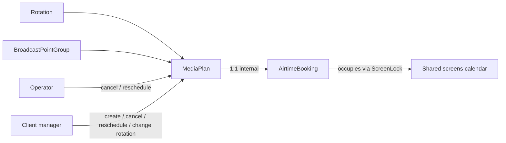
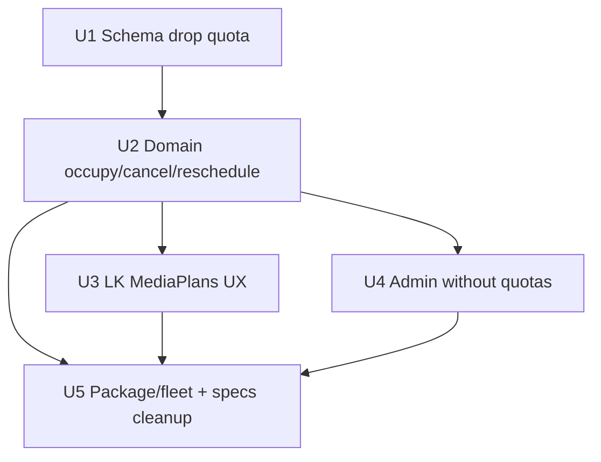

# Media Plan as Airtime Slot - Plan

## Goal Capsule

- **Objective:** Убрать операторские квоты и отдельную бронь из клиентского цикла: медиаплан (ротация + окно на группе) сам занимает свободный календарный слот на экранах группы; товар — весь незанятый календарь, без лимита ёмкости в секундах.
- **Product authority:** Product Contract ниже (session-settled brainstorm 2026-08-06) supersedes квота→бронь→медиаплан в `docs/plans/2026-08-05-002-feat-broadcast-hub-mvp2-airtime-plan.md` и соответствующие формулировки FR-05 / цикла в `specs/002-monitors-broadcast-tz/` **только для модели слота**. Остальной MVP-2 (типы контента, visibility, RBAC, изоляция эфира, package) остаётся в силе, пока не противоречит этому контракту. Surrounding MVP-2 areas are not active scope of this plan.
- **Open blockers:** нет.
- **Execution profile:** code; test-first для FWW create/reschedule и soft-cancel.
- **Stop conditions:** не возвращать `AirtimeQuota` как бюджет секунд; не строить отдельный UX холда без медиаплана; не трогать оплату, filler, ScheduleItem, Agent runtime.
- **Tail ownership:** `ce-work` / implementer owns unit verification; CI green before merge.

---

## Product Contract

**Product Contract preservation:** restructured, no scope change: Outstanding Questions resolved into Key Decisions / KTDs (booking kept internal; soft-cancel; occupancy on form). R1–R12 / A / F / AE IDs unchanged.

### Summary

Клиентский менеджер после группы точек сразу создаёт медиаплан на свободные интервалы экранов группы. Отдельных квот оператора и пункта «Бронирования» в ЛК нет. Слот появляется вместе с планом; перенос окна/группы — first-write-wins; смена ротации — отдельно. Оператор видит все планы и может отменять/переносить чужие, но не нарезает квоты. Миграция старых квот/броней не нужна (пустая БД).

### Problem Frame

Текущий MVP-2 цикл «оператор создаёт квоту → клиент бронирует → затем медиаплан» добавляет шаг без коммерческой ценности, пока эфир не продаётся пакетами секунд. На практике товар — свободные интервалы на shared screens. Отдельный холд без контента и бюджет `seconds_total` / `seconds_remaining` усложняют ЛК и админку.

### Key Decisions

- **Нет лимита ёмкости.** Весь свободный календарь на экранах группы продаётся; оператор не ограничивает «сколько эфира отдать». `(session-settled: user-directed — chosen over caps now/later: весь календарь — товар)` Governs R1, R2.
- **Слот = медиаплан.** Отдельного холда/брони без ротации нет; слот создаётся вместе с планом. `(session-settled: user-directed — chosen over hold-then-attach / operator-only hold)` Governs R3, R4.
- **Два вида правок.** Смена окна/группы = перенос слота (FWW); смена ротации = отдельное редактирование контента. `(session-settled: user-directed — chosen over all-in-place or recreate-only)` Governs R5, R6.
- **Оператор: полный контроль без квот.** Смотрит все планы; отменяет и переносит (окно/группу) любые клиентские; создание квот не нужно. `(session-settled: user-directed — chosen over view-only; supersedes brief view-only answer in dialogue)` Governs R7, R8.
- **ЛК: только «Медиапланы».** Пунктов «Бронирования» / «Квоты» в навигации клиента нет. `(session-settled: user-directed — chosen over bookings menu or occupancy-only nav)` Governs R9.
- **Миграция данных не нужна.** БД пустая; drop/replace схемы квот без backfill. `(session-settled: user-directed — chosen over migrate legacy rows)` Governs R10.
- **Booking остаётся внутренним слотом.** `AirtimeBooking` живёт как невидимая запись 1:1 под MediaPlan (cross-org FWW / ScreenLock); без UX брони. `(session-settled: user-directed — chosen over delete Booking entirely)` Governs R3, R4, R11.
- **Отмена = soft-status.** Активный план/слот переходят в cancelled (или эквивалент); hard destroy не освобождает слот как основной путь. `(session-settled: user-directed — chosen over hard destroy)` Governs R4, R7.
- **Занятость на форме медиаплана.** Панель занятых интервалов на new/reschedule форме; отдельного пункта меню нет. `(session-settled: user-directed — chosen over no occupancy UI)` Governs R2, R9.

<!-- ce-section: work-relationships -->
### How This Work Fits Together

This plan owns **модель эфирного слота** (что занимает время на экране и как этим управляют актёры).

Broader understanding (candidates, not committed roadmap):

- `docs/plans/2026-08-05-002-feat-broadcast-hub-mvp2-airtime-plan.md` — **Depends on / revises:** этот контракт заменяет квота→бронь→план в MVP-2; типы контента, visibility, RBAC, изоляция, package **Can proceed independently** insofar as they do not reintroduce quota capacity or a separate booking UX.
- Оплата / отчёты / filler / ScheduleItem — **Can proceed independently**; **Still to decide** timing relative to this model.
- Station Agent runtime — **Can proceed independently**; package gate = active MediaPlan + covering internal confirmed booking (R11).

### Actors

- A1. **Manager / administrator клиента** — создаёт, отменяет, переносит медиапланы-слоты; меняет ротацию.
- A2. **Оператор** — полный обзор; отмена и перенос чужих планов; без создания квот.
- A3. **Accountant клиента** — без mutating airtime/media (как в MVP-2 RBAC).
- A4. **Broadcast Hub** — источник правды по занятости экранов и планам.

### Key Flows

- F1. Создание медиаплана-слота
  - **Trigger:** Manager готов разместить ротацию на группе.
  - **Actors:** A1, A4
  - **Steps:** Выбирает группу, окно, ротацию; видит занятые чужими интервалы без чужого контента; submit атомарно занимает слот на экранах группы при отсутствии пересечений, иначе отказ (FWW).
  - **Outcome:** Активный план занимает календарь; чужие не могут пересечься на shared screens.
  - **Covered by:** R2–R4, R9

- F2. Перенос окна/группы
  - **Trigger:** Нужен другой интервал или другая группа той же org.
  - **Actors:** A1 или A2, A4
  - **Steps:** Задаёт новую цель; при свободности — атомарный перенос; при занятости — отказ, исходный план без изменений; ротация сохраняется, если совместима.
  - **Outcome:** Слот на новой цели или явный отказ.
  - **Covered by:** R5, R7

- F3. Смена ротации
  - **Trigger:** Другой контент на том же слоте.
  - **Actors:** A1 (и A2 при операторской правке контента, если админка это допускает для планов)
  - **Steps:** Меняет ротацию без смены окна/группы; ready-gate ротации сохраняется.
  - **Outcome:** Тот же слот, новый контент.
  - **Covered by:** R6

- F4. Отмена
  - **Trigger:** Слот больше не нужен.
  - **Actors:** A1 или A2, A4
  - **Steps:** Soft-cancel активного плана освобождает календарь на экранах группы.
  - **Outcome:** Интервал снова свободен для других.
  - **Covered by:** R4, R7

### Requirements

**Calendar occupancy (no capacity quota)**

- R1. Система не вводит и не требует операторского бюджета эфира в секундах на группу; лимита «сколько можно отдать клиентам» нет.
- R2. Свободное время = календарные интервалы на экранах группы, не пересекающиеся с активными медиапланами-слотами других (и той же) организаций на shared screens.
- R3. Создание медиаплана атомарно занимает выбранное окно на всех экранах группы при отсутствии пересечений; при конфликте — reject (first-write-wins).
- R4. Пока медиаплан активен, его окно блокирует пересекающиеся слоты на shared screens; отмена освобождает окно.

**Edits**

- R5. Смена `starts_at`/`ends_at` и/или группы = перенос слота: FWW на цели; при занятости цели исходный план не меняется.
- R6. Смена ротации не меняет занятость календаря (окно и группа прежние), при сохранении ready-gate и org/group invariants.

**Operator and LK**

- R7. Оператор в админке видит все медиапланы всех клиентов и может отменять и переносить (окно/группу) любые из них.
- R8. Оператор не создаёт и не сопровождает квоты эфирного времени как отдельную сущность продукта.
- R9. В навигации ЛК клиента есть «Медиапланы» для create/cancel/reschedule/change-rotation; пунктов «Бронирования» и «Квоты» нет.
- R10. Переход на эту модель не требует миграции существующих строк квот/броней (пустая БД); planning может удалить/заменить связанные сущности без backfill.

**Downstream consumers**

- R11. Package / эфирный срез станции включает только активные медиапланы-слоты, чьё окно покрывает запрошенный горизонт; чужой контент в ЛК по-прежнему не раскрывается через календарь занятости.
- R12. Overlap медиапланов на screen×window внутри одной org по-прежнему запрещён; cross-org на непересекающихся окнах разрешён при соблюдении R2–R3.

### Acceptance Examples

- AE1. FWW при создании
  - **Covers:** R3
  - **Given:** Два менеджера разных org одновременно создают медиапланы с пересечением на shared screen.
  - **When:** Оба submit.
  - **Then:** Ровно один план активен; второй получает отказ; календарь занят одним окном.

- AE2. Нет холда без плана
  - **Covers:** R3, R4, R9
  - **Given:** Клиент в ЛК.
  - **When:** Ищет способ занять время без ротации/медиаплана.
  - **Then:** Отдельного действия брони/холда нет; занятие возможно только созданием медиаплана.

- AE3. Перенос при занятой цели
  - **Covers:** R5
  - **Given:** Активный план A; целевое окно пересекается с чужим активным планом.
  - **When:** Manager или оператор переносит A на цель.
  - **Then:** Отказ; план A на старом окне/группе без изменений.

- AE4. Смена ротации
  - **Covers:** R6
  - **Given:** Активный план с окном W.
  - **When:** Меняют только ротацию на другую ready ротацию той же org.
  - **Then:** Окно W и занятость экранов не меняются; в эфире новая ротация.

- AE5. Отмена оператором
  - **Covers:** R4, R7
  - **Given:** Активный план клиента.
  - **When:** Оператор отменяет его.
  - **Then:** Интервал свободен; другой клиент может создать план на это окно.

- AE6. Нет квот в админке
  - **Covers:** R1, R8
  - **Given:** Оператор в админке.
  - **When:** Ищет создание/редактирование эфирных квот.
  - **Then:** Такой сущности/потока нет; управление эфиром — через медиапланы.

### Success Criteria

- Менеджер создаёт размещение без предварительного шага квоты/брони.
- Конфликты на shared screens решаются FWW без «переполнения квоты».
- В ЛК нет навигации квот/бронирований; в админке нет создания квот.
- Soft-cancel освобождает слот; внутренний booking остаётся согласован с планом.

### Scope Boundaries

**In scope**

- Продуктовая модель слота = медиаплан; внутренний booking; календарная занятость; UX ЛК/админки под это; согласование с package/изоляцией эфира.

**Deferred / out of scope**

- Оплата, отчёты XLS/PDF, filler/автозаполнение пустот, ScheduleItem loop/exact/fill.
- Station Agent runtime / sync.
- Лимиты ёмкости, пакеты секунд, квоты по типу контента.
- Отдельный UX холда слота без медиаплана.
- Миграция исторических `airtime_quotas` / `airtime_bookings` rows.
- Удаление сущности `AirtimeBooking` (остаётся internal).

### Dependencies / Assumptions

- MVP-1 иерархия `BroadcastPointGroup` ↔ screens и ready-gate ротаций уже есть.
- Multi-org на shared screens остаётся целевой моделью.
- Пустая БД в целевых средах для этого перехода — подтверждено.
- `ScreenLock` + `ScreenOverlapGuard` на confirmed bookings остаются каноном cross-org FWW.

### Outstanding Questions

**Deferred to Planning** — resolved in Planning Contract KTDs below (none blocking).

### Sources / Research

- `docs/plans/2026-08-05-002-feat-broadcast-hub-mvp2-airtime-plan.md` — предыдущая модель; KTD3 screen advisory locks.
- `specs/002-monitors-broadcast-tz/business-requirements-for-ad-director.md` — цикл и FR-05; этот контракт упрощает коммерческий слой.
- Existing: `app/domain/airtime/*`, `app/models/airtime_{quota,booking}.rb`, `app/models/media_plan.rb`, `app/controllers/media_plans_controller.rb`, `app/domain/agent/package_builder.rb`, Administrate admin airtime resources.
- Repo research (2026-08-06): MediaPlanConflictDetector org-scoped; cross-org exclusivity today lives only on booking Guard — keep internal booking for FWW.

---

## Planning Contract

### Key Technical Decisions

- KTD1. **Drop `AirtimeQuota` entirely.** Remove model, domain quota locks/decrements, admin resources, factories, specs, FK from bookings. No `seconds_total` / `seconds_remaining` / overflow path. `(session-settled product: no capacity)` Governs R1, R8, R10.
- KTD2. **Keep `AirtimeBooking` as internal 1:1 slot under MediaPlan.** No LK create/index/nav; created only inside MediaPlan create/reschedule domain. Window of booking == window of plan; same org/group. `(session-settled: user-directed — keep Booking)` Governs R3, R4, R11.
- KTD3. **Create = one transaction.** Domain service (e.g. `Airtime::OccupyWithPlan` or `MediaPlans::CreateSlot`): `ScreenLock` → `ScreenOverlapGuard` (confirmed bookings, all orgs) → insert confirmed booking (no quota) → insert active MediaPlan FK to booking. Reject `ConflictError` / validation without partial writes. Reuse half-open overlap predicate from `ScreenOverlapGuard`. Pattern: current `Airtime::Book` minus quota branch. Governs R3; AE1.
- KTD4. **Reschedule = in-place booking+plan update.** Same ScreenLock on old∪new screens; overlap exclude self; on failure ROLLBACK. Update booking window/group/seconds and plan window/group together. Rotation unchanged unless separately edited. Prefer adapting `Airtime::Reschedule` to no-quota path + sync MediaPlan in same txn (not cancel-then-create). Governs R5; AE3.
- KTD5. **Soft-cancel.** Add `cancelled` to `MediaPlan` status (keep `active` / `invalidated` as needed). Cancel domain sets plan `cancelled` + booking `cancelled` atomically. Cancelled/invalidated excluded from Guard, OccupancyPresenter, PackageBuilder, fleet on-air. Primary UX: cancel action, not `destroy`. `(session-settled: soft-status)` Governs R4, R7; AE5.
- KTD6. **Rotation-only update** stays on `MediaPlansController#update` without touching booking window/group. Governs R6; AE4.
- KTD7. **Remove LK booking surface.** Drop sidebar link, `AirtimeBookingsController` routes/views (or stub redirect); policies no longer expose client booking CRUD. Occupancy via `Airtime::OccupancyPresenter` on media plan new + reschedule forms. `(session-settled: occupancy on form)` Governs R9; AE2.
- KTD8. **Admin:** remove `AirtimeQuotas` (and booking CRUD as product surface if present). Operator cancel/reschedule via MediaPlans (Administrate custom actions or dedicated member routes calling same domain services). Admin root must not point at bookings index. Governs R7, R8; AE6.
- KTD9. **Package / fleet.** Keep join on confirmed covering booking + `MediaPlan.active` (not cancelled). Payload may retain `airtime_booking_id` for Agent contract compatibility unless contract update is trivial additive-removal — prefer keep field while booking exists. Governs R11.
- KTD10. **Same-org plan overlap** remains `Scheduling::MediaPlanConflictDetector` with `organization_id`. Cross-org exclusivity stays on booking Guard (KTD3). Do not widen detector to all-orgs while booking Guard exists — double enforcement ok if both agree; Guard is authoritative for FWW. Governs R12.

### Assumptions

- Pilot/dev DB empty enough to `drop_table :airtime_quotas` and nullify/remove `airtime_quota_id` without row backfill.
- Agent consumers tolerate existing `airtime_booking_id` on package items.
- RBAC manager/administrator/accountant from MVP-2 already in place for MediaPlan mutations.

### Implementation Constraints

- Execution direction: **test-first** for occupy/reschedule FWW (`spec/support/concurrency.rb` pattern from MVP-2) and soft-cancel freeing the slot.
- Repo-relative paths only in this plan.
- Do not reintroduce Avo; operator UI is Administrate.

### Sequencing

U1 before domain. U2 before UX. U3/U4 parallel after U2. U5 last (consumers + dead code purge).

### Sources & Research Summary

- Current FWW: `app/domain/airtime/screen_lock.rb`, `screen_overlap_guard.rb`, `book.rb` — keep locks; strip quota.
- Cancel today blocks if active plan — invert: cancel starts from plan and cascades booking (KTD5).
- MediaPlans form today requires `airtime_booking_id` (`media_plans_controller.rb`) — replace with group + window + rotation + occupy service.
- Admin root currently bookings — must retarget (KTD8).
- External research: not load-bearing (local patterns sufficient).

---

## Implementation Units

### U1. Schema: drop quotas, detach booking from quota, MediaPlan cancelled

- **Goal:** DB matches no-capacity model; booking has no quota FK; MediaPlan can be soft-cancelled.
- **Requirements:** R1, R8, R10; KTD1, KTD5
- **Dependencies:** none
- **Files:**
  - Create: `db/migrate/*_drop_airtime_quotas_and_add_media_plan_cancelled.rb`
  - Modify: `db/schema.rb`, `app/models/airtime_booking.rb`, `app/models/media_plan.rb`, `app/models/broadcast_point_group.rb`, `app/models/organization.rb` (drop quota assocs), factories
  - Delete: `app/models/airtime_quota.rb` (after code stop referencing — may land in U5 if safer)
- **Approach:**
  1. Migration: remove FK `airtime_bookings.airtime_quota_id`; drop `airtime_quotas` (empty DB).
  2. Add `cancelled` to MediaPlan status enum (string enum alongside `active` / `invalidated`).
  3. Update `AirtimeBooking` validations: drop `belongs_to :airtime_quota`; keep org/group/window/seconds/status.
  4. Factory `:airtime_booking` without quota; `:media_plan` builds booking only.
- **Test scenarios:**
  - Migration runs on empty DB.
  - Factory builds media_plan without quota.
  - MediaPlan accepts status `cancelled`.
- **Verification:** `bundle exec rspec spec/models/media_plan_spec.rb spec/models/airtime_booking_spec.rb`; migrate test/dev.

### U2. Domain: occupy / soft-cancel / reschedule without quota

- **Goal:** Atomic FWW create and reschedule; soft-cancel frees calendar; no overflow/quota paths.
- **Requirements:** R2–R5, R7; AE1, AE3, AE5; KTD2–KTD5, KTD10
- **Dependencies:** U1
- **Files:**
  - Modify: `app/domain/airtime/book.rb` (replace/rename) or add `app/domain/airtime/occupy_with_plan.rb`, `cancel.rb`, `reschedule.rb`, errors (drop/ignore OverflowError usage)
  - Modify: `app/domain/airtime/screen_overlap_guard.rb`, `occupancy_presenter.rb` (exclude cancelled)
  - Specs: `spec/domain/airtime/*`, `spec/support/concurrency.rb`
- **Approach:**
  1. OccupyWithPlan(org, group, rotation, starts_at, ends_at): validate window/group/screens/rotation ready; ScreenLock; Guard; create confirmed booking (seconds = duration); create active MediaPlan linked 1:1.
  2. SoftCancel(plan): lock plan+booking; set both cancelled; no «blocked by media plan» gate (plan is the entry point).
  3. Reschedule(plan, group, starts_at, ends_at): lock screens; Guard exclude booking; update booking+plan windows/group; on conflict raise and rollback.
  4. Remove quota remaining checks and OverflowError from happy paths.
- **Test scenarios:**
  - AE1 concurrent occupy on shared screen — one wins (concurrency helper).
  - Occupy rejects overlapping confirmed booking.
  - Soft-cancel then second org can occupy same window.
  - Reschedule to busy target fails; original unchanged.
  - Reschedule to free target moves booking+plan together.
  - Cancelled booking absent from OccupancyPresenter / Guard.
- **Verification:** `bundle exec rspec spec/domain/airtime/`

### U3. LK MediaPlans UX (create / occupancy / reschedule / cancel / rotation)

- **Goal:** Manager places airtime only via MediaPlans; no bookings nav; occupancy on form.
- **Requirements:** R6, R9; AE2, AE4; KTD6, KTD7
- **Dependencies:** U2
- **Files:**
  - Modify: `app/controllers/media_plans_controller.rb`, `app/views/media_plans/*`, `app/views/layouts/_sidebar.html.slim`, `config/routes.rb`, policies if needed, i18n
  - Remove or gut: `app/controllers/airtime_bookings_controller.rb`, `app/views/airtime_bookings/*`, booking routes
  - Specs: `spec/requests/media_plans_spec.rb`, `spec/requests/cabinet_shell_spec.rb`, remove/redirect `spec/requests/airtime_bookings_spec.rb`
- **Approach:**
  1. Form params: `broadcast_point_group_id`, `rotation_id`, `starts_at`, `ends_at` (no `airtime_booking_id`).
  2. `create` calls OccupyWithPlan; flash on ConflictError.
  3. Embed OccupancyPresenter for selected group on new + reschedule.
  4. Member routes: `cancel`, `reschedule` (GET form + PATCH); `update` rotation-only (reject window/group changes on update — force reschedule action).
  5. Remove sidebar «Бронирования»; cabinet shell spec asserts absence.
- **Test scenarios:**
  - Create plan without prior booking succeeds and occupies slot.
  - Conflict returns 422/unprocessable with message.
  - Occupancy partial renders occupied intervals without foreign org ids.
  - Rotation update keeps window.
  - Cancel soft-cancels; index hides or marks cancelled per UX choice (default: hide from default index or badge — prefer hide active-only list).
  - Sidebar has no airtime_bookings link (AE2).
- **Verification:** `bundle exec rspec spec/requests/media_plans_spec.rb spec/requests/cabinet_shell_spec.rb`

### U4. Admin: remove quotas; operator cancel/reschedule plans

- **Goal:** Operator manages airtime via MediaPlans only; no quota CRUD; admin root sane.
- **Requirements:** R7, R8; AE5, AE6; KTD8
- **Dependencies:** U2
- **Files:**
  - Delete/remove: `app/controllers/admin/airtime_quotas_controller.rb`, `app/dashboards/airtime_quota_dashboard.rb`, admin booking resources if they imply client booking UX (or keep read-only — prefer remove write paths; bookings not in nav)
  - Modify: `config/routes.rb` admin namespace, `app/views/admin/application/_navigation.html.erb`, `app/dashboards/media_plan_dashboard.rb`, admin media plans controller (custom cancel/reschedule)
  - Specs: admin request specs if present
- **Approach:**
  1. Unregister quota (and booking) from Administrate nav; root → media_plans or organizations.
  2. Wire cancel/reschedule actions on admin MediaPlan to same domain services (authorize operator).
  3. AE6: no path to create AirtimeQuota.
- **Test scenarios:**
  - Operator cancels client plan → slot free.
  - Operator reschedule conflict → original intact.
  - Admin navigation has no Quotas.
- **Verification:** admin request specs + manual smoke checklist in DoD.

### U5. Package/fleet gate + dead-code purge

- **Goal:** Consumers use active plan + confirmed covering booking; remove quota leftovers; specs green.
- **Requirements:** R11, R12; KTD9, KTD1
- **Dependencies:** U2, U3, U4
- **Files:**
  - Modify: `app/domain/agent/package_builder.rb`, `app/controllers/fleet/screens_controller.rb`, agent package specs, media_plan_conflict specs
  - Delete remaining: `AirtimeQuota` model/policy/admin/factories/specs; `Airtime::Book` quota branches; OverflowError if unused
  - Docs touch optional: note in agent contract that booking id remains internal metadata
- **Approach:**
  1. Ensure package/fleet filter `MediaPlan.active` + `AirtimeBooking.confirmed` + cover window; exclude cancelled.
  2. Grep purge `AirtimeQuota` / `seconds_remaining` / admin quotas.
  3. Fix factories and concurrency support tables list.
- **Test scenarios:**
  - Package includes active plan; excludes cancelled.
  - Fleet on-air org isolation unchanged.
  - No constant/load errors for removed quota code.
- **Verification:** `bundle exec rspec spec/domain/agent/ spec/requests/api/agent/ spec/requests/fleet/`; `bin/rubocop` on touched Ruby.

---

## Verification Contract

| Gate | Command | When |
|------|---------|------|
| Domain FWW/cancel/reschedule | `bundle exec rspec spec/domain/airtime/` | U2 |
| LK media plans + shell | `bundle exec rspec spec/requests/media_plans_spec.rb spec/requests/cabinet_shell_spec.rb` | U3 |
| Package + fleet | `bundle exec rspec spec/domain/agent/ spec/requests/api/agent/ spec/requests/fleet/` | U5 |
| Models | `bundle exec rspec spec/models/media_plan_spec.rb spec/models/airtime_booking_spec.rb` | U1+ |
| Lint | `bin/rubocop` on changed Ruby | before merge |
| CI | `.github/workflows/ci.yml` | before merge |

AE1 must have automated concurrency coverage. AE2–AE6 covered by request/domain specs above.

---

## Definition of Done

**Global**

- [ ] R1–R12 satisfied; AE1–AE6 automated.
- [ ] No `AirtimeQuota` in runtime code/nav/admin.
- [ ] No LK «Бронирования» nav or booking create UX.
- [ ] MediaPlan create occupies via internal booking; soft-cancel frees slot.
- [ ] Occupancy panel on media plan form.
- [ ] Operator can cancel/reschedule any client plan without quotas.
- [ ] Package/fleet exclude cancelled; FWW green under concurrency.
- [ ] No payment/filler/ScheduleItem/Agent runtime in diff.

**Per unit**

- [ ] U1: quotas dropped; booking without quota FK; cancelled status.
- [ ] U2: occupy/cancel/reschedule domain + FWW specs.
- [ ] U3: LK MediaPlans-only flow + occupancy + shell.
- [ ] U4: admin without quotas; operator actions.
- [ ] U5: consumers + purge + rubocop.

---

## System-Wide Impact

- **Concurrency:** hot path moves from Book-with-quota to OccupyWithPlan; keep `ScreenLock` — do not rely on org-scoped MediaPlanConflictDetector for cross-org FWW.
- **Admin IA:** root/nav leave bookings/quotas; operators learn MediaPlans as airtime control.
- **Agent contract:** `airtime_booking_id` remains while internal booking exists; document as opaque id.
- **Cancel semantics:** invert old «cancel booking blocked by plan» → cancel plan frees booking.
- **Data:** drop quotas without backfill (empty DB).

## Risks & Dependencies

| Risk | Mitigation |
|------|------------|
| Cross-org double-book if Guard bypassed | Only create/reschedule via domain + ScreenLock (KTD3/4) |
| Partial create (booking without plan) | Single transaction; tests assert atomicity |
| Admin still links to quotas | U4 nav + AE6 |
| Stale booking-only controllers | U3/U5 delete cluster |
| `invalidated` vs `cancelled` confusion | Document: cancelled = user/operator release; invalidated reserved for future auto-invalidation if any — soft-cancel uses `cancelled` |

## Deferred to Follow-Up Work

- Delete internal `AirtimeBooking` entirely (MediaPlan-only occupancy) — rejected for this slice; revisit later.
- Capacity caps / content-type quotas.
- Filler / ScheduleItem / payment.
