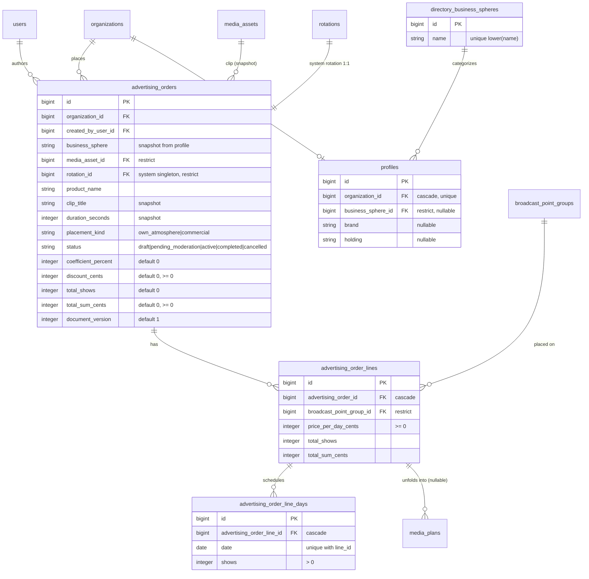

# Заказ на размещение (Advertising Order)

## Goal Capsule

**Objective:** Ввести в продукт документ «Заказ на размещение» (медиаплан-документ из ТЗ, образец — PDF «Триумф»): шапка с контрагентом/продуктом/роликом/ценами, строки по группам экранов, дневная сетка выходов; активация заказа разворачивает сетку в существующие MediaPlan-слоты через `Airtime::OccupyWithPlan`; замена ролика оформляется версией документа; печатная HTML-форма для приложения к договору.

**Product authority:** `docs/brainstorms/2026-08-27-media-plan-playlist-storage-brainstorm.md` (решения), `docs/brainstorms/2026-08-22-cabinet-requirements-brainstorm.md` (роли, «Медиаплан как документ заказа»), `tmp/Медиаплан и плейлист.md`, `tmp/2060.Медиаплан для ролика - Триумф.pdf`.

**Open blockers:** нет (все блокирующие развилки закрыты в брейншторме и KTD ниже; заказчиковские вопросы собраны в Outstanding Questions и не блокируют старт).

**Execution profile:** TDD обязателен (конституция III): Red → Green → Refactor; concurrency-спеки для активации по образцу `spec/support/concurrency.rb`; запуск тестов только `docker compose exec -e RAILS_ENV=test web bundle exec rspec`.

**Stop conditions:** не менять `Airtime::OccupyWithPlan`/`Cancel`/`Reschedule`, `ScreenOverlapGuard`, `ScreenLock`; не вводить удаление `AirtimeBooking`; не возвращать секундные квоты (AirtimeQuota — anti-pattern, CONCEPTS.md).

**Tail ownership:** после реализации — обновить журнал решений `specs/002-monitors-broadcast-tz/requirements-analysis.md` (отмена решения 2026-07-31 «заказ не выделяется») и добавить итоговый паттерн в `docs/solutions/`.

## Product Contract

### Summary

Менеджер создаёт заказ на размещение ролика: шапка (контрагент, сфера деятельности, продукт, ролик, коэффициент, скидка), строки по местам размещения (группа экранов, цена за день), дневная сетка выходов по каждой строке. При активации заказ разворачивается в MediaPlan-слоты (эфир занят по существующим FWW-правилам). Заказ имеет печатную форму — приложение к договору. Замена ролика в активном заказе — без пересоздания эфира, новой версией документа.

### Problem Frame

Сегодня размещение — ручное создание отдельных слотов (`media_plans#new`): нет коммерческой оболочки (контрагент, цена, сумма), нет сетки «дни × выходы», нет документа для договора. Менеджер вынужден вбивать окна руками, а приложение к договору готовить вне системы. При этом эфирная механика слотов полностью работоспособна и трогать её нельзя.

### Key Decisions

- **D1. Заказ порождает слоты** (session-settled: user-directed — chosen over эволюция MediaPlan и параллельный документ). Заказ — коммерческая правда; слот — эфирная правда. Разворачивание только через `Airtime::OccupyWithPlan`. Governs R5, R6.
- **D2. Нормализованная сетка дат** (session-settled: user-directed — chosen over jsonb-сетка). `order → lines → line_days`; прочерк в сетке = отсутствие строки-дня. Governs R3, R9.
- **D3. Кратность с подтверждением** (session-settled: user-directed — chosen over добивка остатка и автоокругление). Выходы в день должны делиться на часы работы; при неделимости форма предлагает ближайшие достижимые значения, в документе фиксируется фактическое. Governs R4.
- **D4. Замена ролика — новая версия документа** (session-settled: user-directed — chosen over тихая замена и запрет). Снапшот ролика в шапке обновляется, `document_version` инкрементируется, печатная форма перевыгружается. Механика — по KTD2 (без пересоздания слотов). Governs R8.
- **D5. Печатная форма — server-rendered HTML** (session-settled: user-directed — chosen over серверный PDF сейчас). Print-лейаут, CSS `@page`, блоки месяцев по ТЗ; PDF для ЭДО — отдельной задачей позже. Governs R10.
- **D6. Документ — новое имя** (session-settled: user-directed — chosen over переименование слота). `AdvertisingOrder`; слот остаётся `MediaPlan`; CONCEPTS.md уже содержит термин. Governs R1.
- **D7. Модерация чужого эфира — вне эпика.** Статус `pending_moderation` заложен в enum, переход не реализуется; commercial-размещение на чужих экранах остаётся доступным напрямую, как сейчас для слотов (Аллея → Командор). Governs R7, Scope Boundaries.
- **D8. Сфера деятельности — справочник оператора + профиль организации** (session-settled: user-directed — две итерации уточнения: профиль вместо поля заказа, затем справочник для значений профиля). Модель `Directory::BusinessSphere` (пространство имён «Справочник»): значения заводит оператор в админке заранее (напр. «Ритейл», «СМИ, Полиграфия, Рекламное Агентство»). `Profile` организации (1:1): `business_sphere_id` (FK в справочник), `brand`, `holding` (холдинг объединяет бренды: Командор → Командор/Аллея/Хороший); заполняется оператором при создании организации, сфера выбирается из справочника. В заказе сфера — **снапшот-строка названия** из профиля на момент создания: печатная форма не меняется задним числом ни при правке профиля, ни при переименовании/удалении значения справочника. Governs R1, R2.
- **D9. Оператор оформляет заказы от имени клиентов** (session-settled: user-directed). По просьбе клиента оператор создаёт и ведёт заказ в `/admin`: выбирает организацию-контрагента, дальше тот же контур, что у клиента (снапшот сферы — из профиля выбранной организации, ролик — из её медиатеки, группы — её + commercial-eligible). Фактический автор фиксируется в `created_by_user_id` (оператор). Реализация — кастомные `new/create` в `Admin::AdvertisingOrdersController` поверх shared-партиалов формы ЛК (KTD7): Administrate-конструктор форм для сетки «строки × дни» не используем. Governs R12, F7, U6.

### How This Work Fits Together

<!-- ce-section: work-relationships -->

Заказ — надстройка над контуром Airtime: порождённые слоты попадают в эфир через существующий package gate (`Agent::PackageBuilder` включает только активные слоты), в квоту — через существующий `CommercialQuota::Check`, в занятость — через `OccupancyPresenter`. Смежные будущие эпики (не скоуп): портрет эфира + генератор плейлистов (брейншторм 2026-08-27), модерация чужого эфира, эфирные справки (план из дней заказа × факт из PlayLog), финансы для бухгалтера.

### Actors

- **A1. Менеджер клиента** — создаёт/правит черновики, активирует, заменяет ролик, отменяет, печатает. Своя организация.
- **A2. Администратор клиента** — то же, что A1, плюс видит все заказы организации.
- **A3. Бухгалтер клиента** — read-доступ к заказам своей организации и печатной форме (первый финансовый артефакт; ранее — только finance-заглушка).
- **A4. Менеджер/администратор оператора** — read всех заказов и отмена через `/admin` (Administrate), по аналогии с чужими медиапланами; плюс **оформление заказов от имени клиентов по их просьбе** (D9): тот же жизненный цикл (черновик → правка сетки → активация → замена ролика), что у A1/A2, но с выбором организации-контрагента.

### Key Flows

**F1. Создание черновика.** Trigger: «Новый заказ» в ЛК. Actors: A1/A2. Steps: шапка (контрагент = своя организация по умолчанию; сфера деятельности подставляется снапшотом из профиля организации; продукт; ролик из медиатеки; коэффициент; скидка) → строки (группа экранов из своих + commercial-eligible, цена за день) → дневная сетка по строке (клетки по месяцам) → автоматический пересчёт итогов → сохранение (status `draft`). Outcome: заказ в `draft`, эфир не тронут. Covered by: R1–R4, AE1–AE3.

**F2. Активация.** Trigger: «Активировать» на черновике. Actors: A1/A2. Steps: валидация готовности (ролик broadcast_ready; у всех групп строк есть часы работы) → для каждой строки схлопывание цепочек дней в окна → `shows_per_hour = shows / часы_работы` → occupy каждого окна (per-slot FWW) → отчёт о покрытии. Outcome: занятые слоты активны; заказ → `active`, если занят хотя бы один слот; незанятые дни видны на странице заказа с действием «Занять повторно». Covered by: R5–R7, AE4–AE6.

**F3. Замена ролика.** Trigger: «Заменить ролик» на активном заказе. Actors: A1/A2. Steps: выбор нового ролика → предупреждение при отличии хронометража → подтверждение → swap в системной ротации (KTD2) → новый снапшот + `document_version += 1`. Outcome: со следующей выдачи пакета экраны играют новый ролик; печатная форма — новая версия; слоты и занятость не меняются. Covered by: R8, AE7.

**F4. Отмена.** Trigger: «Отменить заказ». Actors: A1/A2 (свои), A4 (любые, `/admin`). Steps: подтверждение → soft-cancel всех активных порождённых слотов через `Airtime::Cancel` → статус `cancelled`. Outcome: эфир освобождён; документ и суммы сохранены как история (коммерческая правда не переписывается). Covered by: R9, AE8.

**F5. Печатная форма.** Trigger: «Печать» на заказе. Actors: A1–A4. Steps: server-rendered страница с шапкой (как в PDF «Триумф») и сеткой, сгруппированной блоками по месяцам; прочерки для пустых дней; версия документа. Outcome: страница, готовая к печати/сохранению в PDF из браузера. Covered by: R10, AE9.

**F6. Завершение.** Trigger: ежедневная recurring-задача. Actors: система. Steps: `active`-заказы, у которых все даты в прошлом → `completed`. Outcome: архивная фильтрация работает. Covered by: R11.

**F7. Оформление заказа оператором.** Trigger: «Новый заказ» в `/admin` (клиент попросил по телефону/почте). Actors: A4. Steps: выбор организации-контрагента → форма идентична F1, но в контексте выбранной организации (сфера-снапшот из её профиля; ролики — её медиатека; группы — её + commercial-eligible) → сохранение черновика → активация по F2 с тем же отчётом о покрытии. Outcome: заказ принадлежит организации клиента и виден её менеджерам в ЛК; автор записи — оператор (`created_by_user_id`). Covered by: D9, R12, AE11.

### Requirements

- **R1.** Модели и миграции: `directory_business_spheres` (справочник: `name`, unique-индекс по `lower(name)` — прецедент `tags`), `profiles` (1:1 к организации: `business_sphere_id` FK в справочник — `on_delete: :restrict`, nullable; `brand`, `holding` — строки, nullable), `advertising_orders`, `advertising_order_lines`, `advertising_order_line_days`, `media_plans.advertising_order_line_id` (nullable FK, `on_delete: :restrict`); деньги — integer-копейки; строковые enum'ы; check-constraints (`shows > 0`, суммы `>= 0`); FK с осознанными `on_delete` (строки/дни — cascade от заказа; профиль — cascade от организации; media_asset, справочник — restrict с понятной ошибкой).
- **R2.** Шапка: `organization_id`, `created_by_user_id`, `business_sphere` (строка-снапшот названия из `organization.profile.business_sphere` на момент создания; пустой профиль/сфера не блокируют заказ), `product_name`, `media_asset_id` + снапшоты `clip_title`, `duration_seconds`, `rotation_id` (системная ротация-одиночка, KTD2), `placement_kind` (own_atmosphere/commercial), `coefficient_percent` (default 0), `discount_cents` (default 0), `total_shows`, `total_sum_cents`, `document_version` (default 1), `status` (draft/active/cancelled/completed; `pending_moderation` — зарезервирован, переход не реализуется).
- **R3.** Строки и дни: строка — `broadcast_point_group_id` + `price_per_day_cents` + денормализованные итоги; unique `(order_id, group_id)`; день — `(line_id, date) → shows`, unique, check `shows > 0`.
- **R4.** Кратность: при сохранении сетки каждое значение `shows` валидно только если `shows % мин_часы_работы_локаций_группы == 0`... нет — `shows = shows_per_hour × operating_hours`; валидация: `shows` делится на целые часы работы наименее работающей локации группы за этот день. При неделимости — 422 с перечнем ячеек и ближайшими достижимыми значениями (↓/↑). Строка без `locations_with_operating_hours?` не принимается.
- **R5.** Разворачивание: `Advertising::ActivateOrder` — по каждой строке схлопывание непрерывных цепочек дат в окна (границы окон — локальные полуночи в TZ организации → UTC), `shows_per_hour = shows / часы`; occupy каждого окна отдельным вызовом `Airtime::OccupyWithPlan` (per-slot FWW; мегатранзакцию не делать). Конфликтные окна — в отчёт, не откатывают занятые.
- **R6.** Инвариант commercial-канала: для `placement_kind=commercial` строки — только свои группы или `owner_homogeneous` чужие (правило `PlacementChannel` применится внутри occupy; домен заказа обязан отдавать понятную ошибку строки, а не сырое исключение).
- **R7.** Квота: после активации `CommercialQuota::Check` агрегируется в ОДИН flash по всему заказу (не warning на слот).
- **R8.** Замена ролика: только `broadcast_ready?` ролики; снапшот обновляется; `document_version` инкрементируется; слоты не пересоздаются; при отличии хронометража — явное предупреждение в UI (цикл ротации и квота-числитель изменятся).
- **R9.** Отмена: `Advertising::CancelOrder` — soft-cancel всех active-слотов заказа через `Airtime::Cancel` (устойчив к not-ready ротации); статус `cancelled`; суммы документа не пересчитываются. Draft можно удалить (destroy, каскад строк/дней/системной ротации); не-draft — только cancel.
- **R10.** Печатная форма: отдельный print-лейаут, блоки месяцев по ТЗ (первый блок — с первой даты размещения текущего месяца; если размещение ≤ 31 дня — оба задействованных месяца одной строкой-блоком), прочерки пустых дней, итоги по строке (выходов, цена дня, сумма), общие итоги, скидка, «ИТОГО со скидкой», версия документа, подписи.
- **R11.** Завершение: recurring-задача (Solid Queue, `config/recurring.yml`, production) — `active` → `completed`, когда все даты заказа в прошлом (по TZ организации).
- **R12.** Авторизация: `AdvertisingOrderPolicy` — index/show/print: менеджер/администратор/бухгалтер своей организации; create/update/activate/replace_clip/cancel: менеджер/администратор своей организации; destroy: только draft; Scope — тенантный (`resolve_tenant_scope`); оператор в `/admin` — read + cancel (Administrate dashboard) и полный жизненный цикл от имени любой организации (кастомный admin-контур, D9).
- **R13.** Локализация: ru + en зеркально (`mediateca.ru.yml` / `mediateca.en.yml`): модели, атрибуты, ошибки валидации, enum'ы, ключи вью по неймспейсу.
- **R14.** Журнал решений: `specs/002-monitors-broadcast-tz/requirements-analysis.md` §11/§12 — зафиксировать отмену решения 2026-07-31 «заказ и размещение не выделяются» со ссылкой на этот план и брейншторм 2026-08-27.

### Acceptance Examples

- **AE1.** Менеджер создаёт заказ: 2 строки (своя группа, чужая owner-homogeneous), сетка 03.06–30.06 по 36 выходов → черновик с `total_shows` = сумма по дням, `total_sum_cents` = Σ(дни × цена_дня) строк − скидка.
- **AE2.** Ввод 36 выходов при 11 часах работы → 422, в ответе для ячейки предложены 33 и 44; после выбора 44 сохранено, в заказе 44.
- **AE3.** Строка с группой без часов работы → ошибка строки, заказ не сохраняется.
- **AE4.** Активация: цепочка 03.06–30.06 → одно окно; shows_per_hour = 36/12 = 3; слот active, booking confirmed; в пакете станции ролик появляется (существующий package gate).
- **AE5.** Активация с конфликтом: одно окно из трёх отклонено Guard → заказ `active`, на странице заказа дни конфликтного окна помечены незанятыми, доступно «Занять повторно»; занятые слоты не откачены.
- **AE6.** Commercial-активация на группе с квотой → один агрегированный flash-warning, а не N.
- **AE7.** Замена ролика: новый ролик готов → `document_version` 2, снапшот обновлён, слоты те же (id не изменились), занятость не пересоздавалась; печатная форма показывает v2.
- **AE8.** Отмена активного заказа: все порождённые слоты `cancelled`, букинги освобождены (Guard пропускает новые occupy на те же окна), заказ `cancelled`, суммы на документе прежние.
- **AE9.** Печатная форма заказа 25.12–05.01 (>31 дня): два блока «Декабрь 2026» и «Январь 2027», каждый с днями своего месяца; заказ на 20 дней с пересечением месяцев — один блок-строка.
- **AE10.** Бухгалтер открывает список и печатную форму — 200; создать/активировать — 403.
- **AE11.** Оператор оформляет заказ за клиента из `/admin`: выбирает организацию «Триумф», шапка подставляет сферу из её профиля, ролик — из её медиатеки; активация занимает слоты по F2; заказ виден менеджеру «Триумфа» в ЛК; `created_by_user_id` — оператор.

### Success Criteria

- Менеджер проходит путь «черновик → активация → печатная форма» без ручного ввода окон слотов.
- Оператор оформляет заказ за клиента из `/admin` без входа в ЛК клиента; заказ ничем не отличается от созданного клиентом (кроме авторства).
- Развёрнутые слоты неотличимы от ручных для PackageBuilder, квоты, занятости, флота.
- Ни один вызов активации не оставляет частично записанный слот (транзакционность per-slot), конфликты видны пользователю построчно.
- Нулевая регрессия существующего контура media_plans (все текущие спеки зелёные).

### Scope Boundaries

**Входит:** заказ (CRUD черновика, активация, повторное развёртывание незанятых дней, замена ролика версией, отмена, destroy draft), справочник сфер деятельности (CRUD оператора в `/admin`), профиль организации (сфера из справочника, бренд, холдинг — форма оператора в `/admin`), печатная HTML-форма, политики, админка read+cancel **и оформление заказов оператором от имени клиентов (D9)**, recurring-завершение, обновление журнала решений.

**Не входит (явно):** модерация чужого эфира (отдельный эпик; статус зарезервирован); серверный PDF; эфирные справки и отчёты план/факт; портрет эфира и генератор плейлистов (эпик 2 брейншторма 2026-08-27); правка сетки дат активного заказа (только замена ролика; правка дат — после MVP, см. Open Questions); пересчёт слотов при изменении часов работы/состава группы после активации; экспорт XLS; уведомления; аудит-лог изменений.

### Dependencies / Assumptions

- Эфирная механика (`Airtime::*`), квота, занятость, package gate — существующие, не меняются.
- `BroadcastPointGroup#locations_with_operating_hours?`, `Location::OperatingHours#operating_minutes_in_hour`, `Scheduling::TimeWindowResolver` — готовые строительные блоки.
- Коэффициент в шапке — справочное поле (как «-0%» в PDF «Триумф»); формула итога = Σ строк − скидка. Assumption, подтвердить с заказчиком (Outstanding Q2).
- Профиль организации может быть не заполнен (сфера пуста) — заказ не блокируется, снапшот `business_sphere` остаётся NULL, печатная форма рендерит пустое поле; оператор может заполнить профиль в `/admin` в любой момент (на уже созданные заказы это не влияет — снапшот).
- Часы работы локаций считаются в локальном времени локации; дни заказа — календарные дни в TZ организации заказчика. DST: длина UTC-окна может отличаться от локальных часов — `shows_per_hour` от этого не зависит; тесты на день перехода обязательны.

### Outstanding Questions

1. Нейтральный минимум 5/10 сек — относится к эпику портрета, здесь не блокирует.
2. Подтвердить формулу итога: коэффициент — справочно или входит в сумму (в PDF цены строк, видимо, уже с коэффициентом).
3. Правка сетки дат активного заказа (добавить/убрать дни) — включать в следующую итерацию? Механика известна: cancel-before-occupy по затронутым окнам, укорочение пересекающихся окон через `Airtime::Reschedule`.
4. Нужна ли история версий печатной формы (хранение v1 после замены ролика) или достаточно `document_version`?

### Sources / Research

- Брейншторм: `docs/brainstorms/2026-08-27-media-plan-playlist-storage-brainstorm.md`; роли и дельта: `docs/brainstorms/2026-08-22-cabinet-requirements-brainstorm.md`.
- Паттерн слота: `docs/solutions/architecture-patterns/media-plan-as-airtime-slot.md`; `CONCEPTS.md` (Advertising order, FWW, soft-cancel).
- Код: `app/domain/airtime/occupy_with_plan.rb:6-77`, `cancel.rb:5-38`, `reschedule.rb:5-77`, `app/models/media_plan.rb:37-160`, `app/controllers/media_plans_controller.rb`, `app/domain/commercial_quota/check.rb`, `app/models/location/operating_hours.rb`, `app/domain/scheduling/time_window_resolver.rb`.
- Конфликт решений: `specs/002-monitors-broadcast-tz/business-requirements-for-ad-director.md` (решение 2026-07-31) — отменяется, R14.

## Planning Contract

### Key Technical Decisions

- **KTD1. Пять новых таблиц + nullable FK на слоте.** `directory_business_spheres` (справочник), `profiles` (1:1 к организации), `advertising_orders`, `advertising_order_lines`, `advertising_order_line_days`. ERD ниже. Ручные слоты имеют `advertising_order_line_id = NULL` — обратная совместимость без миграции данных. Пространство имён «Справочник» в коде — `Directory::` (таблицы с префиксом `directory_*`); задел на будущие справочники оператора. `Profile` создаётся вместе с организацией (форма оператора в `/admin`, nested attributes; сфера — выбор из справочника); бренд и холдинг в этом эпике только хранятся и редактируются — группировка по холдингам («Командор» → Командор/Аллея/Хороший) — материал будущих эпиков прав и отчётов.
- **KTD2. Системная ротация-одиночка на заказ.** Слот ссылается на ротацию, заказ — на ролик; поэтому при создании черновика создаётся `Rotation` (organization заказа, `system_managed: true`, имя «Заказ №…») с одним `RotationItem` на ролик шапки; `advertising_orders.rotation_id` 1:1. Разворачивание occupy'ит слоты этой ротацией. **Замена ролика = замена `RotationItem` в этой ротации** — слоты не пересоздаются, новый ролик подъезжает через package gate при следующей выдаче. Это уточняет брейншторм-механику «cancel+occupy» для замены ролика: cancel/occupy остаётся только для будущей правки сетки дат (Outstanding Q3). Ротации с `system_managed` скрываются из списка ротаций медиатеки. Уточнение сознательное: меньше транзакций, нет FWW-риска, история слотов не разрывается.
- **KTD3. Разворачивание — per-slot, без мегатранзакции.** `Advertising::ActivateOrder.call(order:)` → `Result`-объект (Data.define: occupied_windows, conflicted_windows, quota_exceeded). Каждое окно — отдельный `OccupyWithPlan` в собственной транзакции; `Airtime::ConflictError` по окну → в отчёт, цикл продолжается. Схлопывание: сортировка дат строки, непрерывные цепочки (date+1 == next) → окно `chain.first 00:00 … chain.last+1 00:00` локальных → UTC через `Time.find_zone!(organization.time_zone)` (тот же механизм, что `TimeWindowResolver`).
- **KTD4. Частота из делимости.** `shows_per_hour = day.shows / operating_hours_count`, где часы — минимум среди локаций группы за этот день (`operating_minutes_in_hour` по часам расписания; выходные с 0 часов дня в цепочку не входят — день с shows>0 при 0 рабочих часах невалиден на вводе). Неоднородные часы в группе: валидно, по минимуму + предупреждение-подсказка в форме строки (фактические выходы на более длинных точках будут выше — коммерчески безопасно: клиент получает ≥ оплаченного... нет — фиксируем строго: частота одна на слот, документ фиксирует `shows` по минимуму; расхождение факта — предмет эфирных справок, не этого эпика).
- **KTD5. Деньги — integer копейки** (`*_cents`, check `>= 0`). Пересчёт итогов — `Advertising::RecalculateTotals` при любом изменении строк/дней/скидки (вызывается из доменных сервисов заказа, не из колбэков модели). Хелпер отображения `money_display(cents)` → «34 020 ₽».
- **KTD6. Авторизация — Pundit**, паттерны `ApplicationPolicy` (`client_mutator?`, `resolve_tenant_scope`); бухгалтеру добавить read-предикат заказов (первое расширение его доступа за пределы finance-заглушки).
- **KTD7. UI — Slim + daisyUI + нативные формы** (прецедент `media_plans/_form`); сетка дней — клеточная таблица по месяцам (соответствует печатной форме), массовое заполнение диапазона — малый Stimulus-контроллер `order-grid` (values API, cleanup в `disconnect()`); занятость группы — существующим `Airtime::OccupancyPresenter` (без чужих id). Форма заказа — **shared-партиалы**: ЛК и admin-контур (D9) рендерят одну и ту же форму; в admin-варианте добавляется селект организации-контрагента, смена которого перезагружает форму в контексте выбранной организации (нативный GET, без SPA).
- **KTD8. Печатная форма — отдельный `print` layout + ViewComponent** `Advertising::PrintSheetComponent` (блоки месяцев: первый блок с первой даты; ≤31 дня — один блок через месяцы). CSS `@page` в print-стилях. Server-rendered, без JS.
- **KTD9. Завершение заказов** — `Advertising::CompleteExpiredOrdersJob` (Solid Queue recurring, production, ежедневно ночью): `active`, max(line_days.date) < сегодня по TZ организации → `completed`.
- **KTD10. Журнал решений specs/002 обновляется в этом же PR** (R14): отмена «заказ не выделяется» — иначе документы противоречат коду.

### Technical Design

#### ERD

#### Доменные сервисы (`app/domain/advertising/`)

- `Advertising::CreateOrder` — создание черновика: шапка + системная ротация-одиночка + снапшот ролика, в транзакции.
- `Advertising::UpdateGrid` — upsert строк/дней из параметров формы + валидация кратности (ошибки помечают ячейки: `day.errors` через несохранённые записи) + `RecalculateTotals`.
- `Advertising::ActivateOrder` — KTD3/KTD4; идемпотентен: повторный вызов занимает только незанятые дни (покрытие дня = существование active-слота этой строки, чьё окно пересекает локальный день).
- `Advertising::CancelOrder` — R9.
- `Advertising::ReplaceClip` — KTD2: swap `RotationItem` (новый media_asset broadcast_ready), снапшот, `document_version += 1`, пересчёт не требуется.
- `Advertising::RecalculateTotals` — KTD5.
- `Advertising::GridCoverage` — презентер покрытия сетки (дни без слотов) для страницы заказа.

#### Контроллеры и маршруты (ЛК)

`resources :advertising_orders` (index/show/new/create/edit/update/destroy) + member: `post :activate`, `post :cancel`, `get :print`, `get :replace_clip`, `patch :replace_clip`. Тонкие: валидация входа → доменный сервис → HTTP. Ошибки домена → `render` 422 по прецеденту `media_plans_controller.rb:45-48`. Админка: Administrate dashboard (read + member `cancel`, прецедент media_plans в `/admin`; `FORM_ATTRIBUTES` не используется) + **кастомные `new/create/edit/update/activate` в `Admin::AdvertisingOrdersController`** (D9): рендерят shared-партиалы формы ЛК, в шапке — селект организации-контрагента (все организации), доменные сервисы общие.

### Assumptions

- Системная ротация не нарушает инварианты ротаций (ready-валидация слота пройдёт: ролик заказа обязан быть `broadcast_ready?` до активации).
- Группа со смешанными часами допустима; частота по минимуму (KTD4). Если заказчик захочет строгую однородность — сужение валидации позже не ломает данные.
- Бухгалтер не видит чужие организации; цены видят менеджеры своей организации (это их закупка).

### Risks

- **R-1: объём эпика.** 4 таблицы + 7 сервисов + UI сетки + печать. Митигация: Units U1→U6 независимо сдаются, U5/U6 можно отрезать без потери целостности.
- **R-2: кратность-валидация раздражает.** Митигация: подсказка достижимых значений в форме до сабмита (часы работы известны серверу).
- **R-3: DST/високосность в схлопывании окон.** Митигация: окна строятся из локальных дат через зону (KTD3), тесты на 29 марта/25 октября 2026 и 29 февраля.
- **R-4: регрессия media_plans.** Митигация: изменение — только добавление nullable FK; весь существующий контур спеков гоняется в CI каждого Unit.

### Alternatives Considered

- Эволюция `MediaPlan` документными полями — отклонена (размывание инвариантов слота, D1).
- jsonb-сетка дат — отклонена (план/факт-отчётность по дням, D2).
- Мегатранзакция активации — отклонена (противоречит FWW per-slot; удержание advisory locks на всех экранах).
- Cancel+occupy при замене ролика — вытеснена KTD2 (swap в системной ротации без разрыва эфира); cancel/occupy зарезервирован для правки сетки.
- Форм-объект `app/forms/` — отклонён (прецедента нет; сетка обрабатывается доменным сервисом `UpdateGrid`, ошибки на моделях).

### Open Questions

- Q1. Хранить ли историю версий печатной формы (отдельная таблица снапшотов) — или `document_version` достаточно для MVP? (Рекомендация: достаточно; ЭДО-поток уточнит.)
- Q2. Подтверждение формулы итога с заказчиком (Outstanding Q2 Product Contract).
- Q3. Правка сетки активного заказа — следующей итерацией (механика описана, Outstanding Q3).

### Implementation Units Overview

| Unit | Содержание | Зависит от |
|---|---|---|
| U1 | Миграции, модели, валидации, фабрики, локали моделей | — |
| U2 | Домен: CreateOrder, UpdateGrid (+кратность), RecalculateTotals, ActivateOrder, CancelOrder, GridCoverage | U1 |
| U3 | ЛК UI: CRUD, форма сетки, активация с отчётом, отмена, политики, занятость | U2 |
| U4 | Замена ролика (ReplaceClip, версия, UI) | U3 |
| U5 | Печатная HTML-форма (layout, PrintSheetComponent) | U3 |
| U6 | Админка (Administrate + оформление заказов от имени клиентов), CompleteExpiredOrdersJob + recurring, журнал решений, README-гайд менеджера | U2, U3 |

## Implementation Units

### U1. Модели и миграции

- Миграции: `directory_business_spheres` (`name` string null: false + unique expression index по `lower(name)` — прецедент `tags`); `profiles` (`organization_id` FK cascade + unique index — 1:1; `business_sphere_id` FK `on_delete: :restrict`, nullable; `brand`, `holding` — string, nullable); `advertising_orders`; `advertising_order_lines`; `advertising_order_line_days`; `add_reference :media_plans, :advertising_order_line, null: true, foreign_key: { on_delete: :restrict }`; `rotations.system_managed` (boolean, default false, null: false) + `advertising_orders.rotation_id` (FK restrict, unique index — 1:1).
- Модели с валидациями: `Directory::BusinessSphere` (name: presence + case-insensitive uniqueness); `Organization has_one :profile, dependent: :destroy` + `accepts_nested_attributes_for :profile`; `Profile belongs_to :organization` + `belongs_to :business_sphere, class_name: 'Directory::BusinessSphere', optional: true`; enum'ы строковые; same-org инварианты (order.organization == lines.groups.organization для own; commercial — owner_homogeneous допускается, проверка при активации); `clip_title`/`duration_seconds` заполняются из media_asset при сохранении (если не заданы); `business_sphere` заполняется названием из `organization.profile.business_sphere` при создании заказа (снапшот, дальше не синхронизируется); scope `Rotation.managed`/`unmanaged`.
- Фабрики: `:directory_business_sphere` (`class: 'Directory::BusinessSphere'`), `:profile`, `:advertising_order` (traits `:draft`, `:with_lines`), `:advertising_order_line`, `:advertising_order_line_day`; trait `:with_profile` у `:organization`; хелпер сетки в `spec/support/advertising_network.rb`-стиле.
- Тесты: model-specs на валидации/инварианты/ассоциации (включая снапшот сферы: правка профиля или переименование значения справочника после создания заказа не меняет заказ); миграция обратима.
- DoD Unit: `docker compose exec -e RAILS_ENV=test web bundle exec rspec spec/models` зелёный.

### U2. Доменный контур заказа

- [x] Сервисы по Technical Design; `Result = Data.define(...)` у ActivateOrder.
- [x] Тесты (test-first, конституция III): domain-specs `spec/domain/advertising/`, включая concurrency-спек на параллельную активацию пересекающихся окон (образец `spec/support/concurrency.rb`), DST-дни, високосность, разрывы цепочек (выходные с 0 часов), идемпотентность повторной активации, агрегация квота-warning'а.
- [x] DoD Unit: `spec/domain/advertising` зелёный; ручные слоты без order_line_id не тронуты существующими спеками.

### U3. ЛК UI заказа

- Маршруты/контроллер/политика; страницы index (фильтры по статусу), show (покрытие сетки, «Занять повторно», «Заменить ролик», «Отменить», «Печать»), new/edit (шапка + строки + клеточная сетка по месяцам; Stimulus `order-grid` для массового заполнения диапазона; подсказка кратности строки).
- Обработка ошибок — по прецеденту media_plans (422 + flash); занятость группы — `OccupancyPresenter`.
- Тесты: request-specs (авторизация accountant read-only, тенантность), system-spec happy path «создать → сетка → активировать», component-spec при наличии компонентов.
- DoD Unit: request+system зелёные; i18n ru/en без missing keys.

### U4. Замена ролика

- `ReplaceClip` + UI (выбор ролика из готовых, предупреждение о хронометраже, подтверждение), инкремент `document_version`.
- Тесты: domain (swap, отказ на not-ready ролике, версия), request, system «заменить → в пакете станции новый ролик».
- DoD Unit: спеки зелёные; id слотов неизменны в тесте AE7.

### U5. Печатная форма

- Print layout + `Advertising::PrintSheetComponent` + print CSS (`@page`, блоки месяцев по ТЗ, прочерки, итоги, подписи, версия).
- Тесты: component-spec (блоки месяцев: 25.12–05.01 → 2 блока; 20 дней через месяц → 1 блок; прочерки), request print 200 для A1–A4.
- DoD Unit: визуальная сверка с PDF «Триумф» (структурно), спеки зелёные.

### U6. Админка, завершение, документы

- Administrate: dashboard заказа (read + cancel, `LocalizedSelectField` для enum'ов); **оформление заказов от имени клиентов (D9)** — кастомные `new/create/edit/update/activate` в `Admin::AdvertisingOrdersController`, shared-партиалы формы из U3, селект организации-контрагента с перезагрузкой формы в её контексте; **CRUD справочника** `Directory::BusinessSphere` (отдельный dashboard, значения заводит оператор заранее); **профиль в форме организации** — `Field::HasOne :profile` с nested attributes (сфера — `Field::BelongsTo` из справочника, бренд, холдинг — при создании и редактировании организации оператором); `Advertising::CompleteExpiredOrdersJob` + запись в `config/recurring.yml` (production); обновление `specs/002.../requirements-analysis.md` §11/§12; заметка в `docs/guides/manager-guide.md` о заказах.
- Тесты: job-spec (переход active→completed), request админки (CRUD справочника; создание организации с профилем и выбором сферы из справочника; restrict при удалении значения, используемого профилем; **AE11 — оператор создаёт и активирует заказ за клиента, автор — оператор, заказ виден в ЛК клиента**).
- DoD Unit: зелёные спеки; журнал решений обновлён.

## Verification Contract

- Полный прогон: `docker compose exec -e RAILS_ENV=test web bundle exec rspec` — зелёный, включая весь существующий контур.
- Покрытие нового кода — по конвенции SimpleCov проекта.
- Ручной чек-лист: AE1–AE10 в системных/реквест-спеках; concurrency-спек активации; DST-дни.
- Рубокоп/линтеры проекта без новых нарушений; annotaterb-аннотации обновлены.

## Definition of Done

- [ ] U1–U6 сданы, каждый со своим DoD.
- [ ] AE1–AE10 покрыты тестами.
- [ ] Печатная форма структурно соответствует PDF «Триумф» (шапка, сетка, итоги, скидка, подписи).
- [ ] Журнал решений specs/002 обновлён (R14); CONCEPTS.md не требует правок (термин Advertising order уже зафиксирован 2026-08-27).
- [ ] Документ-следствие: после сдачи — `docs/solutions/` паттерн «advertising-order-unfolds-to-slots» (уроки: системная ротация-одиночка, per-slot активация, кратность).

## Appendix

### Research notes

- Интерфейсы Airtime: `OccupyWithPlan.call(organization:, broadcast_point_group:, rotation:, starts_at:, ends_at:, placement_kind:, shows_per_hour:)` → MediaPlan; ошибки `Airtime::ConflictError | InvalidWindowError | ArgumentError | ActiveRecord::RecordInvalid`. `Cancel.call(plan:)` — soft через `update_columns` (устойчив к not-ready ротации). `Reschedule.call(plan:, broadcast_point_group:, starts_at:, ends_at:)`.
- Часы работы: `Location#operating_minutes_in_hour(local_time)`; `BroadcastPointGroup#locations_with_operating_hours?`; получение локаций группы — `group.screens.includes(station: :location).map { _1.station.location }.uniq` (прецедент `CommercialQuota::HourlyAllowance`).
- Формы ЛК: `form_with model:`, ошибки `full_messages`, `datetime-local` + `schedule_datetime_field_value`; селекты daisyUI `select select-bordered`.
- План конвенций: плашки `Goal Capsule → … → Definition of Done` соответствуют `docs/plans/2026-08-10-001-feat-commercial-quota-owner-groups-plan.md`.
