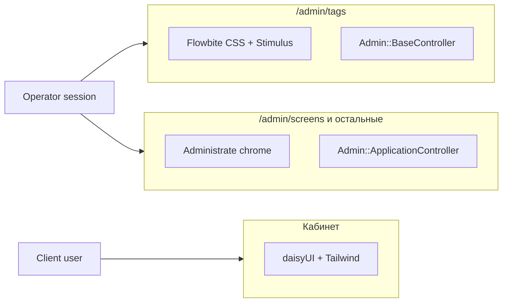

# feat: Flowbite admin scaffold generator

## Overview

Заменить операторскую админку Administrate на кастомные Rails-контроллеры в namespace `:admin`. Визуальный язык — [Flowbite Admin Dashboard](https://github.com/themesberg/flowbite-admin-dashboard) (MIT): sidebar, navbar, CRUD-таблица, формы. Интерактив (drawer, dropdown, modal, tabs) — маленькие Stimulus-контроллеры. **`flowbite.js` не подключаем.**

Этот план — **каркас + генератор + один пилот**. Остальные Administrate-ресурсы не мигрируем.

**Пилот:** `Tag` (одно поле `name`, нет кастомных Administrate fields).



## Problem Statement / Motivation

Administrate даёт быстрый CRUD, но:

- Свой CSS/JS, не стыкуется с Tailwind 4 / Hotwire.
- Сложные формы уже вынесены из конструктора (`Admin::AdvertisingOrdersController` + shared partials).
- Кастомные field-ы живут на vanilla JS, Stimulus на layout Administrate вешать нельзя (см. operating-hours план).
- Нет единого визуального языка с кабинетом и нет нормального пути «сгенерировал ресурс — получил поиск, сорт, пагинацию».

Нужен **повторяемый** способ добавлять admin CRUD: генератор, а не копипаста.

## Proposed Solution

Два независимых слоя, которые сосуществуют, пока не мигрируем остальные ресурсы:

1. **`Admin::BaseController`** — новый корень для кастомных CRUD. Layout `admin/operator`. Tailwind 4 + Flowbite plugin, без daisyUI.
2. **`Admin::ApplicationController`** — без изменений, по-прежнему `< Administrate::ApplicationController`. Все текущие dashboards продолжают работать.
3. Генераторы:
   - `bin/rails g admin:install` — chrome, CSS/JS, Stimulus, Kaminari-тема.
   - `bin/rails g admin:scaffold Tag name:string` — контроллер с Ransack + Kaminari, ERB-views в стиле Flowbite Admin Dashboard, `ransackable_*` на модели. **Модель и миграцию не создаёт.**
4. Пилот: заменить `Admin::TagsController`, удалить `TagDashboard`.

**Почему не `lib/templates/erb/scaffold/`:** в проекте `slim-rails`, обычный `rails g scaffold` пойдёт в кабинет и сломает конвенции ЛК. Нужен отдельный namespaced-генератор без `hook_for :orm`.

## Key Decisions (locked)

| Тема | Решение | Почему |
|---|---|---|
| UI-kit админки | Flowbite Admin Dashboard v2 **utility-классы** (`bg-white`, `bg-gray-50`, `bg-blue-700`, `dark:` в разметке **не используем в пилоте**) | Пользователь явно выбрал шаблон; v4 theme tokens (`bg-brand`) не копировать — они требуют другой CSS-темы и разъедутся с GitHub-шаблоном |
| daisyUI | Только кабинет. Admin CSS — отдельный бандл **без** `@plugin "daisyui"` | Оба кита патчат формы/`btn`/`modal`. Workspace-правило daisyUI остаётся для ЛК |
| Flowbite JS | Не pin, не `import "flowbite"` | Модалки/дропдауны — Stimulus |
| Layout path | `app/views/layouts/admin/operator.html.erb`, `layout "admin/operator"` | Не трогать `layouts/admin/application.html.erb` (Administrate) |
| BaseController parent | `ActionController::Base` + `CurrentOrganization` + `LocaleSwitching`, **без Pundit и без `allow_browser`** | Паритет с сегодняшним admin; `TagPolicy#index?` шире, чем operator-gate |
| Форма Tag | Только `name`. На show — счётчик экранов. Destroy каскадит `screen_tags` | Не тащить HasMany из `TagDashboard::FORM_ATTRIBUTES` |
| Confirm destroy | `data-turbo-confirm` (native) | Modal отложить; a11y из коробки |
| Dark mode | Нет. Светлая тема, без toggle, без `class="dark"` на `<html>` | Кабинет light-only; не плодить третью систему |
| Sidebar | Полный список admin-ресурсов (как Administrate nav). Ссылки на **немигрированные** ресурсы — `data-turbo="false"` | Пилот не должен быть островом |
| Cross-chrome Turbo | `data-turbo-track="reload"` на CSS/JS обоих layout + `data-turbo="false"` между Flowbite ↔ Administrate ↔ кабинет | Иначе смешаются три CSS |
| Kaminari views | `theme: "admin"` → `app/views/kaminari/admin/` | Глобальные `_paginator.html.erb` переоденут пагинацию Administrate |
| Поиск | GET `search_form_for`, предикат `name_cont`, default sort `name asc` | Ransack 4 allowlist обязателен |
| Allowlist Tag | `id name created_at updated_at`; associations пустой массив | Не светить join-ассоциации в query string |
| Invalid `q` | Не 500; неизвестные ключи игнор (`ignore_unknown_conditions`) | Битая закладка не должна валить index |
| Per page | 25 | Kaminari default; `config.max_per_page = 100` |
| Empty states | (a) нет записей + CTA create; (b) поиск без совпадений + «сбросить» | Не одно сообщение |
| i18n | ru/en, ключи `admin.tags.*` + locale switcher в navbar | Как Administrate header |
| `return_to` после login | **Не в scope** | Сейчас login всегда ведёт в кабинет |
| Pundit | Не в пилоте | Следующий план, когда снимем Administrate целиком |
| Views | ERB, не Slim | Пользователь указал `index.html.erb`; кабинет остаётся Slim |
| Gems | Явно `ransack ~> 4.4`, `kaminari ~> 1.2` | Kaminari сейчас только транзитивно от Administrate |

## Technical Considerations

### Architecture

```
Кабинет:  layouts/application.html.erb  → stylesheet tailwind (daisyUI) + importmap "application"
Пилот:    layouts/admin/operator.html.erb → stylesheet admin     + importmap "admin"
Старый:   layouts/admin/application.html.erb → Administrate engine CSS/JS
```

`Admin::TagsController < Admin::BaseController`. Остальные `Admin::*Controller` без изменений.

### CSS: два бандла Tailwind 4

`tailwindcss-rails` 4.6 собирает один вход. Второй — явная CLI-команда.

**`app/assets/tailwind/admin.css`:**

```css
@import "tailwindcss" source(none);
@plugin "flowbite/plugin";
@source "../../../node_modules/flowbite";
@source "../../views/layouts/admin/operator.html.erb";
@source "../../views/admin/**/*.erb";
@source "../../javascript/admin.js";
@source "../../javascript/admin/**/*.js";
@source "../../views/kaminari/admin/**/*.erb";
```

`source(none)` обязателен: иначе Tailwind просканирует Slim-кабинет и daisyUI-классы попадут в admin-бандл.

Кабинетный `app/assets/stylesheets/application.tailwind.css` — исключить админку:

```css
@import "tailwindcss";
@plugin "daisyui" {
  themes: light --default;
}
@source not "../../views/admin";
@source not "../../views/layouts/admin";
```

**Сборка:**

- `Procfile.dev`: вторая линия `admin_css: bundle exec tailwindcss -i ./app/assets/tailwind/admin.css -o ./app/assets/builds/admin.css --watch`
- Enhance `assets:precompile` (или `lib/tasks/admin_css.rake`) той же командой с `--minify`
- CI (`.github/workflows/ci.yml`): после `bin/rails tailwindcss:build` — сборка `admin.css`
- Docker/web: учесть watch в compose, если css-сервис один

npm: `flowbite` как dependency (CSS plugin). **Не** импортировать JS пакета.

В admin-views **запрещены** daisyUI-классы (`btn`, `alert`, `drawer`, `modal`, `dropdown`, `menu`, `table.table`). Только утилиты шаблона.

### JS: отдельный importmap entry

Новый `app/javascript/admin.js` + `pin "admin"` + `pin_all_from "app/javascript/admin/controllers", under: "admin/controllers"`.

Кабинетный `eagerLoadControllersFrom("controllers")` **не** должен подхватывать admin-контроллеры — поэтому они **не** лежат в `app/javascript/controllers/`.

Layout: `javascript_importmap_tags "admin"`.

### Auth

Как сейчас (`app/controllers/admin/application_controller.rb:12-19`):

```ruby
return if Current.user&.organization&.operator?
redirect_to main_app.login_path, alert: I18n.t("admin.authentication_required", ...)
```

Любая роль внутри operator-org проходит (не только manager). Это текущий контракт, не меняем.

### Ransack 4

На `Tag`:

```ruby
def self.ransackable_attributes(_auth_object = nil)
  %w[id name created_at updated_at]
end

def self.ransackable_associations(_auth_object = nil)
  []
end
```

Контроллер: `Tag.ransack(params[:q], auth_object: :admin)` — `auth_object` зарезервирован для следующих ресурсов с более широким списком; в пилоте allowlist одинаковый.

Не вызывать `authorizable_ransackable_attributes` на `ApplicationRecord`.

### Stimulus (крошечные, без stimulus-use)

| Controller | Файл | Зачем в пилоте |
|---|---|---|
| `admin-sidebar` | `admin/controllers/sidebar_controller.js` | Mobile drawer: `-translate-x-full` ↔ `translate-x-0`, overlay, Esc, `aria-expanded`. `disconnect()` чистит. После Turbo-visit внутри Flowbite — закрыть drawer |
| `admin-dropdown` | `admin/controllers/dropdown_controller.js` | User menu в navbar. `hidden`, click-outside, Esc, `aria-expanded` |
| `admin-modal` | `admin/controllers/modal_controller.js` | Native `<dialog>.showModal()`. В Tag CRUD не используется, но ставится install — для следующих ресурсов |
| `admin-tabs` | `admin/controllers/tabs_controller.js` | То же: в коробке, на Tag не рендерится |

Нет `data-modal-toggle` / `data-dropdown-toggle` из Flowbite.

### Generator file map

```
lib/generators/admin/install/install_generator.rb
lib/generators/admin/install/USAGE
lib/generators/admin/install/templates/
  base_controller.rb.tt
  operator.html.erb.tt
  _sidebar.html.erb.tt
  _navbar.html.erb.tt
  _flash.html.erb.tt
  _empty_state.html.erb.tt
  admin.css.tt
  admin.js.tt
  sidebar_controller.js.tt
  dropdown_controller.js.tt
  modal_controller.js.tt
  tabs_controller.js.tt
  kaminari/_paginator.html.erb.tt
  kaminari/_page.html.erb.tt
  kaminari/_prev_page.html.erb.tt
  kaminari/_next_page.html.erb.tt
  kaminari/_first_page.html.erb.tt
  kaminari/_last_page.html.erb.tt
  kaminari/_gap.html.erb.tt

lib/generators/admin/scaffold/scaffold_generator.rb
lib/generators/admin/scaffold/USAGE
lib/generators/admin/scaffold/templates/
  controller.rb.tt
  index.html.erb.tt
  show.html.erb.tt
  new.html.erb.tt
  edit.html.erb.tt
  _form.html.erb.tt
  request_spec.rb.tt
```

`Admin::ScaffoldGenerator < Rails::Generators::NamedBase`, include `ResourceHelpers`, `argument :attributes`. **Не** вызывать ORM hook. `route` с `namespace: :admin` — для Tag маршрут уже есть, генератор должен быть идемпотентен (`gsub_file` / skip если `resources :tags` уже в блоке).

Коллизии: по умолчанию Thor skip (не затирать ручной layout). Для пилота Tag контроллер **заменяем** осознанно (`--force` в задаче миграции).

В `.tt` экранировать ERB как `<%%=`.

### HTML-паттерны (копировать с MIT-шаблона, выкинуть data-* Flowbite)

Эталон: [CRUD Products](https://flowbite-admin-dashboard.vercel.app/crud/products/), исходники `themesberg/flowbite-admin-dashboard`. Core components MIT: [tables](https://flowbite.com/docs/components/tables/), [pagination](https://flowbite.com/docs/components/pagination/), [forms](https://flowbite.com/docs/forms/input-field/), [alerts](https://flowbite.com/docs/components/alerts/), [buttons](https://flowbite.com/docs/components/buttons/). **Не** копировать Pro-блоки с `/application/` без лицензии.

Классы (light):

- Table wrap: `relative overflow-x-auto shadow-md sm:rounded-lg`
- Table: `w-full text-sm text-left text-gray-500`
- Thead: `text-xs text-gray-700 uppercase bg-gray-50`
- Th/Td: `px-6 py-3` / `px-6 py-4`
- Row: `bg-white border-b hover:bg-gray-50`
- Search input: `bg-gray-50 border border-gray-300 text-gray-900 text-sm rounded-lg focus:ring-blue-500 focus:border-blue-500 block w-full ps-10 p-2.5`
- Primary button: `text-white bg-blue-700 hover:bg-blue-800 focus:ring-4 focus:ring-blue-300 font-medium rounded-lg text-sm px-5 py-2.5`
- Danger: `bg-red-700 hover:bg-red-800 …`
- Flash success: `p-4 mb-4 text-sm text-green-800 rounded-lg bg-green-50`
- Flash error: `… text-red-800 … bg-red-50`
- Sidebar: `fixed top-0 left-0 z-40 w-64 h-screen pt-14 … -translate-x-full md:translate-x-0`
- Main: `p-4 md:ml-64 pt-20`

`sort_link @q, :name, url: admin_tags_path` в `<th>`. Рядом — иконка сортировки (можно оставить текст Ransack).

Pagination: `paginate @tags, theme: "admin"` + `page_entries_info`.

Search form:

```erb
<%= search_form_for @q, url: admin_tags_path, html: { method: :get } do |f| %>
  <%= f.hidden_field :s %>
  <%= f.search_field :name_cont, class: "…" %>
<% end %>
```

`hidden_field :s` сохраняет sort при новом поиске. Поиск не шлёт `page` → сброс на 1. Kaminari сам мержит `q` в ссылки pager.

### Controller template (суть)

```ruby
module Admin
  class TagsController < Admin::BaseController
    def index
      @q = Tag.ransack(params[:q], auth_object: :admin)
      @q.sorts = "name asc" if @q.sorts.empty?
      @tags = @q.result.page(params[:page])
    end

    def show
      @tag = Tag.find(params[:id])
    end

    def new
      @tag = Tag.new
    end

    def create
      @tag = Tag.new(tag_params)
      if @tag.save
        redirect_to admin_tag_path(@tag), notice: t("admin.tags.created")
      else
        render :new, status: :unprocessable_content
      end
    end

    def edit
      @tag = Tag.find(params[:id])
    end

    def update
      @tag = Tag.find(params[:id])
      if @tag.update(tag_params)
        redirect_to admin_tag_path(@tag), notice: t("admin.tags.updated")
      else
        render :edit, status: :unprocessable_content
      end
    end

    def destroy
      @tag = Tag.find(params[:id])
      @tag.destroy!
      redirect_to admin_tags_path, notice: t("admin.tags.destroyed")
    end

    private

    def tag_params
      params.expect(tag: [:name])
    end
  end
end
```

404 на отсутствующий id — стандартный Rails. Не подключать Administrate not-found.

### Sidebar contents

Хардкод-список в `_sidebar.html.erb` (не `Administrate::Namespace` — новый chrome не должен зависеть от gem). Пункты = текущие index-маршруты из `config/routes.rb` admin-блока. Активный пункт: `current_page?` / `controller_path`. Ссылка Tags — обычный Turbo внутри Flowbite; ссылка Screens/Media plans/… — `data-turbo="false"`. «В кабинет» (`root_path`) и logout — тоже `data-turbo="false"`.

После миграции следующего ресурса убираем `data-turbo="false"` только у него.

### Pilot cleanup

- Заменить `app/controllers/admin/tags_controller.rb`
- Удалить `app/dashboards/tag_dashboard.rb`
- `resources :tags` уже есть — не дублировать
- Проверить, что Administrate nav на `/admin/screens` всё ещё показывает Tags (ссылка ведёт на новый UI — ок)

## Implementation Phases

### Phase 1: Dependencies and CSS isolation

- Tasks: gems, `npm i flowbite`, `admin.css`, rake/CI/Procfile, `@source not` в кабинетном CSS, empty layout smoke
- Success: `bin/rails tailwindcss:build` + admin CLI оба зелёные; cabinet HTML не содержит `admin.css`

### Phase 2: `admin:install` + chrome

- Tasks: BaseController, operator layout, sidebar/navbar/flash, Stimulus, kaminari/admin theme, importmap `admin`, i18n каркаса (`admin.chrome.*`)
- Success: пустой `Admin::PagesController#index` или сразу Tags; mobile drawer; locale switcher; logout; noindex

### Phase 3: `admin:scaffold` generator

- Tasks: NamedBase generator, `.tt` для controller/views/spec, inject `ransackable_*`, USAGE, generator spec
- Success: `bin/rails g admin:scaffold Example` в tmp/dummy или spec с `destination` не создаёт model/migration

### Phase 4: Pilot Tag

- Tasks: сгенерировать/вписать Tag, request specs, system spec изоляции CSS, удалить dashboard
- Success: полный CRUD + search/sort/pagination; `/admin/screens` визуально Administrate; кабинет daisyUI

### Phase 5: Polish

- Empty states, flash, confirm i18n, RuboCop, README-заметка в `docs/guides/onboarding/01-operator-admin.md`

**Оценка:** Phase 1–2 ~ средний объём (assets/CI самое рискованное); 3 — шаблоны; 4 — TDD как `spec/requests/admin/business_spheres_spec.rb`.

## Alternative Approaches Considered

- **Переопределить `lib/templates/erb/scaffold`** — ломает кабинетный Slim-scaffold. Отклонено.
- **Один Tailwind-бандл + prefix daisyUI** — хрупко, Flowbite plugin всё равно бьёт `[type=checkbox]`. Отклонено.
- **Подключить `flowbite.turbo.js`** — против требования. Отклонено.
- **Pagy вместо Kaminari** — Administrate уже тянет Kaminari; явный gem проще для пагинации и будущей миграции. Pagy не берём.
- **Наследовать `ApplicationController`** — получим Pundit + `allow_browser`, которых в admin нет. Отклонено для пилота.
- **Мигрировать все dashboards сразу** — слишком широкий blast radius (Screen fields, AdvertisingOrder grid, MediaPlan services). Отклонено.

## Acceptance Criteria

### Functional

- [x] Гость и пользователь client-org на любом `/admin/tags*` → redirect `login_path`, записей не создаётся
- [x] Operator-org user: `GET /admin/tags` 200, layout Flowbite (нет `.app-container` / `.navigation__link` Administrate)
- [x] Index: таблица, `sort_link` по `name` и `created_at`, поиск `name_cont`, пагинация 25, `q` сохраняется в pager и в sort
- [x] Пустая БД ≠ пустой поиск (разные empty states)
- [x] Invalid / unknown `q` → 200, не 500
- [x] Create/update: strip + case-insensitive uniqueness; 422 с ошибками; strong params только `:name`
- [x] Destroy: `data-turbo-confirm`; каскад `screen_tags`; экраны остаются
- [x] Missing id → 404
- [x] Locale ru/en: лейблы, flash, confirm, validation; свитчер в navbar
- [x] Sidebar содержит ссылки на остальные admin-ресурсы; переход на `/admin/screens` открывает Administrate
- [x] Navbar: текущий email, «в кабинет», logout

### Non-functional

- [x] Нет `flowbite.js` / `flowbite.turbo` в importmap и в network HTML
- [x] Кабинет не грузит `admin.css` / `admin.js`
- [x] `/admin/screens` не грузит `admin.css`
- [x] `/admin/tags` не грузит daisyUI `tailwind` bundle
- [x] Kaminari-тема не меняет pager Administrate
- [x] `Admin::ApplicationController` по-прежнему `< Administrate::ApplicationController`
- [x] Light-only
- [x] `robots`: `noindex, nofollow` на operator layout

### Generators

- [x] `rails g admin:install` создаёт перечисленные файлы, не затирает Administrate layout
- [x] `rails g admin:scaffold MODEL attrs` не создаёт model/migration; контроллер `< Admin::BaseController`; views ERB + Flowbite-классы; `ransackable_*`; request spec
- [x] Повторный `install` безопасен (skip). Scaffold поверх существующего файла — documented `--force`
- [x] Generator spec в `spec/generators/admin/`

### Quality gates

- [x] Request specs: auth deny, CRUD, search, sort, pagination params, uniqueness 422
- [x] Один system spec: Tags → Screens → Tags и Tags → cabinet — разные stylesheet href
- [x] `docker compose exec -e RAILS_ENV=test web bundle exec rspec spec/requests/admin/tags_spec.rb spec/generators/ spec/system/admin/`
- [x] CI собирает оба CSS
- [x] RuboCop / Brakeman чистые по новым файлам

## Success Metrics

- Новый admin-ресурс уровня Tag генерируется одной командой без ручной вёрстки таблицы
- Оператор может вести теги в новом UI, не теряя доступ к Administrate
- Нулевой визуальный регресс кабинета и `/admin/screens`

## Dependencies & Risks

| Риск | Митигация |
|---|---|
| Turbo смешает CSS трёх chrome | `data-turbo-track="reload"` + `data-turbo="false"` на cross-chrome ссылках; system spec |
| Второй Tailwind entry забудут в CI | Явный step + rake на `assets:precompile` |
| Flowbite plugin ломает daisyUI checkbox | Раздельные бандлы + `@source not` |
| Kaminari theme глобально | Только `app/views/kaminari/admin/` |
| `admin.html.erb` vs каталог `layouts/admin/` | Layout имя `admin/operator` |
| Потеря HasMany screens на форме Tag | Сознательно; теги вешаются с экрана; на show — счётчик |
| Ransack 4 без allowlist → пустой index | Методы на модели + spec |
| Generators затирают ручной chrome | skip по умолчанию |
| `pin_all_from controllers` подхватит admin JS в кабинет | Контроллеры в `javascript/admin/controllers` |
| Flowbite Pro HTML | Только MIT GitHub template + core docs |
| daisyUI cursor rule vs Flowbite | Исключение: admin views = Tailwind utilities; не `btn`. Позже — узкое `.cursor/rules` для `app/views/admin` |

## Out of scope

- Миграция остальных dashboards (Screen, Location, AdvertisingOrder, MediaPlan, …)
- Снятие gem `administrate`
- Pundit в `/admin`
- `return_to` после login
- Dark mode
- Flowbite datepicker/charts/ApexCharts из шаблона
- Dashboard home (`/` admin root остаётся `media_plans#index` на Administrate)
- ViewComponent для admin-таблицы
- Совместный shell с кабинетом

## Documentation Plan

- Обновить `docs/guides/onboarding/01-operator-admin.md`: Tags теперь кастомный UI; остальное Administrate
- USAGE у обоих генераторов
- Не раздувать README-заготовку

## Test plan (implementer)

Образец auth: `spec/requests/admin/business_spheres_spec.rb` + `sign_in_as`.

```ruby
# spec/requests/admin/tags_spec.rb — ключевые примеры
it "denies client organization users"
it "renders flowbite index not administrate chrome"
it "filters by name_cont and keeps sorts in pagination links"
it "sorts by name"
it "creates a tag and strips whitespace"
it "rejects duplicate name case-insensitively with 422"
it "destroys a tag and its screen_tags"
it "does not 500 on unknown ransack keys"
```

System: Cuprite уже в Gemfile. Спека ходит operator session, `assert_selector` на sidebar Flowbite, затем клик Screens (`data-turbo="false"`), проверка Administrate `.navigation`, затем обратно.

Generator spec: `prepare_destination`, invoke, refute migration file, assert `ransackable_attributes` inserted once.

## References & Research

### Internal

- `app/controllers/admin/application_controller.rb` — auth
- `app/controllers/admin/tags_controller.rb` — Administrate stub, заменить
- `app/dashboards/tag_dashboard.rb` — удалить
- `app/models/tag.rb` — uniqueness, normalize
- `app/policies/tag_policy.rb` — не вызывать в пилоте
- `config/routes.rb` 1–35 — `resources :tags` уже есть
- `app/views/layouts/admin/application.html.erb` — не трогать
- `app/assets/stylesheets/application.tailwind.css` — daisyUI entry
- `spec/requests/admin/business_spheres_spec.rb` — шаблон request specs
- `spec/support/request_auth_helpers.rb`
- `Procfile.dev`, `.github/workflows/ci.yml` — второй CSS build
- Исторически: Avo удалён, restyle кабинета **не** трогал `/admin` (`docs/plans/2026-08-05-001-feat-cabinet-ui-redesign-plan.md`)
- Custom admin поверх Administrate: advertising orders (`docs/plans/2026-08-28-001-feat-advertising-order-placement-plan.md`)
- `docs/solutions/` по Ransack/Kaminari/Flowbite/generators — пусто

### External

- Rails 8.1 generators: https://guides.rubyonrails.org/v8.1/generators.html
- Ransack allowlist: https://activerecord-hackery.github.io/ransack/going-further/other-notes/
- Kaminari themes: https://github.com/kaminari/kaminari#customizing-the-pagination-helper
- Flowbite Admin Dashboard (MIT): https://github.com/themesberg/flowbite-admin-dashboard
- Flowbite Rails (CSS-часть; JS **не** брать): https://flowbite.com/docs/getting-started/rails/
- Stimulus actions/targets: https://stimulus.hotwired.dev/reference/actions
- Turbo stylesheet tracking: https://turbo.hotwired.dev/handbook/building#reloading-when-assets-change
