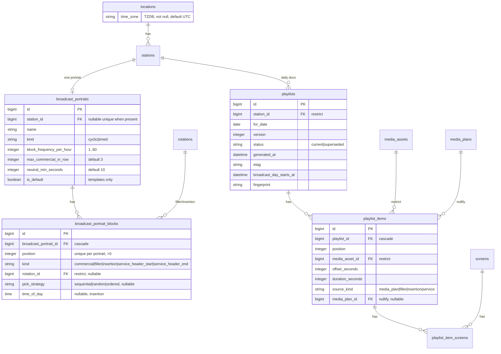

# Портрет эфира и материализованный плейлист

## Goal Capsule

**Objective:** Ввести портрет эфира станции (циклический шаблон блоков: реклама / нейтралка ≥ 10 сек / вставки / сервисные шапки) и ежедневный материализованный плейлист. Новый агент читает `GET /api/agent/v2/package`; v1 заморожен. Эфирная механика слотов (`Airtime::*`, FWW, Guard) не меняется — плейлист проекция.

**Product authority:** `docs/brainstorms/2026-08-27-media-plan-playlist-storage-brainstorm.md` (эпик 2), `CONCEPTS.md` (Broadcast portrait, Playlist), `specs/002-monitors-broadcast-tz/contracts/agent-api-v1.md` (frozen) + `agent-api-v2.md` (этот эпик). Эпик 1 уже сдан: `docs/plans/2026-08-28-001-feat-advertising-order-placement-plan.md`.

**Open blockers:** нет. Развилки брейншторма и Q1/Q2 плана закрыты (нейтралка 10 сек; агентский пакет — `/api/agent/v2/package` сразу). Пробелы SpecFlow закрыты KTD (TZ локации, `screen_ids` на позициях, play_events).

**Execution profile:** TDD (Red → Green → Refactor); тесты только `docker compose exec -e RAILS_ENV=test web bundle exec rspec`. Domain-спеки генератора обязательны до UI.

**Stop conditions:** не менять инварианты `Airtime::OccupyWithPlan` / `Cancel` / `Reschedule` / `ScreenLock` / `ScreenOverlapGuard`; не удалять `AirtimeBooking`; не возвращать `AirtimeQuota`; не строить эфирные справки из плейлистов; не реализовывать `kind=timed`; не добавлять ЛК CRUD портрета/плейлиста; **не менять JSON `/api/agent/v1/package`**.

**Tail ownership:** после сдачи — паттерн в `docs/solutions/` («playlist is a projection»), новый контракт `specs/002-monitors-broadcast-tz/contracts/agent-api-v2.md`, v1-контракт помечен frozen; строка в `CONCEPTS.md` про TZ локации как часы эфирного дня.

## Product Contract

### Summary

Оператор задаёт портрет эфира — шаблон структуры суток точки: частота рекламного блока в час, порядок блоков, ротации нейтралки (минимум клипа 10 сек) и точные вставки. Система каждую ночь (и по событию эфира) материализует плейлист на дату: упорядоченные позиции с таймингом, роликом и происхождением. Новый агент забирает плейлист с `GET /api/agent/v2/package`. `GET /api/agent/v1/package` заморожен: по-прежнему overlapping MediaPlan без нейтралки. Ручные слоты и заказы занимают эфир через `Airtime::OccupyWithPlan`; генератор только читает активные слоты.

### Problem Frame

Сейчас пакет агента — виртуальный union активных слотов (`Agent::PackageBuilder`): нет нейтральной добивки, нет сервисных шапок, нет «плейлиста на завтра», ротация нейтралки была бы недетерминированной. ТЗ требует внутренний ежедневный документ на несколько дней вперёд с принудительным обновлением. Портрета в продукте нет; часовой пояс есть только у организации, хотя эфирный день — свойство места.

### Key Decisions

- **D1. Заказ уже порождает слоты; этот эпик их не трогает** (session-settled: brainstorm). Коммерческий источник генератора — `MediaPlan.active` + confirmed covering booking, без различия ручной/заказ. Governs R6, R12.
- **D2. Портрет нормализован, привязан к станции** (session-settled: brainstorm — chosen over jsonb и привязку к группе/экрану). Nullable `station_id` = шаблон, копируется при создании станции. Governs R1–R3.
- **D3. Плейлист материализуется на (станция, дата)** (session-settled: brainstorm — chosen over on-the-fly и кэш с инвалидацией). Одна `current`-версия, partial unique. Governs R4, R5, R10.
- **D4. Позиции несут экраны** (session-settled: SpecFlow — chosen over один timeline без `screen_ids`). Экраны одной станции легально в разных группах; FWW охраняет экран, не станцию. Без привязки к экранам генератор смешает чужую рекламу. Governs R5, AE4.
- **D5. TZ эфирного дня — на локации** (session-settled: SpecFlow — chosen over TZ организации клиента и выдуманный `stations.time_zone`). Часы работы уже wall-clock локации; `for_date`, `time_of_day`, якорь суток считаются в `locations.time_zone`. Станция наследует TZ локации. Заказы по-прежнему считают окна в TZ организации клиента — расхождение сознательное, чинить в заказах не этот эпик. Governs R8, R9.
- **D6. Контракт агента — `/api/agent/v2/package` сразу** (session-settled: user-directed — chosen over discriminator на v1 и отложенный `/v2`). v1 URL заморожен: нынешний shape overlapping MediaPlan, без filler/insertion/service. v2 — timed `entries` из current-плейлистов; нет плейлиста → `entries: []` + enqueue generate (не тело v1). Governs R13, R14.
- **D7. Нейтральный минимум — 10 секунд** (session-settled: user-directed — chosen over 5). Default и продуктовое значение `neutral_min_seconds=10`; колонка остаётся (check 5 или 10), чтобы оператор мог сузить без миграции, если заказчик передумает. Governs R2, R7.
- **D8. Модерация, справки, timed-эфир, ЛК-просмотр плейлиста — вне эпика.** Governs Scope Boundaries.

### How This Work Fits Together

Портрет — операторская настройка флота (рядом со Station/Location). Плейлист — проекция портрета × активных слотов × часов работы. Слоты остаются эфирной правдой (FWW). Пакет агента читает проекцию. `PlayLog` остаётся фактом для будущих справок (дни заказа × факт), не плейлист. Коммерческая квота и occupy не знают о портрете.

### Actors

- **A1. Администратор/менеджер оператора** — CRUD шаблона и портретов станций, TZ локации, force regen, просмотр плейлиста в `/admin`.
- **A2. Менеджер/администратор клиента** — создаёт слоты и заказы (побочный реген); портрет и плейлист не видит.
- **A3. Агент станции** — новый бинарь: GET `/api/agent/v2/package`; старый: GET v1 (только слоты). POST play_events — один URL v1, eligibility предпочитает плейлист.
- **A4. Система** — dispatcher горизонта, generate per station/date, purge 14 дней.

### Key Flows

**F1. Шаблон портрета.** Trigger: «Новый шаблон» в `/admin`. Actor: A1. Steps: имя, частота блока/час, `max_commercial_in_row`, `neutral_min_seconds`, блоки с kind-specific полями, флаг default. Outcome: `station_id IS NULL`, не больше одного default. Covered by: R1–R3, AE1.

**F2. Создание станции.** Trigger: create station. Actor: A1. Steps: после save — копия default-шаблона. Нет шаблона → станция создана, портрет nil, предупреждение на show. Outcome: станционный портрет независим от шаблона. Covered by: R3, AE2.

**F3. Генерация суток.** Trigger: dispatcher / force / хук эфира. Actor: A4/A1. Steps: lock `(station, date)` → портрет (lazy copy шаблона, если nil) → развернуть сутки в TZ локации → записать items → старый current → superseded. Outcome: одна current-версия, новый etag. Covered by: R4–R9, AE3–AE8.

**F4. Пакет агента v2.** Trigger: GET `/api/agent/v2/package`. Actor: A3 (новый). Steps: сшить current-плейлисты дат, пересекающих `[now, now+offline_cache_hours]`; 304 при If-None-Match; нет current → `entries: []` + enqueue generate (не генерировать в запросе, не отдавать v1-тело). Outcome: 200 JSON, никогда 204. Covered by: R13–R15, AE9–AE11.

**F4b. Пакет агента v1 (frozen).** Trigger: GET `/api/agent/v1/package`. Actor: A3 (старый). Steps: нынешний `Agent::PackageBuilder` без чтения плейлиста. Outcome: overlapping MediaPlan, как сегодня. Covered by: R14.

**F5. Play events.** Trigger: POST play_events. Actor: A3. Steps: eligibility по плейлисту (current или superseded ≤ 2 ч) × экран × asset. Outcome: PlayLog; коммерция — org плана; прочее — org оператора. Covered by: R16, AE12.

**F6. Реген после эфира.** Trigger: успех Occupy/Cancel/Reschedule/ReplaceClip и соседи (R12). Actor: A2 косвенно. Steps: enqueue дат горизонта затронутых станций. Outcome: «завтрашний» current отражает новый слот до ночи. Covered by: R12, AE7.

**F7. Purge.** Trigger: recurring. Actor: A4. Steps: batched delete `for_date < today_in_location_tz - 14 days`. Outcome: справки не страдают. Covered by: R11, AE13.

### Requirements

- **R1.** Модели: `broadcast_portraits`, `broadcast_portrait_blocks`, `playlists`, `playlist_items`, `playlist_item_screens`; `locations.time_zone` (string TZDB, not null, default `"UTC"`). Строковые enum'ы; check-constraints на числа/окна; явные `on_delete`. Unique: одна станция — один портрет; `(portrait_id, position)` блоков; partial unique `(station_id, for_date) WHERE status = 'current'`; не больше одного default-шаблона.
- **R2.** Портрет: `kind` (`cyclic`; `timed` в БД допустим, создать через UI/сервис нельзя), `block_frequency_per_hour` 1..60, `max_commercial_in_row` default 3 (>0), `neutral_min_seconds` default **10** (check `IN (5, 10)`). Блоки: `commercial` (без rotation); `filler` (rotation_id + `pick_strategy` sequential/random/ordered); `insertion` (`time_of_day` + rotation_id); `service_header_start` / `service_header_end` (без rotation).
- **R3.** Шаблон (`station_id` nil) с `is_default`; create station копирует default. Правка шаблона не каскадирует на копии. Правка станционного портрета ставит в очередь реген горизонта станции.
- **R4.** Плейлист: `station_id`, `for_date`, `version` (монотонное целое на пару станция+дата), `status` current/superseded, `generated_at`, `etag`, `broadcast_day_starts_at` (timestamptz якоря). Generate под advisory lock. Идемпотентность: тот же fingerprint входов → не bump version.
- **R5.** Item: `position`, `media_asset_id` (FK `on_delete: :restrict`), `offset_seconds` ≥ 0 от якоря, `duration_seconds` снапшот > 0, `source_kind` (media_plan/filler/insertion/service), nullable `media_plan_id` (`on_delete: :nullify` — история позиции при позднем cancel слота). Хотя бы один экран через `playlist_item_screens` (cascade от item и от screen).
- **R6.** Commercial-позиции: только active MediaPlan + confirmed covering booking, экраны = `plan.group.screens ∩ station.screens`. `own_atmosphere` в commercial-слоты без service headers. Нет плана на слот цикла → filler. На один экран в пересекающемся окне FWW даёт максимум один occupying plan.
- **R7.** Алгоритм cyclic (KTD5): частота N блоков/час; insertion вытесняет пересекающий cyclic-item, цикл не сдвигается; `service_header_*` обрамляют каждый commercial-блок (`placement_kind=commercial`); filler date-deterministic (KTD6); клип короче `neutral_min_seconds` в filler не ставится, берётся следующий, повтор пула допустим.
- **R8.** `for_date`, `time_of_day`, якорь — TZ локации станции. Якорь = начало первого окна `operating_hours` на эту weekday; нет часов → локальная полночь. Пакет отдаёт `broadcast_day_starts_at` ISO8601. Длина суток = секунды до якоря следующего календарного дня (23/24/25 ч DST).
- **R9.** День с 0 окон работы: current с 0 items; v2 отдаёт `entries: []` (не v1-тело). Insertion в пропавший час spring-forward — skip item, generate success. Fall-back 02:30 — первое вхождение.
- **R10.** Нет портрета + есть default-шаблон → lazy copy, затем generate. Нет портрета и нет шаблона → generate не пишет пустой current; v2 = `entries: []` + enqueue; v1 без изменений; на show станции — флаг.
- **R11.** Retention: batched DELETE плейлистов с `for_date` старше 14 суток (включая superseded), сначала items (cascade screens), затем headers. Не трогать даты горизонта. Не partition. Справки не читают эти таблицы.
- **R12.** Хук `Playlists::EnqueueRegen` **после** успеха, не внутри FWW: `OccupyWithPlan`, `Cancel`, `Reschedule` (одна строка после транзакции — `Cancel` идёт через `update_columns`, AR-коллбэки не сработают), `Advertising::ReplaceClip`, save портрета станции, смена `rotation_items` у ротации, на которую ссылается портрет, membership экрана, `operating_hours` / `time_zone` локации. Станции = экраны группы ∩ затронутые; даты = локальные дни пересечения окна в TZ локации, не раньше сегодняшней локальной даты, вперёд на `offline_cache_hours`.
- **R13.** `GET /api/agent/v2/package`: сшить все current плейлисты, чьи сутки пересекают `[now, now+offline_cache_hours]`. Тело — timed `entries` (position, screen_ids, starts_at UTC, duration_seconds, source_kind, media, media_plan_id); `broadcast_day_starts_at` на каждой группе суток. `etag`/`version` = SHA-256 сшитого манифеста entries (без generated_at). Пустой день или нет плейлиста — `entries: []`, 200. Маршруты: `namespace :api { namespace :agent { namespace :v2 { resource :package } } }`. Контроллер `Api::Agent::V2::PackagesController`.
- **R14.** `GET /api/agent/v1/package` **frozen**: текущий `Agent::PackageBuilder` без чтения плейлиста и без смены JSON. Существующие `package_builder_spec` / `packages_spec` не ломаются. Новый агент ходит только в v2. Miss на v2 не подмешивает v1-shape.
- **R15.** v2: `If-None-Match` → 304 через `stale?(etag:, template: false)` затем `render json:`. `Cache-Control: private, must-revalidate`. Не `public`. На v1 304 в этом эпике не обязателен (контракт v1 не расширяем).
- **R16.** play_events: eligible = item current или superseded `generated_at >= 2.hours.ago` с этим asset и screen. `source_kind=media_plan` → PlayLog org плана, только если план ещё active + booking confirmed. Иначе org оператора. Не матчить «любой overlapping plan». Не eligible → 404, транзакция все-или-ничего как сейчас.
- **R17.** Admin: Flowbite CRUD портретов (шаблоны + nested blocks + per-station), show плейлиста (таймлайн, version, source_kind), member force-regen (станция × горизонт), поле TZ на форме локации. Без Pundit. NAV_ITEMS + i18n ru/en. ЛК — ничего.
- **R18.** `kind=timed` нельзя создать. Локали моделей/enum/ошибок ru+en.

### Acceptance Examples

- **AE1.** Оператор создаёт default-шаблон: cyclic, 4 блока/час, блоки commercial → filler sequential → service_header_start/end. Второй default → 422.
- **AE2.** Создание станции копирует шаблон (`station_id` = новая, блоки те же). Правка шаблона не меняет копию. Создание без шаблона — станция 201, портрет nil.
- **AE3.** Станция, локация 09:00–21:00 `Asia/Krasnoyarsk`, N=4. Generate на дату: якорь 09:00+07, items покрывают рабочее окно, filler между commercial по портрету.
- **AE4.** Два экрана станции в разных группах, два commercial-слота на один час. Items не смешивают ролики: каждый item.screen_ids ⊆ своей группы. Filler/service — оба экрана.
- **AE5.** `shows_per_hour=2`, N=4, `max_commercial_in_row=3`: в час не больше 2 commercial-выходов на экран и не больше 3 подряд; недобор не нарушает max-in-row.
- **AE6.** Insertion 12:00 вытесняет cyclic-item на этом offset; остальные cyclic не сдвигаются.
- **AE7.** Occupy на завтра после generate: до ночи current завтрашнего дня содержит новый ролик. ReplaceClip живого заказа — тот же слот id, в items новый `media_asset_id`.
- **AE8.** 29.03.2026 Europe/Berlin: день 23 ч, insertion 02:30 отсутствует — generate success без этой позиции. 25.10.2026: 25 ч, 02:30 — первое вхождение.
- **AE9.** 18:00, `offline_cache_hours=24`: `GET /api/agent/v2/package` сшивает today+tomorrow в `entries`. Тот же токен на `GET /api/agent/v1/package` по-прежнему отдаёт overlapping MediaPlan.
- **AE10.** Нет портрета и нет шаблона: v2 — `entries: []` и enqueue generate; v1 — как нынешний `package_builder_spec`. Есть плейлист на закрытый weekday (0 окон): v2 `entries: []`, не v1-shape.
- **AE11.** Повторный GET v2 с If-None-Match = etag → 304. Force regen → новый etag, 200 с телом.
- **AE12.** play_event нейтралки → PlayLog org оператора. play_event ролика заказа → org клиента. Asset не в плейлисте экрана → 404, ни одной записи.
- **AE13.** Плейлист 15-дневной давности исчезает после purge; current сегодняшнего дня на месте. Delete media_asset, на который ссылается живой item → restrict.

### Success Criteria

- Станция с портретом отдаёт детерминированный плейлист на дату: повторный generate с теми же входами не меняет version/etag.
- Два экрана разных групп на одной станции не показывают чужую рекламу.
- Агент на v2 играет commercial + filler + insertion + service; агент на v1 по-прежнему видит только слоты (JSON v1 не меняется).
- Occupy/Cancel/ReplaceClip отражаются в current-плейлисте горизонта без правки Guard/FWW.
- Нулевая регрессия существующих `package_builder_spec`, occupy/cancel/reschedule, advertising activate.

### Scope Boundaries

**Входит:** портрет (шаблон + станция), TZ локации, генератор суток, jobs горизонта/purge/force, хуки регена, `GET /api/agent/v2/package` + 304, v1 frozen, play_events по плейлисту (если current есть), admin UI, спеки, контракт `agent-api-v2.md`.

**Не входит:** `kind=timed`; модерация чужого эфира; эфирные справки; серверный PDF; ЛК show плейлиста; правка сетки активного заказа; partition item-таблиц; смена `find_by_agent_token` O(n); heartbeat агента; каскад правки шаблона на станции; интерпретация часов заказа в TZ локации.

### Dependencies / Assumptions

- Эпик 1 сдан: слоты с `advertising_order_line_id`, `ReplaceClip` меняет `RotationItem`, не слоты.
- `Location::OperatingHours`, `offline_cache_hours`, agent token — как сейчас.
- Neutral-ротации уже есть (`content_type: neutral`, `visibility: network`).
- Агент — first-party; новый бинарь ходит в `/api/agent/v2/package`. Старый бинарь остаётся на v1 до вывода из флота (Sunset-заголовки на v1 — optional, не блокер).
- `neutral_min_seconds` по умолчанию 10 (D7).
- Пилотный масштаб ≪ 10k точек: batched DELETE достаточен; partition — follow-up при приближении к миллионам rows/день.

### Outstanding Questions

1. Писать ли PlayLog на filler в org оператора (выбрано в R16) или вовсе не писать — подтвердить, когда появятся справки.

### Sources / Research

- Брейншторм: `docs/brainstorms/2026-08-27-media-plan-playlist-storage-brainstorm.md`.
- Паттерн слота: `docs/solutions/architecture-patterns/media-plan-as-airtime-slot.md`.
- Код: `app/domain/agent/package_builder.rb`, `app/controllers/api/agent/v1/packages_controller.rb`, `play_events_controller.rb`, `app/models/station.rb`, `app/models/location.rb`, `app/domain/airtime/occupy_with_plan.rb`, `cancel.rb` (`update_columns`), `app/domain/advertising/replace_clip.rb`, `config/recurring.yml`, `db/migrate/20260804103454_*` (partial unique operator).
- Контракт: `specs/002-monitors-broadcast-tz/contracts/agent-api-v1.md` (frozen); новый `agent-api-v2.md` в том же каталоге.
- Прецедент job: `Advertising::CompleteExpiredOrdersJob` + YAML-тест recurring.
- Rails 8.1: `stale?(etag:, template: false)` для JSON; Solid Queue recurring только ключ `production:`; TZ задачи = `config.time_zone` (UTC), не TZ станции.
- Не использовать: jsonb-портрет; `Kernel.srand` / `String#hash` как seed; generate внутри agent request; AR-коллбэки на Cancel.

## Planning Contract

### Key Technical Decisions

- **KTD1. Четыре таблицы + TZ на локации + join экранов.** ERD ниже. `playlist_item_screens` — не integer[]: FK как в остальной схеме; cascade с обеих сторон (удаление экрана не блокируется живым плейлистом; реген по R12 пересоберёт).
- **KTD2. Домен `Portraits::` и `Playlists::`**, не `Orders::`. Живой прецедент неймспейса — `Advertising::`. `Portraits::CopyTemplate`, `Portraits::UpsertBlocks`. `Playlists::GenerateForDate`, `Playlists::EnqueueRegen`, `Playlists::Fingerprint`, `Playlists::PackageFromPlaylists`.
- **KTD3. Хуки — явный вызов, не `after_commit`.** `Cancel` обходит коллбэки. Occupy/Cancel/Reschedule получают одну строку после успеха: `Playlists::EnqueueRegen.from_plan(plan)` / `.from_cancelled_plan(...)`. Внутренности FWW/Guard/Lock не меняются.
- **KTD4. Dispatcher, не «3am по TZ станции».** Recurring каждые 15 минут (UTC): `Playlists::DispatchHorizonJob` → `Playlists::GenerateStationHorizonJob.perform_later(station_id)` с `limits_concurrency to: 1, key: station_id, on_conflict: :discard`. Внутри: локальные даты `[today, today+horizon]`. GenerateForDate идемпотентен. Не 10k строк в `recurring.yml`.
- **KTD5. Развёртка cyclic.** Для каждого экрана станции: рабочий интервал в TZ локации → сетка слотов `3600/N` секунд. Указатель cycle по `position` блоков. На слот:
  - если есть insertion с `time_of_day` в этом слоте — insertion (ротация, pick как filler);
  - иначе блок цикла: commercial → взять occupying plan экрана на `slot_starts_at`, выдать `min(ceil(shows_per_hour / N), max_commercial_in_row)` следующих роликов ротации (date-deterministic offset), обернуть service headers только для `placement_kind=commercial`; нет плана → filler;
  - filler/ordered/sequential/random — KTD6.
  Затем merge экранов: одинаковые (asset, offset, source, media_plan) схлопываются, union screen_ids.
- **KTD6. Детерминированный pick.** Каталог = `rotation.ordered_items` с `broadcast_delivery_attachment`, duration ≥ `neutral_min_seconds`. Sequential: `offset = (for_date - Date.new(1970,1,1)).to_i`; `catalog.rotate(offset % size)` — не `yday`. Ordered: без дневного rotate. Random: `Random.new(Digest::SHA256.digest("v1|#{station_id}|#{for_date.iso8601}|#{rotation_id}")[0,8].unpack1("Q>"))` — не `String#hash`, не `srand`. Алгоритм `v1` кладётся в fingerprint.
- **KTD7. Fingerprint входов.** SHA-256: portrait (id+updated_at+blocks), operating_hours, time_zone, screen_ids станции, id+updated_at occupying plans на дату, rotation_items затронутых ротаций, `offline_cache_hours` не входит (горизонт — про число дат, не про содержимое суток). Совпал с current → return current.
- **KTD8. Два URL, два билдера.** v1 остаётся `Agent::PackageBuilder` as-is. v2 — `Playlists::PackageFromPlaylists` в `Api::Agent::V2::PackagesController`: stitch дат горизонта; нет current → пустые `entries` + `Playlists::EnqueueRegen` (не persist в request). ETag v2 = SHA-256 entries без timestamp. 304 только на v2 (`stale?`, `template: false`). Не класть `schema_version` discriminator в одно тело.
- **KTD9. Admin.** Scaffold портретов рядом с флотом в NAV. Nested blocks: Stimulus `portrait-blocks` (добавить/reorder/kind fields), cleanup в `disconnect()`. Плейлист — show-only, не CRUD. Force regen — member POST станции. TZ — select на форме локации (прецедент org time_zone).
- **KTD10. Purge job** `Playlists::PurgeExpiredJob`, `schedule: at 4am every day` в `production:` recurring.yml. Batch 1000 за `delete_all` по playlist ids, не миллионный DELETE без WHERE limit.

### Technical Design

#### ERD



#### Доменные сервисы

| Сервис | Роль |
|---|---|
| `Portraits::CopyTemplate` | Копия default → station, в транзакции с блоками |
| `Portraits::UpsertBlocks` | Reorder + kind validations |
| `Playlists::GenerateForDate` | lock → fingerprint → items → supersede+insert current |
| `Playlists::Fingerprint` | KTD7 |
| `Playlists::EnqueueRegen` | уникальные (station_id, date) → jobs |
| `Playlists::PackageFromPlaylists` | stitch дат, signed blob URLs как PackageBuilder |
| `Playlists::NeutralPicker` | KTD6 |

Jobs: `Playlists::DispatchHorizonJob`, `GenerateStationHorizonJob`, `GenerateForDateJob`, `PurgeExpiredJob`.

Контроллер v2: `stale?` + `Playlists::PackageFromPlaylists`. v1-контроллер не трогать. Play events: eligibility query по `playlist_items` + join screens, если current в горизонте есть; иначе прежний overlapping-plan match (v1-флот).

### Assumptions

- `Location::OperatingHours` не умеет окна через полночь — якорь и сетка в пределах weekday, как сейчас.
- Нейтральные ролики без `.ts` пропускаются (как video без broadcast_file в PackageBuilder).
- Оператор ровно один: PlayLog filler.organization = `Organization.operator`.
- Mid-day regen: агент доигрывает файл и берёт ближайший `starts_at >= now` (контракт агента, не сервер).

### Risks

- **R-1: алгоритм набора commercial vs shows_per_hour.** Митигация: domain-спеки AE5 до UI; недобор — warning в Result generate, не ломает max-in-row.
- **R-2: два контракта на флоте.** Митигация: v1 frozen (нулевая регрессия старых specs); новый агент только v2; пустой v2 при miss не путается с v1-shape.
- **R-3: Cancel без хука.** Митигация: явный вызов, спека «cancel → item пропал из current».
- **R-4: DST.** Митигация: тесты 29.03/25.10.2026 по образцу `activate_order_spec`.
- **R-5: thundering herd generate в GET.** Митигация: enqueue only, concurrency limit per station.
- **R-6: объём эпика.** Митигация: Units U1→U6; U6 (admin polish) отрезаем последним.

### Alternatives Considered

- jsonb-портрет как `operating_hours` — отклонён (брейншторм: слабые FK на ротации).
- Плейлист на экран — отклонён (агент один токен на станцию; merge screen_ids проще).
- `stations.time_zone` — отклонён: часы работы живут на локации, два пояса разъедутся.
- Ломать v1 items in-place — отклонён (контракт `agent-api-v1.md` frozen).
- Discriminator `schema_version` на том же `/v1/package` — отклонён (session-settled: `/v2` сразу, D6).
- Partition + `DETACH` — отложен (пилот ≪ 3M rows/день).
- Generate в GET при miss — отклонён (thundering herd).
- AR `after_commit` на MediaPlan — отклонён (`Cancel`/`update_columns`).

### Open Questions

Нет блокирующих. PlayLog на filler (Outstanding 1) — не этот эпик.

### Implementation Units Overview

| Unit | Содержание | Зависит от |
|---|---|---|
| U1 | Миграции, модели, фабрики, локали моделей, TZ на Location | — |
| U2 | Портрет: CopyTemplate, UpsertBlocks, валидации блоков, copy on station create | U1 |
| U3 | GenerateForDate + NeutralPicker + Fingerprint + lock; DST/closed/multi-screen спеки | U2 |
| U4 | Jobs горизонта/purge, EnqueueRegen, хуки Occupy/Cancel/Reschedule/ReplaceClip/membership/hours | U3 |
| U5 | `GET /api/agent/v2/package`, 304, play_events, контракт `agent-api-v2.md`; v1 frozen | U3 |
| U6 | Admin CRUD портрета, show плейлиста, force regen, TZ на локации, NAV, i18n | U2, U4, U5 |

## Implementation Units

### U1. Модели и миграции

- Миграции: `time_zone` на `locations` (backfill `"UTC"`); `broadcast_portraits` + partial unique default-шаблона `WHERE station_id IS NULL AND is_default`; unique `station_id` WHERE NOT NULL; `broadcast_portrait_blocks`; `playlists` + partial unique current; `playlist_items`; `playlist_item_screens` unique `(playlist_item_id, screen_id)`.
- Checks: frequency 1..60, position > 0, offset/duration > 0, `neutral_min_seconds IN (5, 10)`, `max_commercial_in_row > 0`. Enum-списки CHECK не ставить — как в `advertising_orders`.
- Модели + kind-specific validations (commercial без rotation; filler/insertion с rotation; insertion с time_of_day).
- Фабрики: `:broadcast_portrait` (traits `:template`, `:default`, `:for_station`), `:broadcast_portrait_block`, `:playlist`, `:playlist_item`.
- Тесты model-spec: unique current, default template, restrict asset, TZ presence.
- DoD: `spec/models` по новым моделям зелёный.

### U2. Портрет

- `Portraits::CopyTemplate`, `UpsertBlocks`.
- `Admin::StationsController#create` вызывает CopyTemplate после save (не откатывать станцию, если шаблона нет).
- Тесты domain + request create station.
- DoD: AE1–AE2 в спеках.

### U3. Генератор

- `Playlists::GenerateForDate.call(station:, for_date:)` → Result (`playlist:, warnings:`).
- Advisory lock namespace отдельный от `ScreenLock` 874_201.
- Спеки test-first: AE3–AE6, AE8, AE10 closed day, fingerprint skip, пустой filler-пул, клип < min, own_atmosphere без service header.
- DoD: `spec/domain/playlists` + `spec/domain/portraits` зелёные.

### U4. Jobs и хуки

- Три job-класса + YAML `production:` + spec «recurring.yml содержит class и schedule» (прецедент `complete_expired_orders_job_spec`).
- `EnqueueRegen` + вызовы в occupy/cancel/reschedule/replace_clip; membership controller; locations update hours/tz; portrait update.
- Спеки: AE7; cancel через `update_columns` всё равно enqueue; concurrency discard второго generate той же станции.
- DoD: job+domain хуки зелёные; occupy_spec не краснеет (хук после return плана).

### U5. Агент

- Маршрут и `Api::Agent::V2::PackagesController`; `Playlists::PackageFromPlaylists`; `stale?` + 304.
- v1 `PackagesController` / `PackageBuilder` **не менять** (кроме уже существующих спек — зелёные).
- Новый файл контракта `specs/002-monitors-broadcast-tz/contracts/agent-api-v2.md`; в v1-контракте — пометка frozen + ссылка на successor v2.
- play_events: если есть current-плейлист в горизонте — eligibility по items; иначе legacy overlapping plan.
- Спеки: `spec/requests/api/agent/v2/packages_spec.rb` (AE9–AE11), `spec/domain/playlists/package_from_playlists_spec.rb`; v1 specs без диффа поведения.
- DoD: v2 request specs зелёные; полный прогон v1 packages без регрессии.

### U6. Admin UI

- `Admin::BroadcastPortraitsController` (index шаблоны/станции, nested blocks), show playlist на станции (фильтр даты), POST `regenerate_playlists`.
- Location form: `time_zone`.
- NAV секция screen_fleet + `admin.nav.*`.
- Request specs admin; system-spec не обязателен, если request покрывает CRUD блоков и regen 302.
- DoD: i18n ru/en без missing; chrome Flowbite, не daisyUI.

## Verification Contract

- `docker compose exec -e RAILS_ENV=test web bundle exec rspec` — полный прогон, включая airtime и advertising.
- Ручной чек-лист AE1–AE13 в domain/request спеках.
- DST-дни и двухэкранная станция — обязательно.
- RuboCop без новых нарушений; annotaterb.

## Definition of Done

- [ ] U1–U6 сданы со своими DoD.
- [ ] AE1–AE13 покрыты тестами.
- [ ] Контракт `agent-api-v2.md` сдан; v1 помечен frozen; CONCEPTS: TZ локации = эфирный день.
- [ ] После сдачи — `docs/solutions/architecture-patterns/playlist-as-airtime-projection.md` (уроки: screen_ids, хуки не коллбэки, отдельный v2 URL, fingerprint).

## Appendix

### Research notes

- PackageBuilder сейчас: active plans ∩ confirmed covering booking ∩ screens.station_id, horizon `now + offline_cache_hours`, etag = SHA-256 items+screen_map без timestamp (`app/domain/agent/package_builder.rb:10-54`).
- Play events сейчас слабее пакета (нет `.active` / confirmed) — выровнять вверх, не вниз (`play_events_controller.rb:34-48`).
- Recurring только `production:` (`config/recurring.yml:12-19`); в test ключа нет — спека парсит YAML.
- Admin без Pundit (`.cursor/rules/flowbite-admin.mdc`); Stations: token display only.
- Историческое имя Playlist = Rotation (MVP1); не путать.

### Agent package v2 (черновик контракта)

`GET /api/agent/v2/package` — тот же Bearer, что v1.

```json
{
  "version": "sha256",
  "etag": "sha256",
  "generated_at": "2026-09-02T12:00:00Z",
  "valid_until": "2026-09-03T12:00:00Z",
  "entries": [
    {
      "for_date": "2026-09-02",
      "broadcast_day_starts_at": "2026-09-02T02:00:00Z",
      "position": 1,
      "offset_seconds": 0,
      "starts_at": "2026-09-02T02:00:00Z",
      "duration_seconds": 10,
      "source_kind": "service",
      "media_plan_id": null,
      "screen_ids": [7, 8],
      "media": { "id": 19, "url": "/rails/active_storage/blobs/redirect/...", "mime_type": "video/mp2t" }
    }
  ],
  "screen_map": { "7": [0, 1, 2] }
}
```

`screen_map`: screen_id → индексы `entries`. Нет current-плейлиста и закрытый день — `"entries": []`, `"screen_map": {}`. Не 204. `schema_version` в теле не нужен: версия — в URL.
