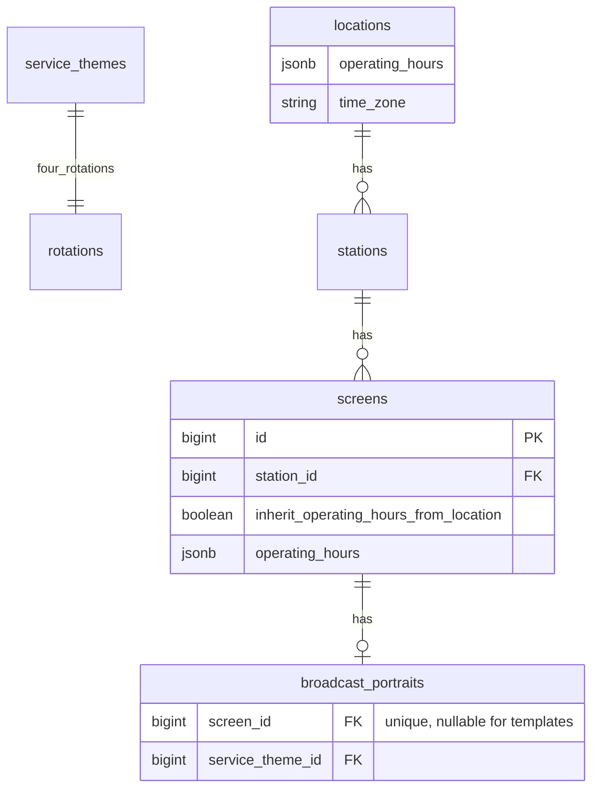

# Служебная медиатека оператора

> **Ревизия 2026-09-04:** портрет эфира и часы работы привязываются к **экрану** (не к станции). Часы работы экрана по умолчанию наследуются от локации; оператор может задать собственные.

## Goal Capsule

**Objective:** Оператор загружает сервисные ролики по тематикам в `/admin`, назначает тему на **портрет экрана** при создании и редактировании экрана; эфир получает шапки, приветствие и закрытие дня по **эффективным часам работы экрана** (собственные или унаследованные от локации).

**Product authority:** `docs/brainstorms/2026-09-03-operator-service-media-brainstorm.md` (тематики, 4 ротации, admin upload), ревизия 2026-09-04 (портрет и hours на экране). `CONCEPTS.md`, `docs/solutions/architecture-patterns/playlist-as-airtime-projection.md`.

**Open blockers:** нет. Развилки brainstorm + ревизия закрыты в Key Decisions (D1–D14).

**Execution profile:** TDD; сначала миграция портрета/hours на экран (U0), затем ServiceTheme. Тесты: `docker compose exec -e RAILS_ENV=test web bundle exec rspec`.

**Stop conditions:** не менять `Airtime::*` / FWW / Guard; не трогать JSON v1 package; не давать клиентам upload service; не Directory тем; не zip-import.

**Tail ownership:** паттерн в `docs/solutions/`; обновить `CONCEPTS.md` (портрет на экране, effective operating hours); `flowbite-admin.mdc` (screen form: portrait + hours).

## Product Contract

### Summary

Оператор создаёт **тематики** (`ServiceTheme`) с четырьмя `system_managed` ротациями. Загрузка в admin → `MediaAsset` service в нужную ротацию.

**Портрет эфира** назначается **экрану**: при создании экрана выбирается шаблон портрета (копия через `Portraits::CopyTemplate`); при редактировании — смена шаблона, правка блоков, выбор `service_theme_id`. Шаблоны портрета (`screen_id IS NULL`) остаются глобальными.

**Часы работы** — на экране: флаг `inherit_operating_hours_from_location` (default `true`) + опциональный jsonb `operating_hours`. Эффективные часы: локации станции, если наследование; иначе собственные экрана. Welcome/close и якорь эфирного дня для экрана считаются из effective hours.

Плейлист остаётся **на станцию и дату** (агент — один токен на станцию); генератор объединяет per-screen timeline в station playlist с `playlist_item_screens` (как сейчас для commercial/filler).

### Problem Frame

Сегодня портрет на станции (`broadcast_portraits.station_id`), копируется при create station. Часы работы только на локации — все экраны станции делят один график, хотя в одной точке могут быть экраны с разной тематикой (салон vs рыбный отдел) и разным режимом работы. Нет admin upload service; service headers без `pick_strategy`.

### Key Decisions

- **D1–D3.** ServiceTheme, admin upload, operator-only — без изменений (brainstorm).
- **D4. Тема на портрете экрана + pick_strategy.** `service_theme_id` на `broadcast_portraits` экрана. Governs R5, R6.
- **D5–D7.** Welcome/close kinds, min_seconds nil, regen horizon — без изменений.
- **D8. Regen при смене темы/портрета/hours экрана.** `EnqueueRegen.from_screen(screen)` → все даты горизонта станции экрана. Governs R10.
- **D9–D11.** Destroy restrict, manual edit clears theme, out of scope — без изменений.

- **D12. Портрет на экране, не на станции (rev 2026-09-04).** `broadcast_portraits.screen_id` UNIQUE NOT NULL для экземпляров; `station_id` удаляется (data migration: каждый экран станции получает копию бывшего station portrait, затем station portrait удаляется). Шаблоны: `screen_id IS NULL`. Governs R14–R16.
- **D13. Часы работы на экране с наследованием (rev 2026-09-04).** `screens.inherit_operating_hours_from_location` boolean default `true`; `screens.operating_hours` jsonb nullable. `Screen#effective_operating_hours` → location или screen. Governs R17–R18.
- **D14. Назначение портрета в UI экрана (rev 2026-09-04).** Create screen: `template_id` → `CopyTemplate` на экран. Edit screen: смена шаблона (replace), ссылка на редактирование портрета экрана, `service_theme_id`. Убрать `template_id` / copy portrait с формы станции. Governs R15, R16.

### How This Work Fits Together

Медиатека → тема → 4 ротации. Экран при создании получает портрет из шаблона. Оператор выбирает service theme на портрете экрана. Генератор для каждого экрана станции: свой портрет, свои effective hours, merge в station playlist. Agent v2 без изменения контракта.

### Actors

- **A1. Оператор (admin)** — темы, upload, create/edit screen (шаблон, theme, hours).
- **A2. Система** — transcode, regen, per-screen generate merge.
- **A3. Агент станции** — v2 package без изменений.

### Key Flows

**F1. Создание темы.** Без изменений. R1, AE1.

**F2. Upload клипа.** Regen станций, где ротация темы в портретах **экранов** этой станции. R4, AE2.

**F3. Создание экрана.** Trigger: create screen в admin. Steps: station, name, `template_id` (default template), `inherit_operating_hours` (default true), optional custom hours → save → `Portraits::CopyTemplate.call(screen:, template:)`. Outcome: у экрана свой `broadcast_portrait`. R14–R16, AE11.

**F4. Редактирование экрана.** Trigger: update screen. Steps: смена `template_id` (replace portrait), toggle inherit hours / custom hours, опционально `service_theme_id` на портрете → regen. R15–R18, AE3, AE12.

**F5. Генерация суток.** Per screen: portrait blocks, effective operating hours, welcome/close at open/close **для этого экрана**; merge items по station. R7–R9, R18, AE4–AE7.

### Requirements

#### ServiceTheme (без изменений по сути)

- **R1–R4.** `service_themes`, Create/Destroy, admin CRUD upload, EnqueueRegen.from_rotation.

#### Портрет и тема на экране

- **R5.** `broadcast_portraits.service_theme_id` nullable; `ApplyServiceTheme` upsert 4 theme blocks.
- **R6.** Block kinds + `pick_strategy` на service headers и welcome/close.
- **R14.** Миграция: `broadcast_portraits.screen_id` FK `screens` ON DELETE CASCADE, partial unique `(screen_id) WHERE screen_id IS NOT NULL`. Удалить `station_id`. Backfill: для каждой станции с портретом — скопировать портрет на каждый экран станции (или только если один экран — уточнить в U0: **копия на каждый screen**).
- **R15.** `Portraits::CopyTemplate` принимает `screen:` вместо `station:`; `screen.has_one :broadcast_portrait`.
- **R16.** Admin `ScreensController`: permit `template_id`, `inherit_operating_hours_from_location`, `operating_hours`; after create → CopyTemplate; on template change → CopyTemplate replace; portrait edit — member или nested `Admin::ScreenBroadcastPortraitsController` (или reuse `Admin::BroadcastPortraitsController` scoped to screen). Убрать portrait copy с `StationsController#create/update`.
- **R17.** `screens.inherit_operating_hours_from_location` boolean NOT NULL default true; `screens.operating_hours` jsonb NOT NULL default `{}` (или nullable when inherit). Include `Location::OperatingHours` on `Screen` или shared concern `EffectiveOperatingHours`.
- **R18.** `Screen#effective_operating_hours` — location.operating_hours if inherit else screen.operating_hours. `OperatingHours#day_bounds` принимает hours hash + time_zone. Generator `operating_windows(screen)` uses screen effective hours; anchor per screen if hours differ (или station anchor = min open across screens — **решение:** per-screen anchor для insertion; cyclic slots в пределах effective windows экрана).
- **R7–R9.** Welcome/close из `day_bounds` **effective hours экрана**.
- **R10.** Regen: screen portrait save, screen hours change, theme apply → `from_screen`; location hours change → `from_location` (все экраны локации с inherit).
- **R11–R13.** NAV, fingerprint, warnings — fingerprint включает **per-screen** `{ screen_id, portrait, effective_operating_hours }`.

### Acceptance Examples

- **AE1–AE2.** Тема и upload — без изменений.
- **AE3.** Портрет **экрана**: тема + pick strategies → 4 блока.
- **AE4.** Экран A: inherit hours, локация 09:00–21:00; экран B: custom 10:00–20:00; оба на одной станции → welcome/close в разное время; items с правильными `screen_ids`.
- **AE5–AE7.** Closed day, split-shift, random header — per screen effective hours.
- **AE8.** Destroy theme in use — restrict.
- **AE9.** Manual block edit → `service_theme_id` cleared.
- **AE10.** v2 package — без изменения JSON.
- **AE11.** Create screen с default template → у экрана `broadcast_portrait` с блоками шаблона; station portrait отсутствует.
- **AE12.** Edit screen: inherit hours off, custom 08:00–22:00 → regen; welcome at 08:00 для этого экрана only.
- **AE13.** Location hours change → regen экранов с `inherit_operating_hours_from_location: true`.
- **AE14.** Два экрана одной станции, разные `service_theme_id` → разные service headers на соответствующих `screen_ids`.

### Success Criteria

- Портрет и тема назначаются на экран при create/edit.
- Экраны одной станции могут иметь разные темы и часы работы.
- Плейлист станции корректно мержит per-screen projections.
- Миграция с station portrait без потери данных.

### Scope Boundaries

**Входит:** миграция portrait → screen; screen operating hours + inherit; ServiceTheme; admin screen form; generator per-screen; regen hooks; specs.

**Не входит:** per-screen agent token; клиентский upload service; TZ на экране (остаётся `locations.time_zone`); удаление station-level playlist model.

### Dependencies / Assumptions

- Плейлист per station сохраняется (agent token на station).
- Экран belongs_to station → location для TZ и inherited hours.
- Существующие station portraits мигрируются на все screens станции.

### Outstanding Questions

1. PlayLog attribution — без изменений (operator org для service).
2. При миграции: если у станции 3 экрана и один station portrait — **копия на все 3** (одинаковый стартовый портрет).

## Planning Contract

### Key Technical Decisions

- **KTD1. ERD** — `service_themes`; `broadcast_portraits.screen_id` (вместо station_id); `screens.inherit_operating_hours_from_location` + `operating_hours`.
- **KTD2. CopyTemplate(screen:)** — аналог текущего station flow; `service_theme_id` копируется с шаблона если задан на template (опционально).
- **KTD3. Generator per-screen loop** — `GenerateForDate` для каждого `station.screens` строит partial timeline с `screen.broadcast_portrait` и `screen.effective_operating_hours`; merge как AE4 в portrait plan.
- **KTD4. Fingerprint** — массив `screens: [{ id, portrait_updated_at, blocks, effective_operating_hours }]` вместо одного portrait + location hours.
- **KTD5. EnqueueRegen.from_screen(screen)** — dates horizon для `screen.station` в TZ локации.
- **KTD6–KTD7.** ServiceTheme domain, hide system rotations — без изменений.

### Technical Design

#### ERD

#### Доменные сервисы

| Сервис | Роль |
|--------|------|
| `Portraits::CopyTemplate` | **screen:** вместо station |
| `Portraits::ApplyServiceTheme` | На portrait экрана |
| `ServiceThemes::*` | Без изменений |
| `Screen#effective_operating_hours` | inherit vs custom |
| `OperatingHours#day_bounds(hours, date)` | Shared helper |

Расширения: `GenerateForDate` (per-screen), `Fingerprint`, `EnqueueRegen.from_screen`.

### Assumptions

- TZ эфирного дня — по-прежнему `location.time_zone` (все экраны станции в одной локации).
- Шаблоны портрета не привязаны к screen/station (`screen_id NULL`).
- Station `show` playlist — агрегат; детализация per-screen через `playlist_item_screens`.

### Risks

- **R-1: Миграция station → screen portraits** — митигация: reversible migration script + backfill spec.
- **R-2: Разные anchors у экранов одной станции** — митигация: offset_seconds от per-screen anchor; v2 entries уже per screen_ids.
- **R-3: Сложность generator** — митигация: U0 отдельно, specs AE4/AE14 до ServiceTheme UI.
- **R-4–R-6.** Enum kinds, empty rotations, theme manual edit — без изменений.

### Alternatives Considered

- Портрет на станции (brainstorm / portrait plan) — **отклонён** (rev 2026-09-04): не позволяет разную тематику и hours на экранах одной точки.
- Hours только на локации — отклонён; inherit покрывает типовой случай.
- Отдельный playlist per screen — отклонён; agent один на station.

### Open Questions

Нет блокирующих. Миграция: копия station portrait на каждый screen станции.

### Implementation Units Overview

| Unit | Содержание | Зависит от |
|------|------------|------------|
| **U0** | Portrait screen_id migration; screen operating hours; CopyTemplate(screen); generator/fingerprint/regen per-screen; admin screen form; deprecate station portrait | — |
| U1 | `service_themes`, block kinds, models | U0 |
| U2 | ServiceThemes CRUD admin | U1 |
| U3 | Upload AddClip | U2 |
| U4 | ApplyServiceTheme on **screen** portrait; theme UI on screen edit | U1, U0 |
| U5 | Generator welcome/close + NeutralPicker headers (uses effective hours) | U0, U4 |
| U6 | Integration, AE matrix, docs | U3–U5 |

## Implementation Units

### U0. Портрет и часы работы на экране (пререквизит)

- Migration: `add_screen_id_to_broadcast_portraits`, backfill, remove `station_id`; `add_operating_hours_to_screens`.
- `Screen has_one :broadcast_portrait`; `BroadcastPortrait belongs_to :screen`.
- `Portraits::CopyTemplate` → `screen:`; remove station copy from `Admin::StationsController`.
- `Screen#effective_operating_hours`, validation shape (reuse `Location::OperatingHours` normalizer).
- `GenerateForDate`: iterate screens with own portrait + effective hours; update `Fingerprint`, `operating_windows`.
- `EnqueueRegen.from_screen`; location hours hook regens inheriting screens.
- Admin screen form: `template_id`, inherit toggle, `_operating_hours_fields` when not inherit; Stimulus `screen-form` extend.
- Admin screen show: link to edit portrait; remove station-level portrait UI if redundant.
- Specs: AE11–AE14, migration backfill, `copy_template_spec` for screen.
- **DoD:** station portrait gone; per-screen generate green; existing generate specs adapted.

### U1. Модели ServiceTheme

- `create_service_themes`, `service_theme_id` on portraits, block kinds `service_welcome`/`service_close`.
- **DoD:** model specs green.

### U2. ServiceThemes admin CRUD

- Без изменений относительно v1 плана.
- **DoD:** AE1, AE8.

### U3. Upload медиатеки

- Без изменений.
- **DoD:** AE2.

### U4. Тема на портрете экрана

- `ApplyServiceTheme` на `screen.broadcast_portrait`.
- Screen edit / portrait form: `service_theme_id` + pick_strategy fields.
- `CopyTemplate` copies `service_theme_id` from template when present.
- **DoD:** AE3, AE9, AE14.

### U5. Generator service clips

- `day_bounds` from `screen.effective_operating_hours`.
- `header_pick` → `NeutralPicker`, min_seconds nil.
- **DoD:** AE4–AE7, AE12–AE13.

### U6. Polish

- Hide theme rotations; warnings; `docs/solutions/` note; update `CONCEPTS.md`.
- **DoD:** full AE matrix; `flowbite-admin.mdc` screen portrait + hours.

## References & Research

### Internal

- Current station portrait: `app/models/station.rb:35`, `app/controllers/admin/stations_controller.rb:29-46`
- CopyTemplate: `app/domain/portraits/copy_template.rb`
- Screen admin: `app/controllers/admin/screens_controller.rb`
- Generator: `app/domain/playlists/generate_for_date.rb`, `fingerprint.rb`
- Operating hours: `app/models/location/operating_hours.rb`
- Portrait plan (superseded for binding): `docs/plans/2026-09-02-001-feat-broadcast-portrait-playlist-plan.md` — generator merge pattern AE4

### External

Не требовалось.
