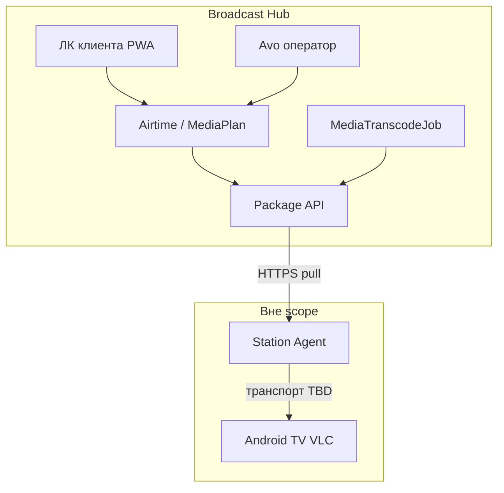
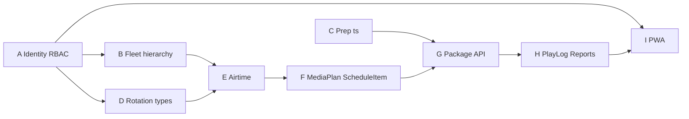

# План реализации Broadcast Hub

> **Статус**: утверждён к реализации  
> **Дата**: 2026-08-01  
> **Горизонт**: полный Хаб (MVP‑1…5 + Package API / prep со стороны Хаба)  
> **Источник ТЗ**: [requirements-analysis.md](./requirements-analysis.md)  
> **База**: рабочий MVP‑001 ([../001-media-playlist-broadcast/](../001-media-playlist-broadcast/))

**Scope:** только Хаб (Rails‑монолит `mediateca-broadcast`). Агент — отдельный репозиторий; здесь — контракт Package/Agent API + prep. **Вне scope:** CMS меню, биллинг/оплата, выбор транспорта до ТВ/sync (TBD), power/VLC (Агент).

**Паттерны:** доменные сервисы в `app/domain/*` (`ServiceObject`), Pundit, Solid Queue, Avo + Hotwire/daisyUI, Active Storage.

---

## Текущее состояние → цель

| Есть (MVP‑001) | Нужно по ТЗ Хаба |
|---|---|
| `Organization` + `User` без ролей | Оператор vs клиент; роли `manager`/`accountant`/`administrator` |
| Плоский `BroadcastPoint` + `PointGroup` | `Location → Station → Screen`; группы точек над Screen |
| `Playlist` + `ScheduleRule` (окна) | `Rotation`, `MediaPlan`, `ScheduleItem` (loop/exact/fill) |
| `ProcessMediaMetadataJob` | + `MediaTranscodeJob` → `.ts` GOP=25 |
| Device API (WebView) | + Agent Package API (`/agent/v1/...`) |
| Нет квот / play log / отчётов | Airtime + FWW, PlayLog 2 мес., отчёты XLS/PDF |

---

## Архитектурные решения (зафиксированы)

1. **Тенантность:** `organizations.kind`: `operator` | `client`. Флот (`Location`/`Station`/`Screen`) принадлежит **только** operator-org. Медиатека, ротации, брони, медиапланы — у client-org. Клиент видит весь парк для брони; в эфире точки — только свой блок.
2. **Миграция флота:** `BroadcastPoint` эволюционирует в `Screen` (rename таблицы + `station_id`, `orientation`); добавить `locations`, `stations` (`offline_cache_hours` default 24). `PointGroup` → группа экранов оператора (цели брони/медиаплана); membership → `screen_id`.
3. **Ротация:** доменное имя Rotation; таблица `playlists` переименовать в `rotations` (или alias `Rotation = Playlist` на первом шаге, rename — отдельный PR внутри фазы). В UI ЛК — «ротация».
4. **Квоты:** единица — **секунда**; бронь мгновенная; конфликт — **first-write-wins** (`SELECT … FOR UPDATE` / unique partial index на слот); переполнение — reject; отмена/перенос с сохранением исходной брони при занятой цели.
5. **Расписание:** новая модель `ScheduleItem { priority, window_start, window_end, mode: loop|exact|fill }` + генератор пакета; `ScheduleRule` — миграционный слой / deprecate после MediaPlan.
6. **Аудит «режима клиента»:** one-click из Avo → сессия ЛК с `Current.actor` = оператор, `Current.user` = synthetic/admin клиента; все mutating‑действия пишут `acted_by_operator_id`.
7. **UTC** в БД; отображение по TZ точки/пользователя.
8. **Device API v1** сохраняем до появления Агента (параллельный канал); Package API — основной контракт для edge.

---

## Фазы реализации

### Фаза A — Identity, RBAC, режим клиента

**FR-07, §3**

- `users.role` enum (`manager` / `accountant` / `administrator`); Pundit policies по матрице §3.2.
- `organizations.kind`; seed/operator org; запрет клиенту CRUD флота.
- Avo action «Войти как клиент» → signed token / session flag + audit.
- Расширить `Current`: `organization`, `user`, `actor` (operator при impersonation).

Ключевые файлы: `app/models/user.rb`, `app/policies/*`, `app/controllers/avo/*`, `app/models/current.rb`.

Тесты: policy matrix; impersonation пишет audit; accountant не создаёт ротации.

---

### Фаза B — Иерархия флота Location → Station → Screen

**FR-01**

- Миграции: `locations`, `stations`, rename/evolve `broadcast_points` → `screens` (+ `orientation`, tags на screen).
- Avo: CRUD локаций/станций/экранов, `offline_cache_hours` на Station.
- ЛК клиента: **read-only каталог** парка (фильтры тегов AND между фасетами / OR внутри — как сейчас в `Fleet::FilterPoints`).
- Перенос `PointGroup` на screens; обновить Device pairing (`venue_label` → screen).

Ключевые файлы: `app/models/broadcast_point.rb` → screen, `app/domain/fleet/*`, Avo resources, `app/controllers/broadcast_points_controller.rb`.

Тесты: иерархия обязательна; клиент не создаёт screen; фильтры тегов; pairing по screen.

---

### Фаза C — Prep `.ts` (MediaTranscodeJob)

**FR-02.9/02.10, NFR-11**

- После metadata job (или параллельно для video): `MediaTranscodeJob` — H.264 1080p25, GOP=25, AAC, PTS=0, MPEG-TS; Active Storage attachment `:broadcast_file` (`.ts`).
- Статусы: расширить `processing_status` или отдельный `transcode_status` (`pending`→`processing`→`ready`/`failed`); в эфир/пакет только `ready` + `.ts`.
- Лимит файла 1 ГБ (валидация); ADR профиля в `docs/` или `specs/002-...`.

Ключевые файлы: `app/jobs/process_media_metadata_job.rb`, новый `app/jobs/media_transcode_job.rb`, `app/domain/media/*`, `app/models/media_asset.rb`.

Тесты: успех/fail job; не-video без transcode; пакет не включает failed.

---

### Фаза D — Ротация, типы контента, нейтральный пул

**FR-03, FR-06.1 (база)**

- Rename Playlist→Rotation в UI и модели; `content_type` на MediaAsset: `own|commercial|neutral|service`.
- NeutralPool (org operator или shared) + политика filler (повтор при малом пуле допустим).
- ЛК: менеджер собирает ротации (существующий DnD).

Тесты: unique name per client org; только ready‑медиа в ротации; изоляция тенантов.

---

### Фаза E — Airtime: квоты, бронь, отмена, перенос

**FR-05, US-B шаги 3–4**

- Модели: `AirtimeQuota` (screen|group × window × seconds available), `AirtimeBooking` (client org, group, window, seconds, status).
- Сервисы: `Airtime::Book`, `Airtime::Cancel`, `Airtime::Reschedule` — FWW, reject overflow, reschedule только на свободный слот.
- ЛК: календарь свободных слотов на группе точек; бронь/отмена/перенос для `manager`/`administrator`.
- Avo: все брони всех клиентов; отмена/перенос оператором.

Ключевые файлы: новые `app/domain/airtime/*`, controllers ЛК + Avo resources.

Тесты: FWW под concurrency; reject overflow; перенос на занятый — отказ, исходная бронь жива; клиент не видит чужие брони.

---

### Фаза F — MediaPlan + ScheduleItem

**FR-06, FR-06.11, US-C**

- `MediaPlan`: rotation + screen_group + booking/window.
- `ScheduleItem` с `mode: loop|exact|fill`, priority; exact > loop при конфликте.
- Генератор суточного эфира (сервис) → вход для Package builder.
- Deprecate прямую привязку `ScheduleRule`→playlist в пользу MediaPlan (data migration существующих правил).

Тесты: exact вытесняет loop в окне; media plan только после валидной брони; клиент видит только свой блок на точке.

---

### Фаза G — Package / Agent API (сторона Хаба)

**FR-09 / §16.4**

- Auth станции: token на `Station` (digest), namespace `Api::Agent::V1`.
- Эндпоинты:
  - `GET .../package` — манифест + signed URLs на `.ts`
  - `GET .../config` — cache N, TV list
  - `POST .../heartbeat`, `play_events`, `alerts`
- OpenAPI/контракт в `specs/002-monitors-broadcast-tz/contracts/agent-api-v1.md` (наследник package.json).
- Транспорт до ТВ **не** описываем в пакете как обязательный протокол — только артефакты + order + tv_map.

Тесты: request specs на auth, version/etag пакета, play_events → PlayLog.

---

### Фаза H — PlayLog + отчёты

**FR-08, NFR-08**

- `PlayLog` (screen, media_asset, started_at, org, source); retention job — 2 месяца.
- Отчёты: справка выходов по дням; упрощённая (КА, ролик, места, кол-во, период); просмотр ротаций точки.
- Экспорт XLS/PDF (без печати/ЭП).
- Фин. калькулятор долей: параметры формулы в Avo (MVP‑5 «желательно» — после справок выходов).

Тесты: retention; клиент видит только свои выходы; экспорт не пустой на fixture‑логах.

---

### Фаза I — PWA ЛК и полировка

**FR-07.1, NFR-01**

- Включить PWA manifest/service worker (routes уже закомментированы в `config/routes.rb`).
- Адаптив уже на Tailwind/daisyUI — пройти ключевые сценарии US‑B на mobile viewport.
- Шаблоны с зонами (MVP‑4) — **отдельный follow-up** внутри Хаба после H (высокий объём, не блокирует коммерческий цикл).

---

## Порядок и зависимости

Рекомендуемая последовательность PR‑стримов: **A → B → C∥D → E → F → G → H → I**.

---

## Чеклист фаз

- [ ] **A** Identity — `organizations.kind`, roles, Pundit, режим клиента из Avo
- [ ] **B** Location → Station → Screen, группы точек, каталог парка в ЛК
- [ ] **C** MediaTranscodeJob → `.ts` GOP=25 + статусы
- [ ] **D** Rotation (ex Playlist), content_type, NeutralPool
- [ ] **E** AirtimeQuota/Booking — FWW, отмена, перенос
- [ ] **F** MediaPlan + ScheduleItem (loop/exact/fill)
- [ ] **G** Agent Package API + контракт OpenAPI/md
- [ ] **H** PlayLog, отчёты, экспорт XLS/PDF, retention 2 мес.
- [ ] **I** PWA ЛК; шаблоны зон — follow-up

---

## Артефакты документации (в ходе работ)

- Обновить/создать `specs/002-monitors-broadcast-tz/spec.md` + `data-model.md` под Хаб.
- ADR: encoding GOP=25; ADR: ScheduleItem/квоты/MediaPlan; контракт `contracts/agent-api-v1.md`.
- Не трогать реализацию Агента в этом репозитории.

---

## Риски

| Риск | Митигация |
|---|---|
| Ломающая смена владения точек (org клиента → operator) | Миграция данных + dual-read в одном релизе; feature flag каталога |
| Rename Playlist/BroadcastPoint | Alias-модели + пошаговый rename таблиц; не big-bang |
| FWW под нагрузкой | Unique index + transaction/`lock`; request/system тесты с двумя клиентами |
| Package JSON ещё не зафиксирован (L3) | Черновик контракта в фазе G до кода Агента; version field |
| Транспорт/sync TBD | Package без привязки к HLS; только media URLs + order |
